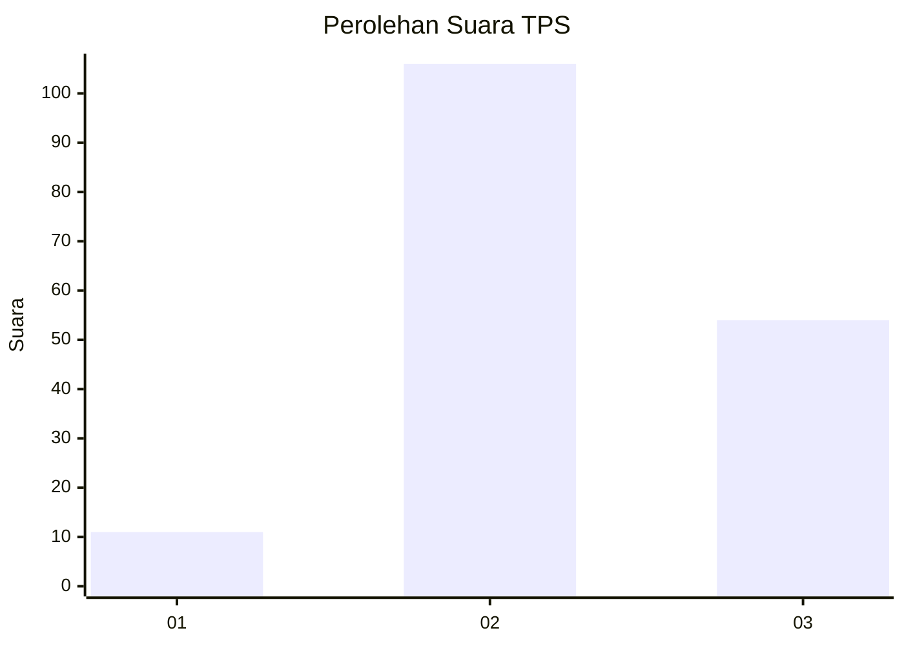
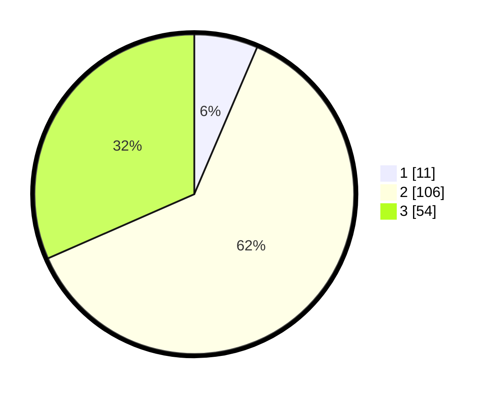

# Hasil

## Grafik

## Tabel

| No. | Nama Paslon    | Suara | Suara (raw) | Persentase |
|:--- |:-------------- | -----:| -----------:| ----------:|
| 1   | ANIES MUHAIMIN | 11    | [11][p-1]   | 6,43       |
| 2   | PRABOWO GIBRAN | 106   | [106][p-2]  | 61,99      |
| 3   | GANJAR MAHFUD  | 54    | [54][p-3]   | 31,58      |

[p-1]: https://github.com/gigit-pemilu/pemilu-2024-35-jawa-timur/blob/main/pilpres/hitung-suara/sub/35-jawa-timur/sub/04-tulungagung/sub/15-besuki/sub/2009-siyotobagus/sub/005-tps/sub/paslon-1.txt
[p-2]: https://github.com/gigit-pemilu/pemilu-2024-35-jawa-timur/blob/main/pilpres/hitung-suara/sub/35-jawa-timur/sub/04-tulungagung/sub/15-besuki/sub/2009-siyotobagus/sub/005-tps/sub/paslon-2.txt
[p-3]: https://github.com/gigit-pemilu/pemilu-2024-35-jawa-timur/blob/main/pilpres/hitung-suara/sub/35-jawa-timur/sub/04-tulungagung/sub/15-besuki/sub/2009-siyotobagus/sub/005-tps/sub/paslon-3.txt

## Foto C Plano

https://sirekap-obj-formc.kpu.go.id/cb93/pemilu/ppwp/35/04/15/20/09/3504152009005-20240214-214419--348ee76a-0891-4dd2-b494-daf0c818ece0.jpg

https://sirekap-obj-formc.kpu.go.id/cb93/pemilu/ppwp/35/04/15/20/09/3504152009005-20240214-214756--300659d4-8f30-4854-943d-328eeaedb391.jpg

https://sirekap-obj-formc.kpu.go.id/cb93/pemilu/ppwp/35/04/15/20/09/3504152009005-20240214-204335--afb14dfa-b2f2-4db6-a4c3-234e54db5b32.jpg

## Metadata

| Key        | Value               |
| ---------- | ------------------- |
| Time Stamp | 2024-02-19 06:16:00 |

