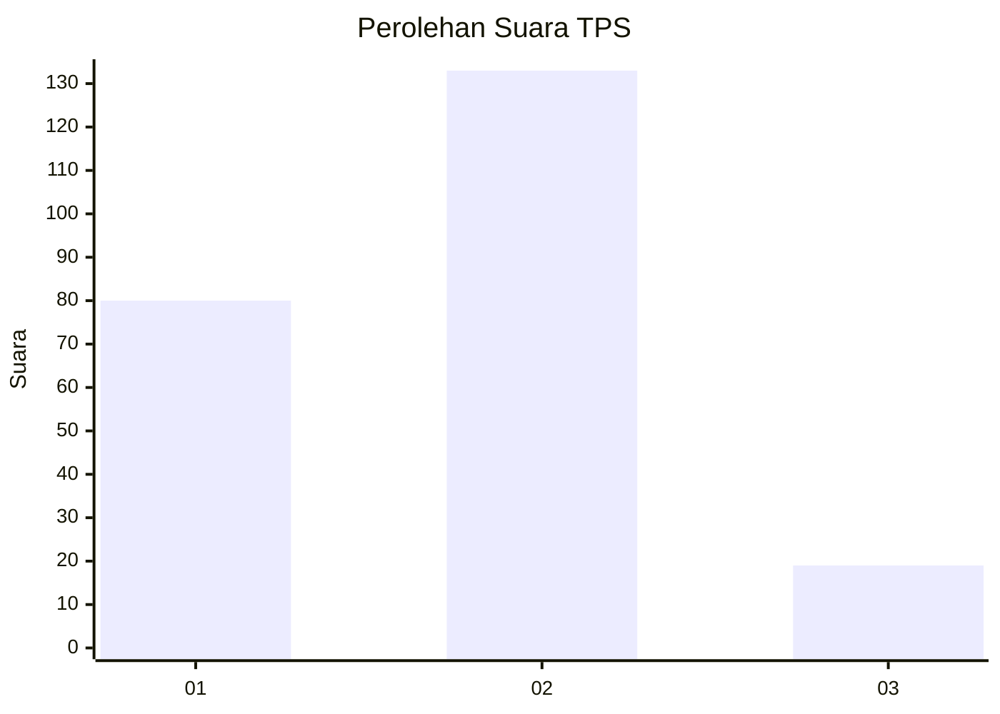
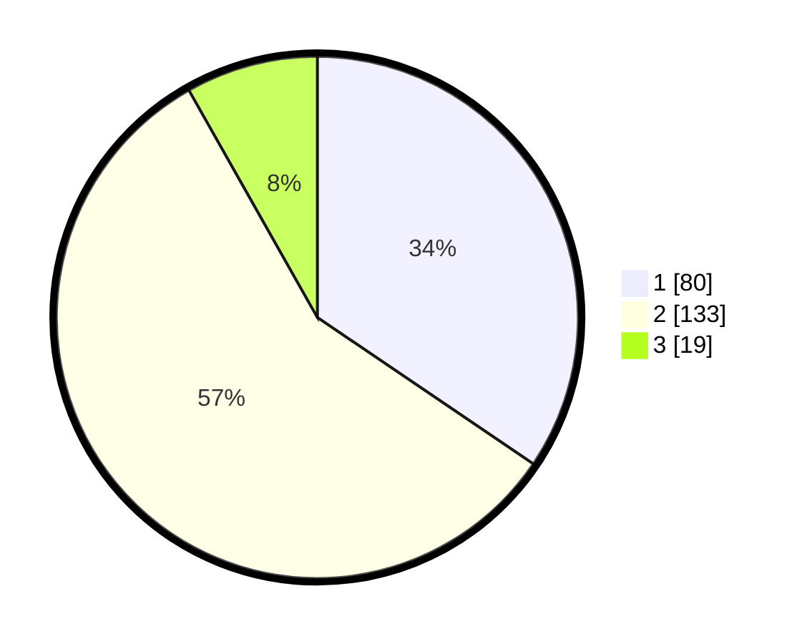

# Hasil

## Grafik

## Tabel

| No. | Nama Paslon    | Suara | Suara (raw) | Persentase |
|:--- |:-------------- | -----:| -----------:| ----------:|
| 1   | ANIES MUHAIMIN | 80    | [80][p-1]   | 34,48      |
| 2   | PRABOWO GIBRAN | 133   | [133][p-2]  | 57,33      |
| 3   | GANJAR MAHFUD  | 19    | [19][p-3]   | 8,19       |

[p-1]: https://github.com/gigit-pemilu/pemilu-2024-35-jawa-timur/blob/main/pilpres/hitung-suara/sub/35-jawa-timur/sub/04-tulungagung/sub/16-campurdarat/sub/2003-sawo/sub/005-tps/sub/paslon-1.txt
[p-2]: https://github.com/gigit-pemilu/pemilu-2024-35-jawa-timur/blob/main/pilpres/hitung-suara/sub/35-jawa-timur/sub/04-tulungagung/sub/16-campurdarat/sub/2003-sawo/sub/005-tps/sub/paslon-2.txt
[p-3]: https://github.com/gigit-pemilu/pemilu-2024-35-jawa-timur/blob/main/pilpres/hitung-suara/sub/35-jawa-timur/sub/04-tulungagung/sub/16-campurdarat/sub/2003-sawo/sub/005-tps/sub/paslon-3.txt

## Foto C Plano

https://sirekap-obj-formc.kpu.go.id/bb7f/pemilu/ppwp/35/04/16/20/03/3504162003005-20240214-235911--07f8e09e-9b20-49a2-8e07-2c6bc2636633.jpg

https://sirekap-obj-formc.kpu.go.id/bb7f/pemilu/ppwp/35/04/16/20/03/3504162003005-20240214-235923--ef8303c2-89b5-42b0-afa1-2de81212bf00.jpg

https://sirekap-obj-formc.kpu.go.id/bb7f/pemilu/ppwp/35/04/16/20/03/3504162003005-20240215-000032--c7f55c70-fa69-4cbb-b1fc-2f3487f30939.jpg

## Metadata

| Key        | Value               |
| ---------- | ------------------- |
| Time Stamp | 2024-02-17 18:00:00 |

