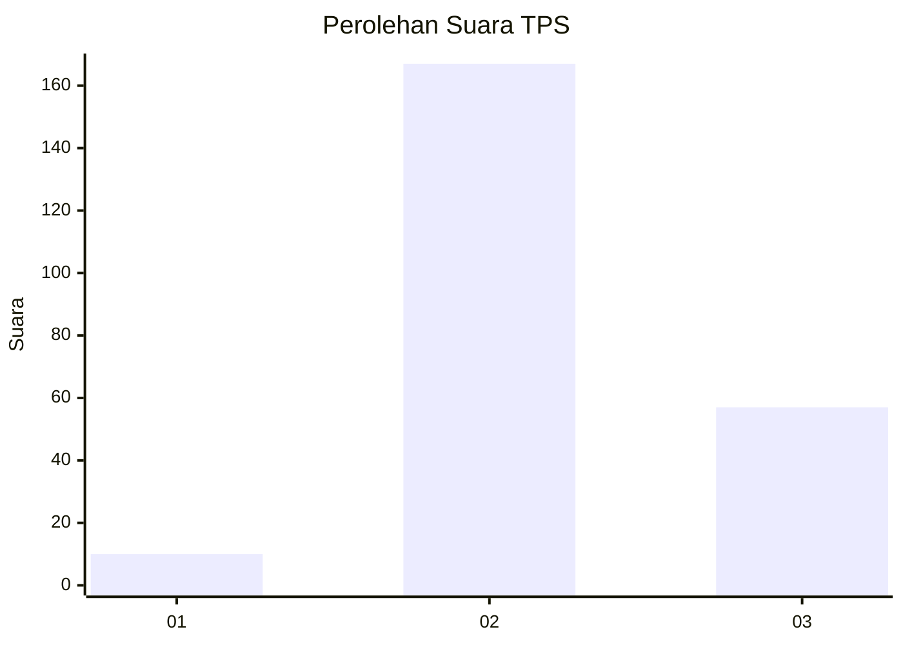
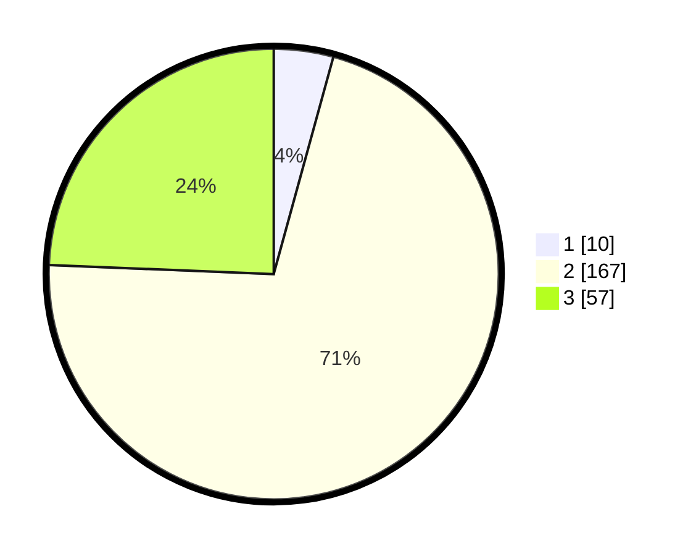

# Hasil

## Grafik

## Tabel

| No. | Nama Paslon    | Suara | Suara (raw) | Persentase |
|:--- |:-------------- | -----:| -----------:| ----------:|
| 1   | ANIES MUHAIMIN | 10    | [10][p-1]   | 4,27       |
| 2   | PRABOWO GIBRAN | 167   | [167][p-2]  | 71,37      |
| 3   | GANJAR MAHFUD  | 57    | [57][p-3]   | 24,36      |

[p-1]: https://github.com/gigit-pemilu/pemilu-2024/blob/main/pilpres/hitung-suara/sub/35-jawa-timur/sub/04-tulungagung/sub/16-campurdarat/sub/2003-sawo/sub/013-tps/sub/paslon-1.txt
[p-2]: https://github.com/gigit-pemilu/pemilu-2024/blob/main/pilpres/hitung-suara/sub/35-jawa-timur/sub/04-tulungagung/sub/16-campurdarat/sub/2003-sawo/sub/013-tps/sub/paslon-2.txt
[p-3]: https://github.com/gigit-pemilu/pemilu-2024/blob/main/pilpres/hitung-suara/sub/35-jawa-timur/sub/04-tulungagung/sub/16-campurdarat/sub/2003-sawo/sub/013-tps/sub/paslon-3.txt

## Foto C Plano

https://sirekap-obj-formc.kpu.go.id/40c6/pemilu/ppwp/35/04/16/20/03/3504162003013-20240214-215221--d30ed77e-c7d7-47fd-9840-693732f8d6b2.jpg

https://sirekap-obj-formc.kpu.go.id/40c6/pemilu/ppwp/35/04/16/20/03/3504162003013-20240214-215514--8f23b59b-e5da-47be-a56e-389e0adf5185.jpg

https://sirekap-obj-formc.kpu.go.id/40c6/pemilu/ppwp/35/04/16/20/03/3504162003013-20240214-215346--0d0a537d-980c-4ae1-a413-1226d371ff33.jpg

## Metadata

| Key        | Value               |
| ---------- | ------------------- |
| Time Stamp | 2024-02-17 18:00:00 |

