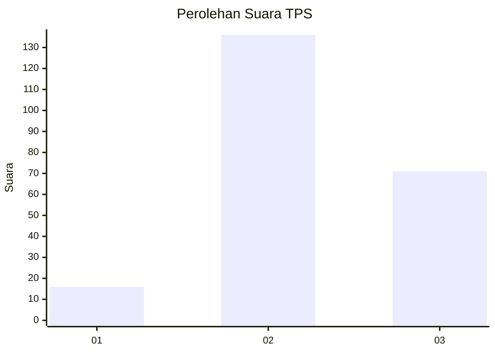
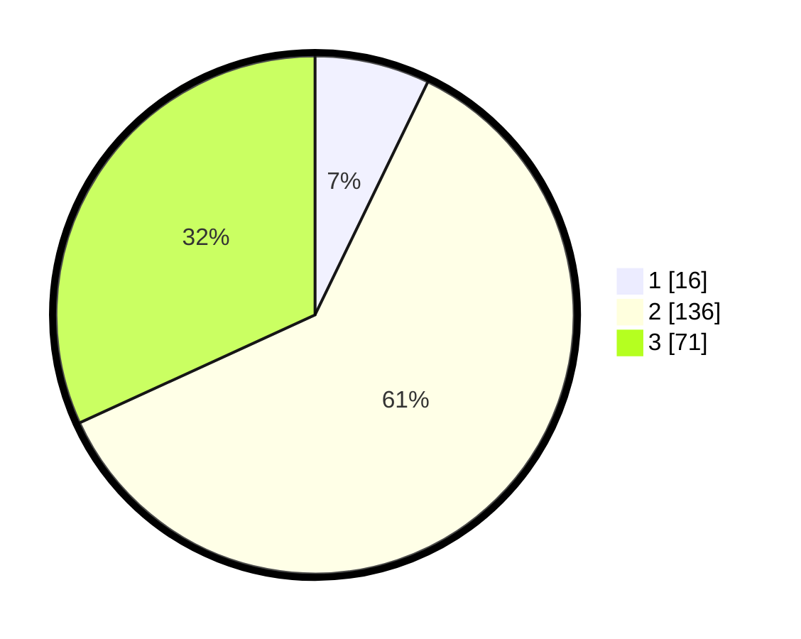

# Hasil

## Grafik

## Tabel

| No. | Nama Paslon    | Suara | Suara (raw) | Persentase |
|:--- |:-------------- | -----:| -----------:| ----------:|
| 1   | ANIES MUHAIMIN | 16    | [16][p-1]   | 7,17       |
| 2   | PRABOWO GIBRAN | 136   | [136][p-2]  | 60,99      |
| 3   | GANJAR MAHFUD  | 71    | [71][p-3]   | 31,84      |

[p-1]: https://github.com/gigit-pemilu/pemilu-2024/blob/main/pilpres/hitung-suara/sub/35-jawa-timur/sub/04-tulungagung/sub/16-campurdarat/sub/2003-sawo/sub/014-tps/sub/paslon-1.txt
[p-2]: https://github.com/gigit-pemilu/pemilu-2024/blob/main/pilpres/hitung-suara/sub/35-jawa-timur/sub/04-tulungagung/sub/16-campurdarat/sub/2003-sawo/sub/014-tps/sub/paslon-2.txt
[p-3]: https://github.com/gigit-pemilu/pemilu-2024/blob/main/pilpres/hitung-suara/sub/35-jawa-timur/sub/04-tulungagung/sub/16-campurdarat/sub/2003-sawo/sub/014-tps/sub/paslon-3.txt

## Foto C Plano

https://sirekap-obj-formc.kpu.go.id/960e/pemilu/ppwp/35/04/16/20/03/3504162003014-20240216-162301--1512ce37-c062-4c6e-8708-1360eb222e03.jpg

https://sirekap-obj-formc.kpu.go.id/960e/pemilu/ppwp/35/04/16/20/03/3504162003014-20240216-162126--6e61e39f-9c37-423f-9086-2d8d97874492.jpg

https://sirekap-obj-formc.kpu.go.id/960e/pemilu/ppwp/35/04/16/20/03/3504162003014-20240216-162809--7181db0f-38da-4b7f-8fd7-45150365ddda.jpg

## Metadata

| Key        | Value               |
| ---------- | ------------------- |
| Time Stamp | 2024-02-17 18:30:00 |

