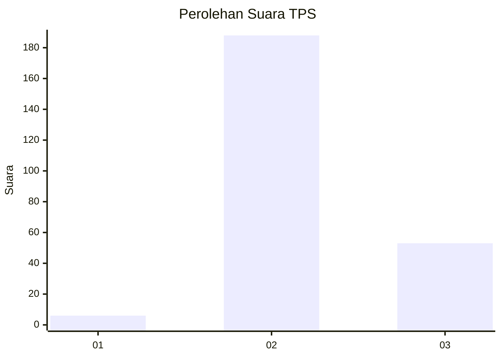

# Hasil

## Grafik

## Tabel

| No. | Nama Paslon    | Suara | Suara (raw) | Persentase |
|:--- |:-------------- | -----:| -----------:| ----------:|
| 1   | ANIES MUHAIMIN | 6     | [6][p-1]    | 2,43       |
| 2   | PRABOWO GIBRAN | 188   | [188][p-2]  | 76,11      |
| 3   | GANJAR MAHFUD  | 53    | [53][p-3]   | 21,46      |

[p-1]: https://github.com/gigit-pemilu/pemilu-2024/blob/main/pilpres/hitung-suara/sub/35-jawa-timur/sub/04-tulungagung/sub/16-campurdarat/sub/2005-campurdarat/sub/001-tps/sub/paslon-1.txt
[p-2]: https://github.com/gigit-pemilu/pemilu-2024/blob/main/pilpres/hitung-suara/sub/35-jawa-timur/sub/04-tulungagung/sub/16-campurdarat/sub/2005-campurdarat/sub/001-tps/sub/paslon-2.txt
[p-3]: https://github.com/gigit-pemilu/pemilu-2024/blob/main/pilpres/hitung-suara/sub/35-jawa-timur/sub/04-tulungagung/sub/16-campurdarat/sub/2005-campurdarat/sub/001-tps/sub/paslon-3.txt

## Foto C Plano

https://sirekap-obj-formc.kpu.go.id/1bfd/pemilu/ppwp/35/04/16/20/05/3504162005001-20240214-214154--35e5cd01-5a93-45f2-a66e-f2e32ceadd42.jpg

https://sirekap-obj-formc.kpu.go.id/1bfd/pemilu/ppwp/35/04/16/20/05/3504162005001-20240214-215253--14b1f4a3-80bc-487e-ab52-a09eebf2d8cb.jpg

https://sirekap-obj-formc.kpu.go.id/1bfd/pemilu/ppwp/35/04/16/20/05/3504162005001-20240216-143731--67732d14-3442-430d-9de6-2cfd8fab1482.jpg

## Metadata

| Key        | Value               |
| ---------- | ------------------- |
| Time Stamp | 2024-02-17 18:30:00 |

