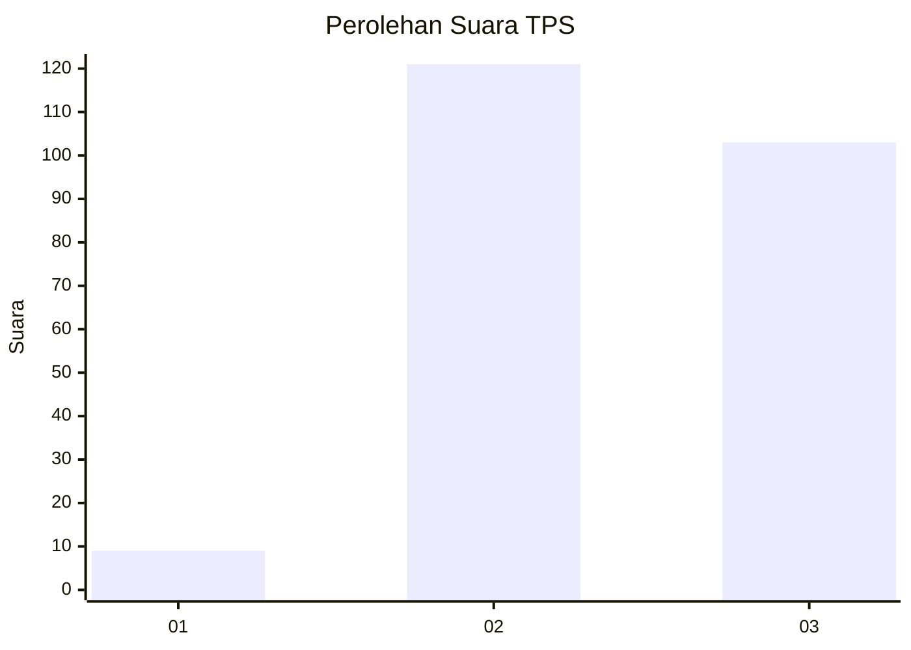
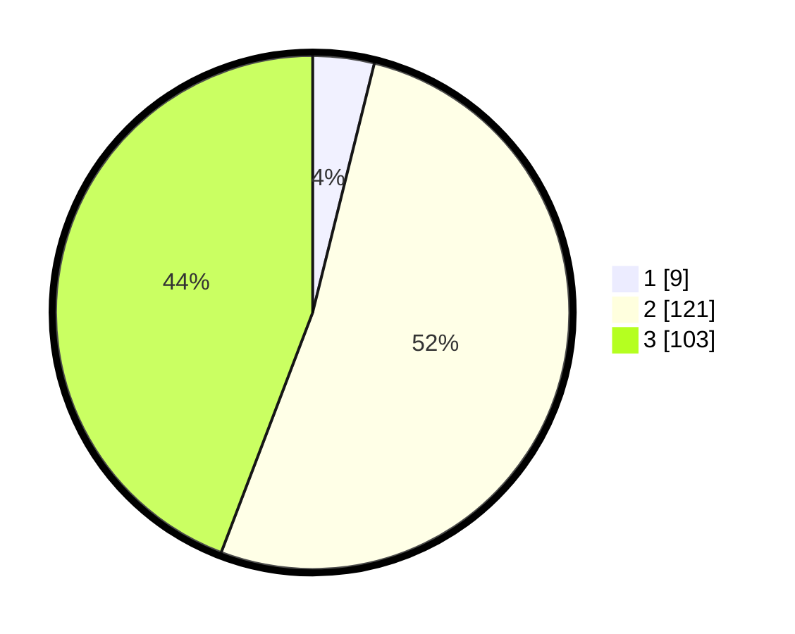

# Hasil

## Grafik

## Tabel

| No. | Nama Paslon    | Suara | Suara (raw) | Persentase |
|:--- |:-------------- | -----:| -----------:| ----------:|
| 1   | ANIES MUHAIMIN | 9     | [9][p-1]    | 3,86       |
| 2   | PRABOWO GIBRAN | 121   | [121][p-2]  | 51,93      |
| 3   | GANJAR MAHFUD  | 103   | [103][p-3]  | 44,21      |

[p-1]: https://github.com/gigit-pemilu/pemilu-2024/blob/main/pilpres/hitung-suara/sub/35-jawa-timur/sub/04-tulungagung/sub/16-campurdarat/sub/2006-wates/sub/002-tps/sub/paslon-1.txt
[p-2]: https://github.com/gigit-pemilu/pemilu-2024/blob/main/pilpres/hitung-suara/sub/35-jawa-timur/sub/04-tulungagung/sub/16-campurdarat/sub/2006-wates/sub/002-tps/sub/paslon-2.txt
[p-3]: https://github.com/gigit-pemilu/pemilu-2024/blob/main/pilpres/hitung-suara/sub/35-jawa-timur/sub/04-tulungagung/sub/16-campurdarat/sub/2006-wates/sub/002-tps/sub/paslon-3.txt

## Foto C Plano

https://sirekap-obj-formc.kpu.go.id/0441/pemilu/ppwp/35/04/16/20/06/3504162006002-20240217-131814--45929b23-d338-4eee-941b-11becc9ee8ac.jpg

https://sirekap-obj-formc.kpu.go.id/0441/pemilu/ppwp/35/04/16/20/06/3504162006002-20240217-132044--3aa23e34-49a5-456a-ac56-8d331f6a1393.jpg

https://sirekap-obj-formc.kpu.go.id/0441/pemilu/ppwp/35/04/16/20/06/3504162006002-20240214-185538--3989c503-a69a-4376-903b-848dee205590.jpg

## Metadata

| Key        | Value               |
| ---------- | ------------------- |
| Time Stamp | 2024-02-17 18:00:00 |

