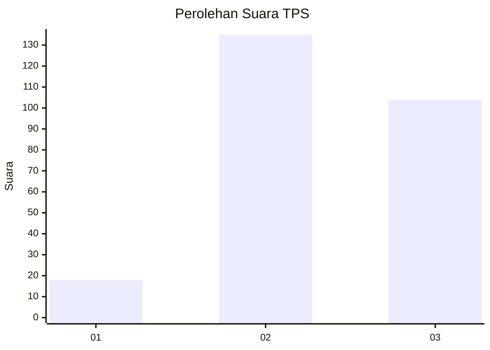
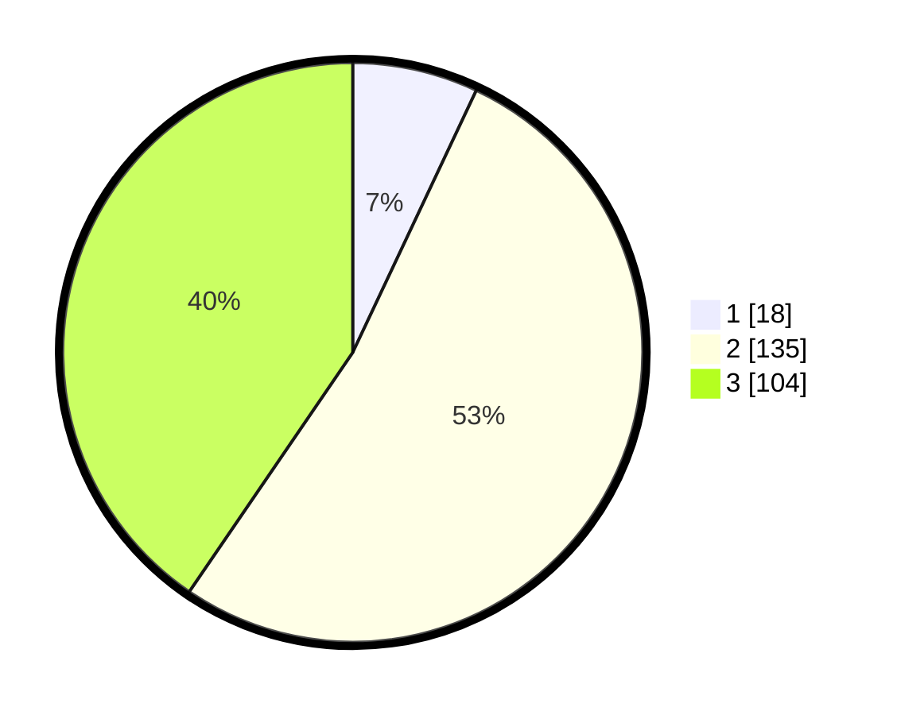

# Hasil

## Grafik

## Tabel

| No. | Nama Paslon    | Suara | Suara (raw) | Persentase |
|:--- |:-------------- | -----:| -----------:| ----------:|
| 1   | ANIES MUHAIMIN | 18    | [18][p-1]   | 7,00       |
| 2   | PRABOWO GIBRAN | 135   | [135][p-2]  | 52,53      |
| 3   | GANJAR MAHFUD  | 104   | [104][p-3]  | 40,47      |

[p-1]: https://github.com/gigit-pemilu/pemilu-2024-35-jawa-timur/blob/main/pilpres/hitung-suara/sub/35-jawa-timur/sub/04-tulungagung/sub/16-campurdarat/sub/2006-wates/sub/021-tps/sub/paslon-1.txt
[p-2]: https://github.com/gigit-pemilu/pemilu-2024-35-jawa-timur/blob/main/pilpres/hitung-suara/sub/35-jawa-timur/sub/04-tulungagung/sub/16-campurdarat/sub/2006-wates/sub/021-tps/sub/paslon-2.txt
[p-3]: https://github.com/gigit-pemilu/pemilu-2024-35-jawa-timur/blob/main/pilpres/hitung-suara/sub/35-jawa-timur/sub/04-tulungagung/sub/16-campurdarat/sub/2006-wates/sub/021-tps/sub/paslon-3.txt

## Foto C Plano

https://sirekap-obj-formc.kpu.go.id/0b98/pemilu/ppwp/35/04/16/20/06/3504162006021-20240215-005048--fc914936-021b-4a57-a937-ca8f163ad42f.jpg

https://sirekap-obj-formc.kpu.go.id/0b98/pemilu/ppwp/35/04/16/20/06/3504162006021-20240215-005305--ffcb0e21-029d-4453-a49e-e98001fb9e4b.jpg

https://sirekap-obj-formc.kpu.go.id/0b98/pemilu/ppwp/35/04/16/20/06/3504162006021-20240215-005357--e2f5047a-55ce-41ef-b63b-7c8b26a9e868.jpg

## Metadata

| Key        | Value               |
| ---------- | ------------------- |
| Time Stamp | 2024-02-17 18:00:00 |

