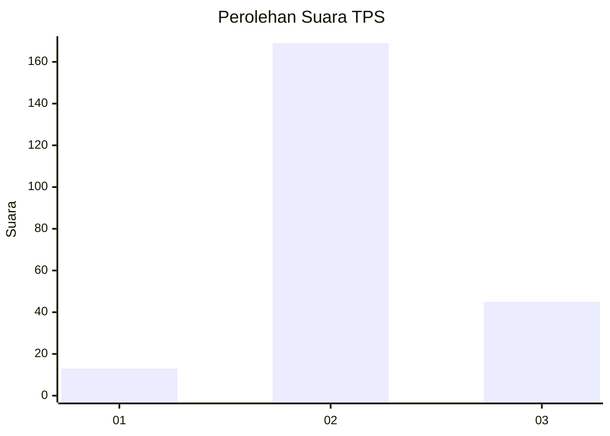

# Hasil

## Grafik

## Tabel

| No. | Nama Paslon    | Suara | Suara (raw) | Persentase |
|:--- |:-------------- | -----:| -----------:| ----------:|
| 1   | ANIES MUHAIMIN | 13    | [13][p-1]   | 5,73       |
| 2   | PRABOWO GIBRAN | 169   | [169][p-2]  | 74,45      |
| 3   | GANJAR MAHFUD  | 45    | [45][p-3]   | 19,82      |

[p-1]: https://github.com/gigit-pemilu/pemilu-2024/blob/main/pilpres/hitung-suara/sub/35-jawa-timur/sub/04-tulungagung/sub/16-campurdarat/sub/2007-pelem/sub/009-tps/sub/paslon-1.txt
[p-2]: https://github.com/gigit-pemilu/pemilu-2024/blob/main/pilpres/hitung-suara/sub/35-jawa-timur/sub/04-tulungagung/sub/16-campurdarat/sub/2007-pelem/sub/009-tps/sub/paslon-2.txt
[p-3]: https://github.com/gigit-pemilu/pemilu-2024/blob/main/pilpres/hitung-suara/sub/35-jawa-timur/sub/04-tulungagung/sub/16-campurdarat/sub/2007-pelem/sub/009-tps/sub/paslon-3.txt

## Foto C Plano

https://sirekap-obj-formc.kpu.go.id/04ac/pemilu/ppwp/35/04/16/20/07/3504162007009-20240215-195937--58273c2c-e98b-41e5-b933-975416e33b0e.jpg

https://sirekap-obj-formc.kpu.go.id/04ac/pemilu/ppwp/35/04/16/20/07/3504162007009-20240214-214820--83dca3a5-4007-498d-a4b9-fc33e7643260.jpg

https://sirekap-obj-formc.kpu.go.id/04ac/pemilu/ppwp/35/04/16/20/07/3504162007009-20240214-214922--d5836cb8-2116-462c-acf4-6271fb8c8070.jpg

## Metadata

| Key        | Value               |
| ---------- | ------------------- |
| Time Stamp | 2024-02-16 01:00:27 |

