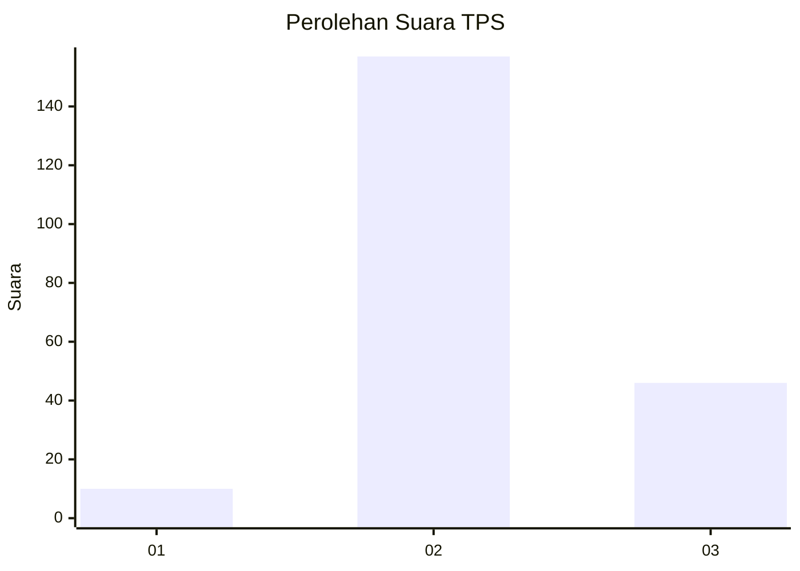

# Hasil

## Grafik

## Tabel

| No. | Nama Paslon    | Suara | Suara (raw) | Persentase |
|:--- |:-------------- | -----:| -----------:| ----------:|
| 1   | ANIES MUHAIMIN | 10    | [10][p-1]   | 4,69       |
| 2   | PRABOWO GIBRAN | 157   | [157][p-2]  | 73,71      |
| 3   | GANJAR MAHFUD  | 46    | [46][p-3]   | 21,60      |

[p-1]: https://github.com/gigit-pemilu/pemilu-2024/blob/main/pilpres/hitung-suara/sub/35-jawa-timur/sub/04-tulungagung/sub/16-campurdarat/sub/2007-pelem/sub/020-tps/sub/paslon-1.txt
[p-2]: https://github.com/gigit-pemilu/pemilu-2024/blob/main/pilpres/hitung-suara/sub/35-jawa-timur/sub/04-tulungagung/sub/16-campurdarat/sub/2007-pelem/sub/020-tps/sub/paslon-2.txt
[p-3]: https://github.com/gigit-pemilu/pemilu-2024/blob/main/pilpres/hitung-suara/sub/35-jawa-timur/sub/04-tulungagung/sub/16-campurdarat/sub/2007-pelem/sub/020-tps/sub/paslon-3.txt

## Foto C Plano

https://sirekap-obj-formc.kpu.go.id/6eaf/pemilu/ppwp/35/04/16/20/07/3504162007020-20240217-122025--2618ecfa-a548-42e9-b6c2-f9ffcda2e393.jpg

https://sirekap-obj-formc.kpu.go.id/6eaf/pemilu/ppwp/35/04/16/20/07/3504162007020-20240217-122317--e514de58-a8c3-480d-932c-37a81e84e184.jpg

https://sirekap-obj-formc.kpu.go.id/6eaf/pemilu/ppwp/35/04/16/20/07/3504162007020-20240217-122413--d0e145a6-71f3-4db1-a102-bf3ec0d400ee.jpg

## Metadata

| Key        | Value               |
| ---------- | ------------------- |
| Time Stamp | 2024-02-17 18:00:00 |

