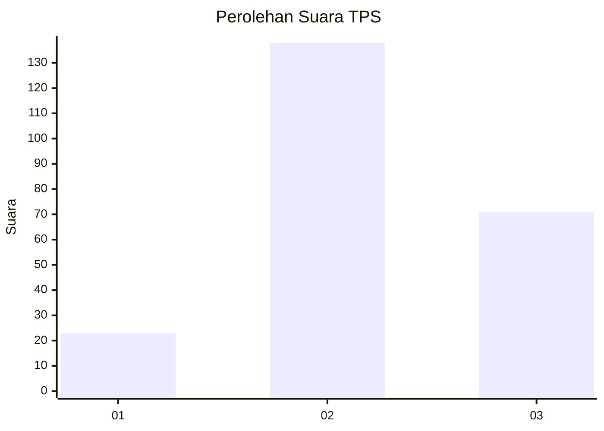
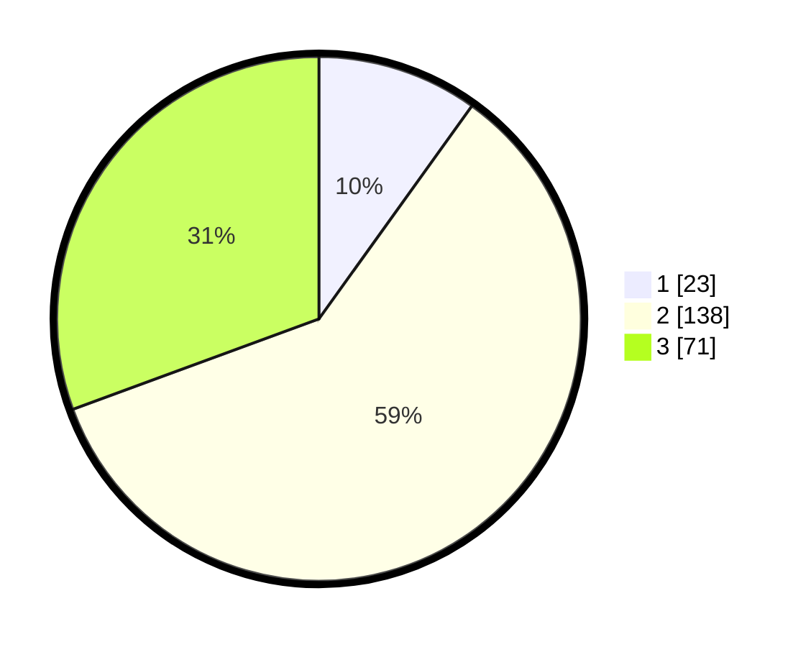

# Hasil

## Grafik

## Tabel

| No. | Nama Paslon    | Suara | Suara (raw) | Persentase |
|:--- |:-------------- | -----:| -----------:| ----------:|
| 1   | ANIES MUHAIMIN | 23    | [23][p-1]   | 9,91       |
| 2   | PRABOWO GIBRAN | 138   | [138][p-2]  | 59,48      |
| 3   | GANJAR MAHFUD  | 71    | [71][p-3]   | 30,60      |

[p-1]: https://github.com/gigit-pemilu/pemilu-2024-35-jawa-timur/blob/main/pilpres/hitung-suara/sub/35-jawa-timur/sub/04-tulungagung/sub/16-campurdarat/sub/2009-tanggung/sub/010-tps/sub/paslon-1.txt
[p-2]: https://github.com/gigit-pemilu/pemilu-2024-35-jawa-timur/blob/main/pilpres/hitung-suara/sub/35-jawa-timur/sub/04-tulungagung/sub/16-campurdarat/sub/2009-tanggung/sub/010-tps/sub/paslon-2.txt
[p-3]: https://github.com/gigit-pemilu/pemilu-2024-35-jawa-timur/blob/main/pilpres/hitung-suara/sub/35-jawa-timur/sub/04-tulungagung/sub/16-campurdarat/sub/2009-tanggung/sub/010-tps/sub/paslon-3.txt

## Foto C Plano

https://sirekap-obj-formc.kpu.go.id/2c7b/pemilu/ppwp/35/04/16/20/09/3504162009010-20240214-202806--58b37096-649f-466b-bc1c-91e26e8ee985.jpg

https://sirekap-obj-formc.kpu.go.id/2c7b/pemilu/ppwp/35/04/16/20/09/3504162009010-20240214-202949--b077d645-0541-43b1-bf6b-cd09bc296119.jpg

https://sirekap-obj-formc.kpu.go.id/2c7b/pemilu/ppwp/35/04/16/20/09/3504162009010-20240214-214925--c4b4e2c3-3060-4ade-a7fb-fccd8cfd8836.jpg

## Metadata

| Key        | Value               |
| ---------- | ------------------- |
| Time Stamp | 2024-02-15 09:00:24 |

