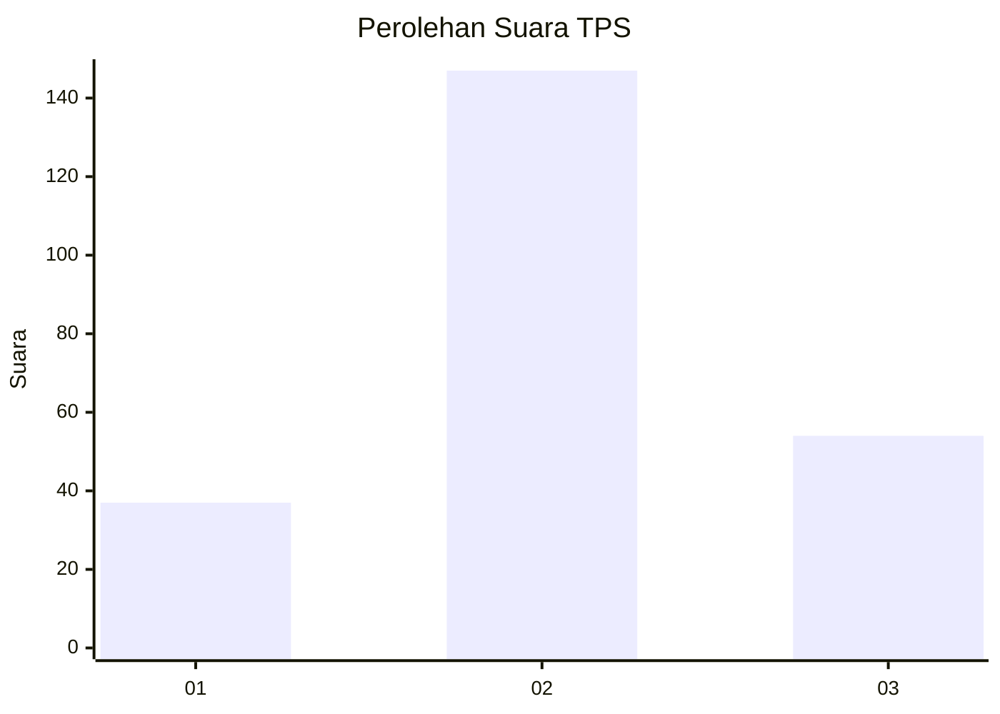
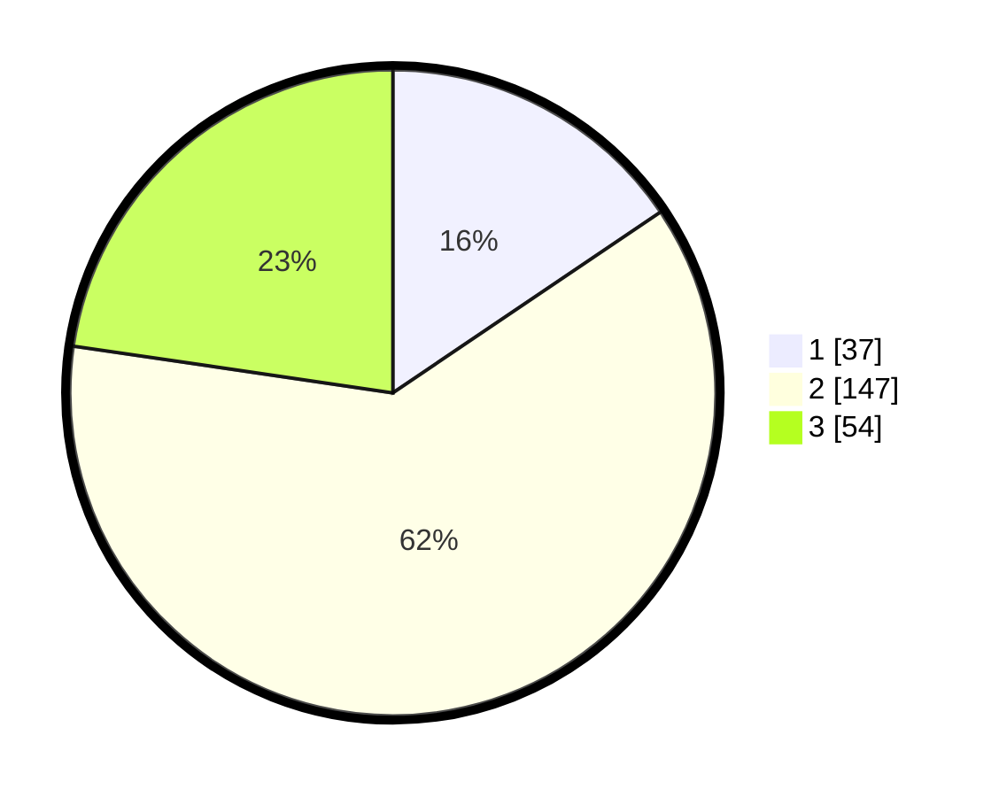

# Hasil

## Grafik

## Tabel

| No. | Nama Paslon    | Suara | Suara (raw) | Persentase |
|:--- |:-------------- | -----:| -----------:| ----------:|
| 1   | ANIES MUHAIMIN | 37    | [37][p-1]   | 15,55      |
| 2   | PRABOWO GIBRAN | 147   | [147][p-2]  | 61,76      |
| 3   | GANJAR MAHFUD  | 54    | [54][p-3]   | 22,69      |

[p-1]: https://github.com/gigit-pemilu/pemilu-2024/blob/main/pilpres/hitung-suara/sub/35-jawa-timur/sub/04-tulungagung/sub/17-bandung/sub/2001-nglampir/sub/006-tps/sub/paslon-1.txt
[p-2]: https://github.com/gigit-pemilu/pemilu-2024/blob/main/pilpres/hitung-suara/sub/35-jawa-timur/sub/04-tulungagung/sub/17-bandung/sub/2001-nglampir/sub/006-tps/sub/paslon-2.txt
[p-3]: https://github.com/gigit-pemilu/pemilu-2024/blob/main/pilpres/hitung-suara/sub/35-jawa-timur/sub/04-tulungagung/sub/17-bandung/sub/2001-nglampir/sub/006-tps/sub/paslon-3.txt

## Foto C Plano

https://sirekap-obj-formc.kpu.go.id/0293/pemilu/ppwp/35/04/17/20/01/3504172001006-20240216-174127--6e14b8a0-d4cc-4b27-ab58-2bca0d4aafc2.jpg

https://sirekap-obj-formc.kpu.go.id/0293/pemilu/ppwp/35/04/17/20/01/3504172001006-20240216-174128--39924a23-ee74-45c8-a339-30e744c11e7b.jpg

https://sirekap-obj-formc.kpu.go.id/0293/pemilu/ppwp/35/04/17/20/01/3504172001006-20240214-214841--0e2c3516-7b67-44a1-b524-3a29acc7aff0.jpg

## Metadata

| Key        | Value               |
| ---------- | ------------------- |
| Time Stamp | 2024-02-17 16:52:47 |

## DATA PEMILIH TETAP

Jumlah pemilih dalam DPT: **289**.
 * L: **144**.
 * P: **145**.

## DATA PENGGUNA HAK PILIH

Jumlah pengguna hak pilih dalam DPT: **242**.
 * L: **122**.
 * P: **120**.

Jumlah pengguna hak pilih dalam DPTb: **0**.
 * L: **0**.
 * P: **0**.

Jumlah pengguna hak pilih dalam DPK: **0**.
 * L: **0**.
 * P: **0**.

Jumlah pengguna hak pilih: **242**.
 * L: **122**.
 * P: **120**.

## JUMLAH SUARA SAH DAN TIDAK SAH

JUMLAH SELURUH SUARA SAH: **238**.

JUMLAH SUARA TIDAK SAH: **4**.

JUMLAH SELURUH SUARA SAH DAN SUARA TIDAK SAH: **242**.

