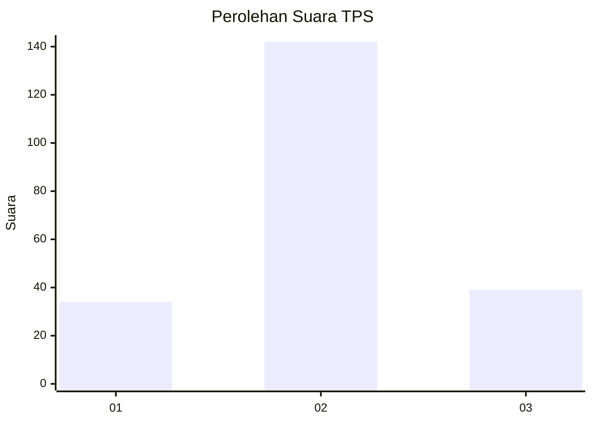
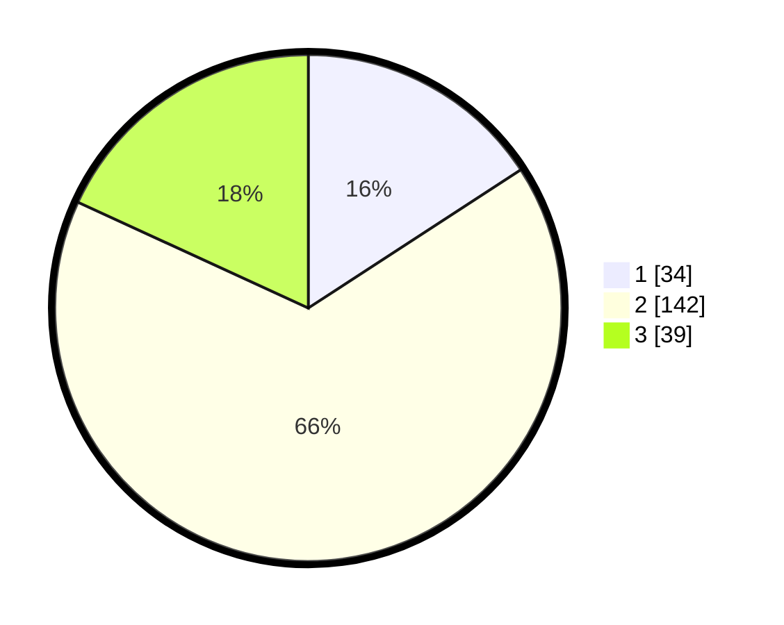

# Hasil

## Grafik

## Tabel

| No. | Nama Paslon    | Suara | Suara (raw) | Persentase |
|:--- |:-------------- | -----:| -----------:| ----------:|
| 1   | ANIES MUHAIMIN | 34    | [34][p-1]   | 15,81      |
| 2   | PRABOWO GIBRAN | 142   | [142][p-2]  | 66,05      |
| 3   | GANJAR MAHFUD  | 39    | [39][p-3]   | 18,14      |

[p-1]: https://github.com/gigit-pemilu/pemilu-2024-35-jawa-timur/blob/main/pilpres/hitung-suara/sub/35-jawa-timur/sub/04-tulungagung/sub/17-bandung/sub/2005-suwaru/sub/006-tps/sub/paslon-1.txt
[p-2]: https://github.com/gigit-pemilu/pemilu-2024-35-jawa-timur/blob/main/pilpres/hitung-suara/sub/35-jawa-timur/sub/04-tulungagung/sub/17-bandung/sub/2005-suwaru/sub/006-tps/sub/paslon-2.txt
[p-3]: https://github.com/gigit-pemilu/pemilu-2024-35-jawa-timur/blob/main/pilpres/hitung-suara/sub/35-jawa-timur/sub/04-tulungagung/sub/17-bandung/sub/2005-suwaru/sub/006-tps/sub/paslon-3.txt

## Foto C Plano

https://sirekap-obj-formc.kpu.go.id/4397/pemilu/ppwp/35/04/17/20/05/3504172005006-20240214-225704--95eda12c-ed53-488e-983a-42fc44bf3709.jpg

https://sirekap-obj-formc.kpu.go.id/4397/pemilu/ppwp/35/04/17/20/05/3504172005006-20240214-225940--6f7265a3-417a-4d81-b234-fee8b2d91b18.jpg

https://sirekap-obj-formc.kpu.go.id/4397/pemilu/ppwp/35/04/17/20/05/3504172005006-20240214-230043--f5ba66a5-65e5-424c-b828-087cf2148a96.jpg

## Metadata

| Key        | Value               |
| ---------- | ------------------- |
| Time Stamp | 2024-02-17 17:30:00 |

