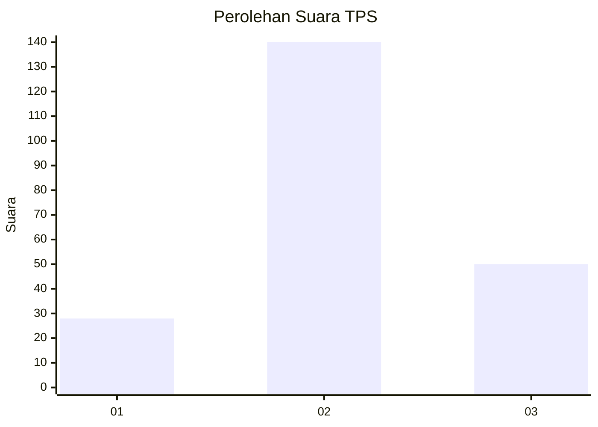
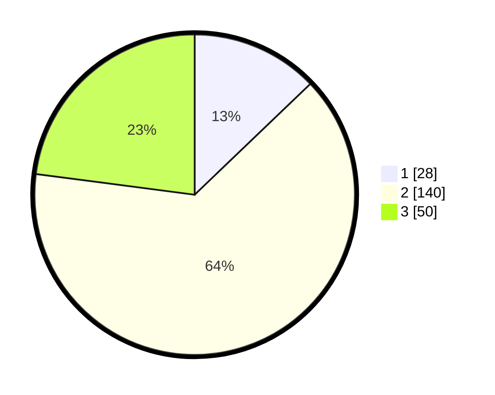

# Hasil

## Grafik

## Tabel

| No. | Nama Paslon    | Suara | Suara (raw) | Persentase |
|:--- |:-------------- | -----:| -----------:| ----------:|
| 1   | ANIES MUHAIMIN | 28    | [28][p-1]   | 12,84      |
| 2   | PRABOWO GIBRAN | 140   | [140][p-2]  | 64,22      |
| 3   | GANJAR MAHFUD  | 50    | [50][p-3]   | 22,94      |

[p-1]: https://github.com/gigit-pemilu/pemilu-2024/blob/main/pilpres/hitung-suara/sub/35-jawa-timur/sub/04-tulungagung/sub/17-bandung/sub/2006-ngunggahan/sub/001-tps/sub/paslon-1.txt
[p-2]: https://github.com/gigit-pemilu/pemilu-2024/blob/main/pilpres/hitung-suara/sub/35-jawa-timur/sub/04-tulungagung/sub/17-bandung/sub/2006-ngunggahan/sub/001-tps/sub/paslon-2.txt
[p-3]: https://github.com/gigit-pemilu/pemilu-2024/blob/main/pilpres/hitung-suara/sub/35-jawa-timur/sub/04-tulungagung/sub/17-bandung/sub/2006-ngunggahan/sub/001-tps/sub/paslon-3.txt

## Foto C Plano

https://sirekap-obj-formc.kpu.go.id/fb0b/pemilu/ppwp/35/04/17/20/06/3504172006001-20240214-221903--0ab00fc8-e759-4333-85b6-882c679389bf.jpg

https://sirekap-obj-formc.kpu.go.id/fb0b/pemilu/ppwp/35/04/17/20/06/3504172006001-20240214-221958--c77c1124-82f7-4956-89fc-07d38fde1fd3.jpg

https://sirekap-obj-formc.kpu.go.id/fb0b/pemilu/ppwp/35/04/17/20/06/3504172006001-20240214-222116--e6d872f8-deba-4fd1-a1d4-aa69097ae84a.jpg

## Metadata

| Key        | Value               |
| ---------- | ------------------- |
| Time Stamp | 2024-02-17 17:30:00 |

