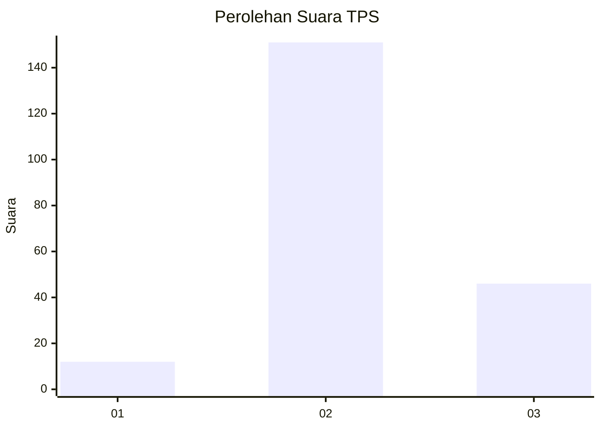
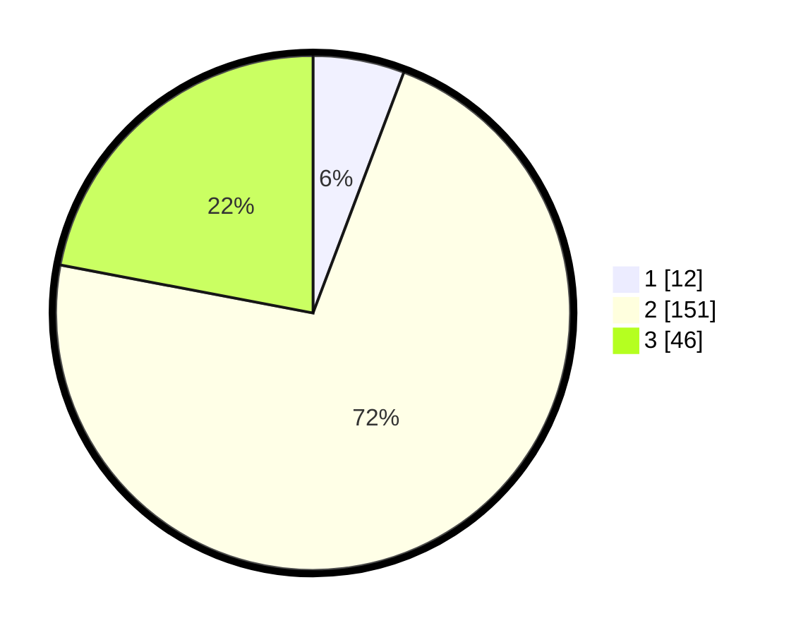

# Hasil

## Grafik

## Tabel

| No. | Nama Paslon    | Suara | Suara (raw) | Persentase |
|:--- |:-------------- | -----:| -----------:| ----------:|
| 1   | ANIES MUHAIMIN | 12    | [12][p-1]   | 5,74       |
| 2   | PRABOWO GIBRAN | 151   | [151][p-2]  | 72,25      |
| 3   | GANJAR MAHFUD  | 46    | [46][p-3]   | 22,01      |

[p-1]: https://github.com/gigit-pemilu/pemilu-2024-35-jawa-timur/blob/main/pilpres/hitung-suara/sub/35-jawa-timur/sub/04-tulungagung/sub/17-bandung/sub/2006-ngunggahan/sub/011-tps/sub/paslon-1.txt
[p-2]: https://github.com/gigit-pemilu/pemilu-2024-35-jawa-timur/blob/main/pilpres/hitung-suara/sub/35-jawa-timur/sub/04-tulungagung/sub/17-bandung/sub/2006-ngunggahan/sub/011-tps/sub/paslon-2.txt
[p-3]: https://github.com/gigit-pemilu/pemilu-2024-35-jawa-timur/blob/main/pilpres/hitung-suara/sub/35-jawa-timur/sub/04-tulungagung/sub/17-bandung/sub/2006-ngunggahan/sub/011-tps/sub/paslon-3.txt

## Foto C Plano

https://sirekap-obj-formc.kpu.go.id/bcec/pemilu/ppwp/35/04/17/20/06/3504172006011-20240215-002651--6b1ae62f-8725-4ca8-a4e2-4097cd9ea1f6.jpg

https://sirekap-obj-formc.kpu.go.id/bcec/pemilu/ppwp/35/04/17/20/06/3504172006011-20240215-014214--40a5e08e-e839-4a50-829d-1182e8721e95.jpg

https://sirekap-obj-formc.kpu.go.id/bcec/pemilu/ppwp/35/04/17/20/06/3504172006011-20240215-002840--1aa8b14b-2de9-4ee1-9444-3ae0b2281a6f.jpg

## Metadata

| Key        | Value               |
| ---------- | ------------------- |
| Time Stamp | 2024-02-17 17:30:00 |

