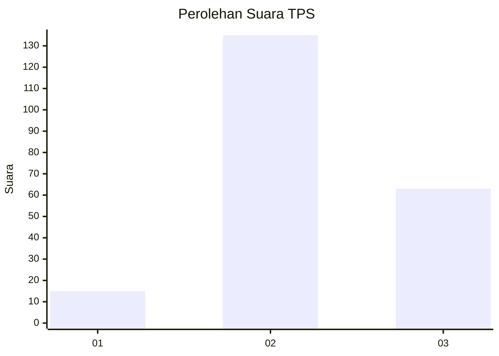
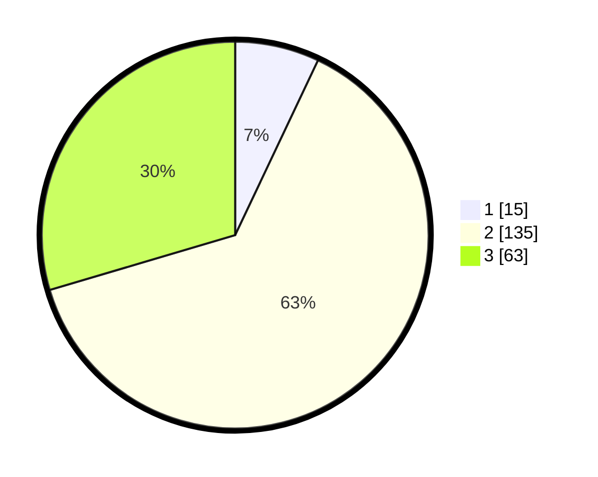

# Hasil

## Grafik

## Tabel

| No. | Nama Paslon    | Suara | Suara (raw) | Persentase |
|:--- |:-------------- | -----:| -----------:| ----------:|
| 1   | ANIES MUHAIMIN | 15    | [15][p-1]   | 7,04       |
| 2   | PRABOWO GIBRAN | 135   | [135][p-2]  | 63,38      |
| 3   | GANJAR MAHFUD  | 63    | [63][p-3]   | 29,58      |

[p-1]: https://github.com/gigit-pemilu/pemilu-2024-35-jawa-timur/blob/main/pilpres/hitung-suara/sub/35-jawa-timur/sub/04-tulungagung/sub/17-bandung/sub/2006-ngunggahan/sub/016-tps/sub/paslon-1.txt
[p-2]: https://github.com/gigit-pemilu/pemilu-2024-35-jawa-timur/blob/main/pilpres/hitung-suara/sub/35-jawa-timur/sub/04-tulungagung/sub/17-bandung/sub/2006-ngunggahan/sub/016-tps/sub/paslon-2.txt
[p-3]: https://github.com/gigit-pemilu/pemilu-2024-35-jawa-timur/blob/main/pilpres/hitung-suara/sub/35-jawa-timur/sub/04-tulungagung/sub/17-bandung/sub/2006-ngunggahan/sub/016-tps/sub/paslon-3.txt

## Foto C Plano

https://sirekap-obj-formc.kpu.go.id/bebe/pemilu/ppwp/35/04/17/20/06/3504172006016-20240214-221346--d35c3d57-6937-44e6-9523-2dd440c938b2.jpg

https://sirekap-obj-formc.kpu.go.id/bebe/pemilu/ppwp/35/04/17/20/06/3504172006016-20240214-221456--bba208cc-e2f6-49bc-8760-971e22904653.jpg

https://sirekap-obj-formc.kpu.go.id/bebe/pemilu/ppwp/35/04/17/20/06/3504172006016-20240214-205709--26d93f2d-a012-49a6-8c91-04afba2def12.jpg

## Metadata

| Key        | Value               |
| ---------- | ------------------- |
| Time Stamp | 2024-02-17 17:30:00 |

