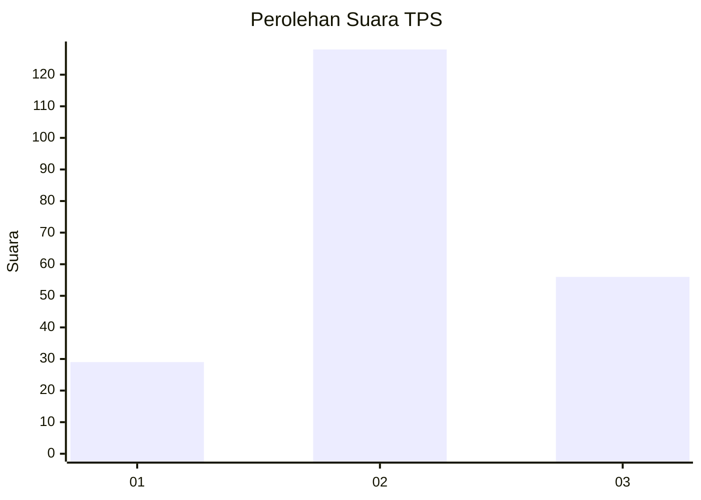
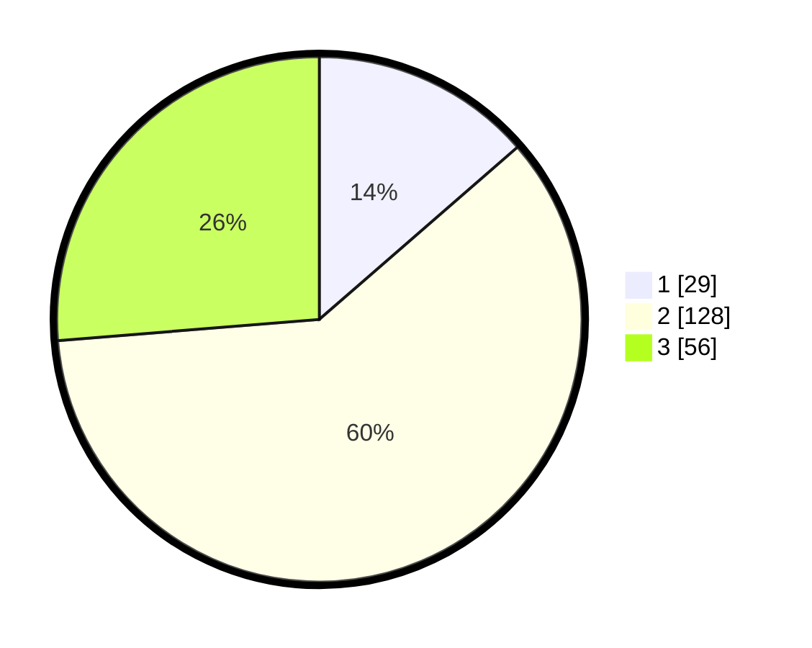

# Hasil

## Grafik

## Tabel

| No. | Nama Paslon    | Suara | Suara (raw) | Persentase |
|:--- |:-------------- | -----:| -----------:| ----------:|
| 1   | ANIES MUHAIMIN | 29    | [29][p-1]   | 13,62      |
| 2   | PRABOWO GIBRAN | 128   | [128][p-2]  | 60,09      |
| 3   | GANJAR MAHFUD  | 56    | [56][p-3]   | 26,29      |

[p-1]: https://github.com/gigit-pemilu/pemilu-2024-35-jawa-timur/blob/main/pilpres/hitung-suara/sub/35-jawa-timur/sub/04-tulungagung/sub/17-bandung/sub/2007-suruhan-kidul/sub/002-tps/sub/paslon-1.txt
[p-2]: https://github.com/gigit-pemilu/pemilu-2024-35-jawa-timur/blob/main/pilpres/hitung-suara/sub/35-jawa-timur/sub/04-tulungagung/sub/17-bandung/sub/2007-suruhan-kidul/sub/002-tps/sub/paslon-2.txt
[p-3]: https://github.com/gigit-pemilu/pemilu-2024-35-jawa-timur/blob/main/pilpres/hitung-suara/sub/35-jawa-timur/sub/04-tulungagung/sub/17-bandung/sub/2007-suruhan-kidul/sub/002-tps/sub/paslon-3.txt

## Foto C Plano

https://sirekap-obj-formc.kpu.go.id/e83e/pemilu/ppwp/35/04/17/20/07/3504172007002-20240214-235831--7759c281-8b44-4952-b2ed-78a9ad0f22b3.jpg

https://sirekap-obj-formc.kpu.go.id/e83e/pemilu/ppwp/35/04/17/20/07/3504172007002-20240215-000049--502f73b7-3f97-458b-a8d3-b9eac22dbc80.jpg

https://sirekap-obj-formc.kpu.go.id/e83e/pemilu/ppwp/35/04/17/20/07/3504172007002-20240215-000303--5fdec1d6-f412-4b39-91d3-4dea768806d7.jpg

## Metadata

| Key        | Value               |
| ---------- | ------------------- |
| Time Stamp | 2024-02-17 17:30:00 |

