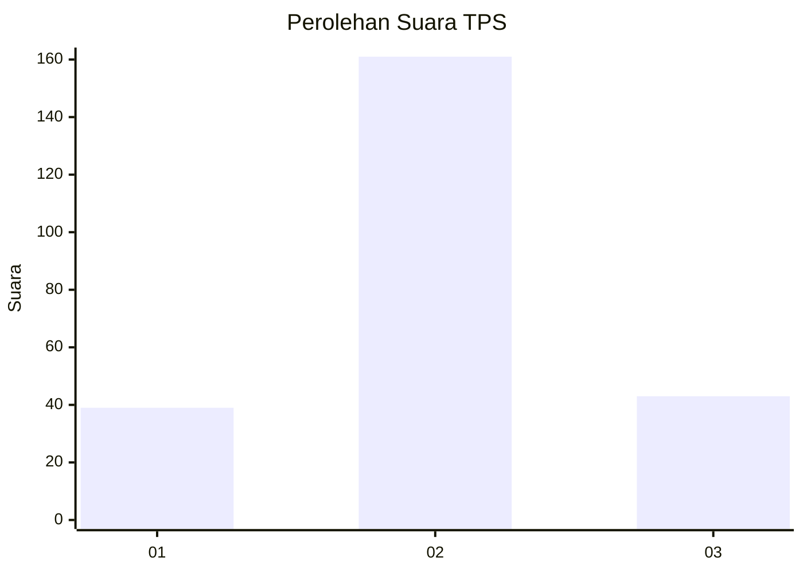
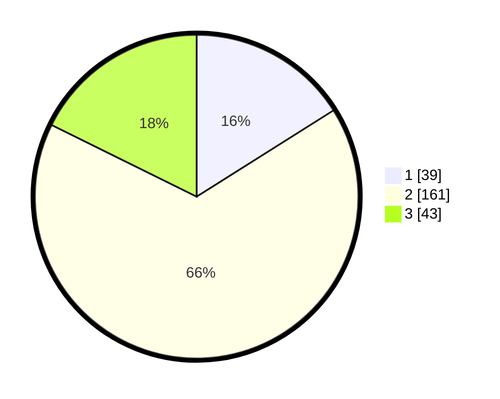

# Hasil

## Grafik

## Tabel

| No. | Nama Paslon    | Suara | Suara (raw) | Persentase |
|:--- |:-------------- | -----:| -----------:| ----------:|
| 1   | ANIES MUHAIMIN | 39    | [39][p-1]   | 16,05      |
| 2   | PRABOWO GIBRAN | 161   | [161][p-2]  | 66,26      |
| 3   | GANJAR MAHFUD  | 43    | [43][p-3]   | 17,70      |

[p-1]: https://github.com/gigit-pemilu/pemilu-2024/blob/main/pilpres/hitung-suara/sub/35-jawa-timur/sub/04-tulungagung/sub/17-bandung/sub/2007-suruhan-kidul/sub/003-tps/sub/paslon-1.txt
[p-2]: https://github.com/gigit-pemilu/pemilu-2024/blob/main/pilpres/hitung-suara/sub/35-jawa-timur/sub/04-tulungagung/sub/17-bandung/sub/2007-suruhan-kidul/sub/003-tps/sub/paslon-2.txt
[p-3]: https://github.com/gigit-pemilu/pemilu-2024/blob/main/pilpres/hitung-suara/sub/35-jawa-timur/sub/04-tulungagung/sub/17-bandung/sub/2007-suruhan-kidul/sub/003-tps/sub/paslon-3.txt

## Foto C Plano

https://sirekap-obj-formc.kpu.go.id/b9e5/pemilu/ppwp/35/04/17/20/07/3504172007003-20240215-030504--e14e3116-34cf-42af-bef7-16a6d50238be.jpg

https://sirekap-obj-formc.kpu.go.id/b9e5/pemilu/ppwp/35/04/17/20/07/3504172007003-20240215-031251--ef8ce1e6-5398-407b-920c-d3fedfe3c020.jpg

https://sirekap-obj-formc.kpu.go.id/b9e5/pemilu/ppwp/35/04/17/20/07/3504172007003-20240215-031417--4bad2575-5d06-4a97-89c3-02b4f7b36633.jpg

## Metadata

| Key        | Value               |
| ---------- | ------------------- |
| Time Stamp | 2024-02-17 17:30:00 |

