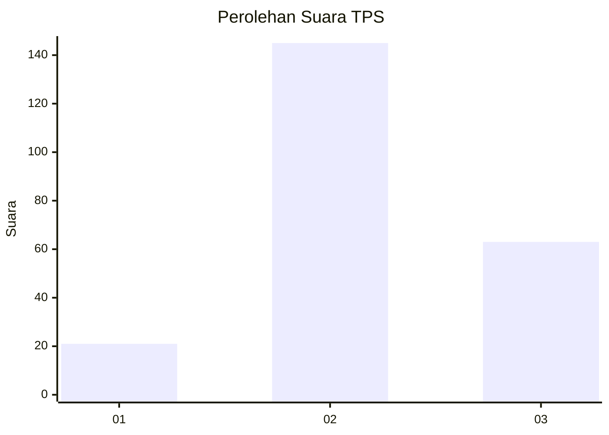
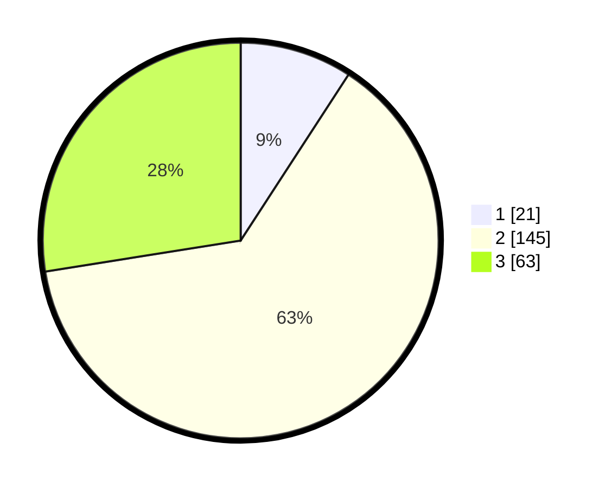

# Hasil

## Grafik

## Tabel

| No. | Nama Paslon    | Suara | Suara (raw) | Persentase |
|:--- |:-------------- | -----:| -----------:| ----------:|
| 1   | ANIES MUHAIMIN | 21    | [21][p-1]   | 9,17       |
| 2   | PRABOWO GIBRAN | 145   | [145][p-2]  | 63,32      |
| 3   | GANJAR MAHFUD  | 63    | [63][p-3]   | 27,51      |

[p-1]: https://github.com/gigit-pemilu/pemilu-2024/blob/main/pilpres/hitung-suara/sub/35-jawa-timur/sub/04-tulungagung/sub/17-bandung/sub/2008-bandung/sub/008-tps/sub/paslon-1.txt
[p-2]: https://github.com/gigit-pemilu/pemilu-2024/blob/main/pilpres/hitung-suara/sub/35-jawa-timur/sub/04-tulungagung/sub/17-bandung/sub/2008-bandung/sub/008-tps/sub/paslon-2.txt
[p-3]: https://github.com/gigit-pemilu/pemilu-2024/blob/main/pilpres/hitung-suara/sub/35-jawa-timur/sub/04-tulungagung/sub/17-bandung/sub/2008-bandung/sub/008-tps/sub/paslon-3.txt

## Foto C Plano

https://sirekap-obj-formc.kpu.go.id/c18a/pemilu/ppwp/35/04/17/20/08/3504172008008-20240217-112700--1955391c-be63-4c61-b978-d3b21b62004f.jpg

https://sirekap-obj-formc.kpu.go.id/c18a/pemilu/ppwp/35/04/17/20/08/3504172008008-20240217-113124--6f0c33b6-c5a3-4af4-a78f-f8e6379957b6.jpg

https://sirekap-obj-formc.kpu.go.id/c18a/pemilu/ppwp/35/04/17/20/08/3504172008008-20240217-112920--999cc86c-8d8b-41c9-9f37-e965416ad2ae.jpg

## Metadata

| Key        | Value               |
| ---------- | ------------------- |
| Time Stamp | 2024-02-17 17:30:00 |

