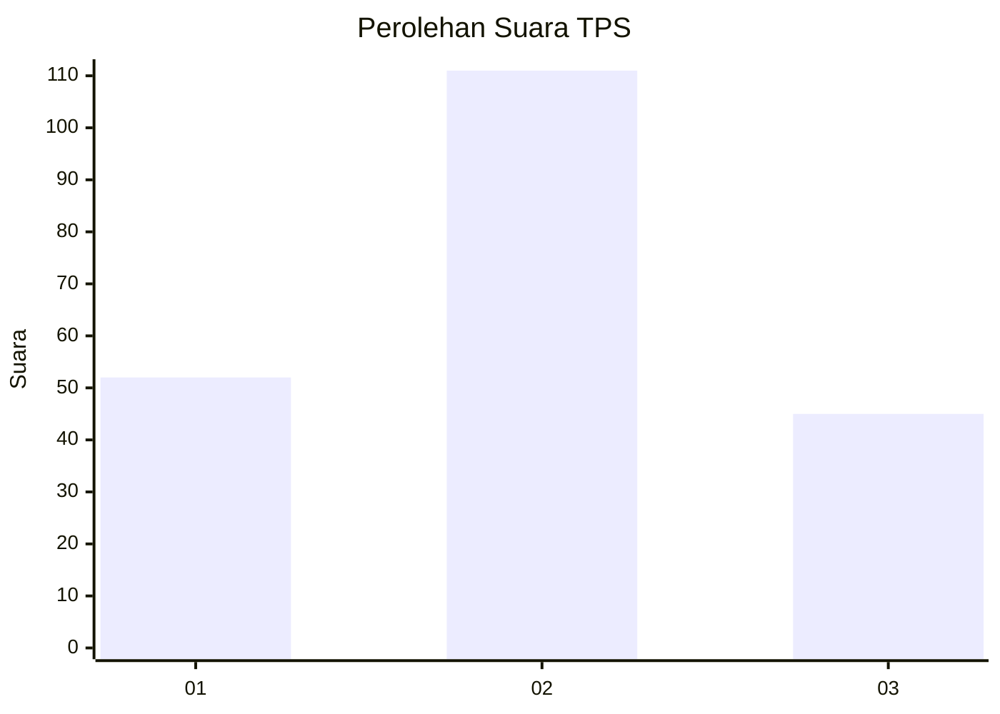
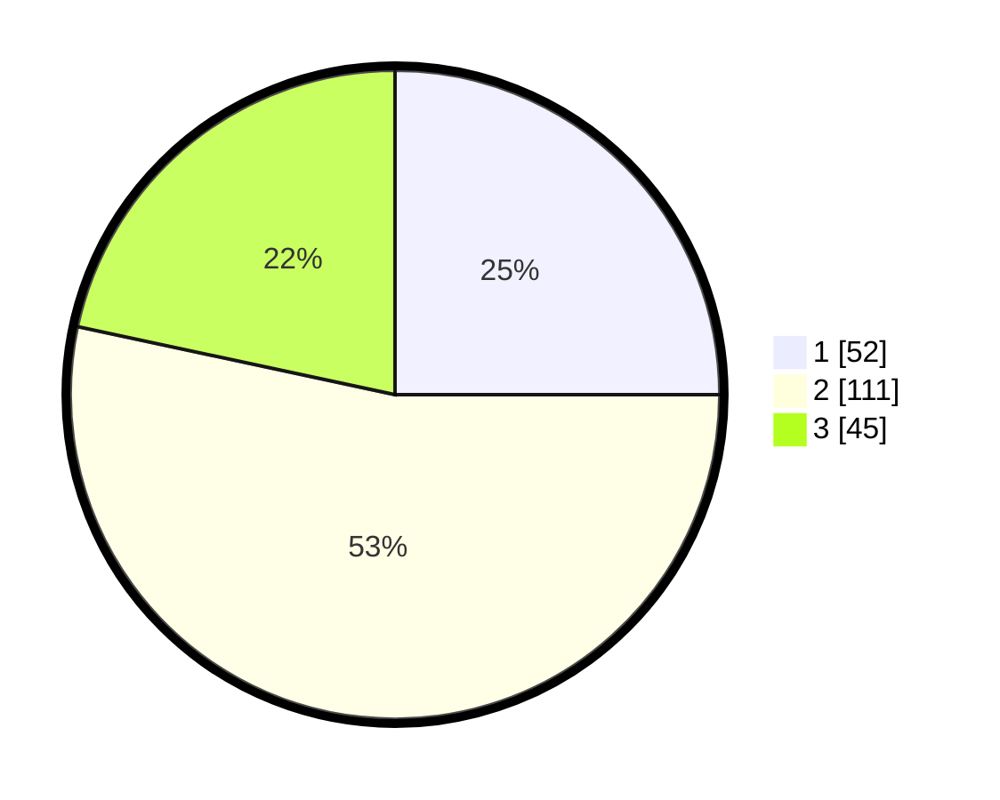

# Hasil

## Grafik

## Tabel

| No. | Nama Paslon    | Suara | Suara (raw) | Persentase |
|:--- |:-------------- | -----:| -----------:| ----------:|
| 1   | ANIES MUHAIMIN | 52    | [52][p-1]   | 25,00      |
| 2   | PRABOWO GIBRAN | 111   | [111][p-2]  | 53,37      |
| 3   | GANJAR MAHFUD  | 45    | [45][p-3]   | 21,63      |

[p-1]: https://github.com/gigit-pemilu/pemilu-2024-35-jawa-timur/blob/main/pilpres/hitung-suara/sub/35-jawa-timur/sub/04-tulungagung/sub/17-bandung/sub/2009-mergayu/sub/001-tps/sub/paslon-1.txt
[p-2]: https://github.com/gigit-pemilu/pemilu-2024-35-jawa-timur/blob/main/pilpres/hitung-suara/sub/35-jawa-timur/sub/04-tulungagung/sub/17-bandung/sub/2009-mergayu/sub/001-tps/sub/paslon-2.txt
[p-3]: https://github.com/gigit-pemilu/pemilu-2024-35-jawa-timur/blob/main/pilpres/hitung-suara/sub/35-jawa-timur/sub/04-tulungagung/sub/17-bandung/sub/2009-mergayu/sub/001-tps/sub/paslon-3.txt

## Foto C Plano

https://sirekap-obj-formc.kpu.go.id/c38d/pemilu/ppwp/35/04/17/20/09/3504172009001-20240215-045547--53fed420-c6ca-4673-9000-bf86e3f97c5d.jpg

https://sirekap-obj-formc.kpu.go.id/c38d/pemilu/ppwp/35/04/17/20/09/3504172009001-20240215-045656--f3bff29f-f354-416d-a631-eeff28bbcc7f.jpg

https://sirekap-obj-formc.kpu.go.id/c38d/pemilu/ppwp/35/04/17/20/09/3504172009001-20240215-045755--b7d08f6c-e4ad-4342-9510-49f76d041738.jpg

## Metadata

| Key        | Value               |
| ---------- | ------------------- |
| Time Stamp | 2024-02-17 17:30:00 |

