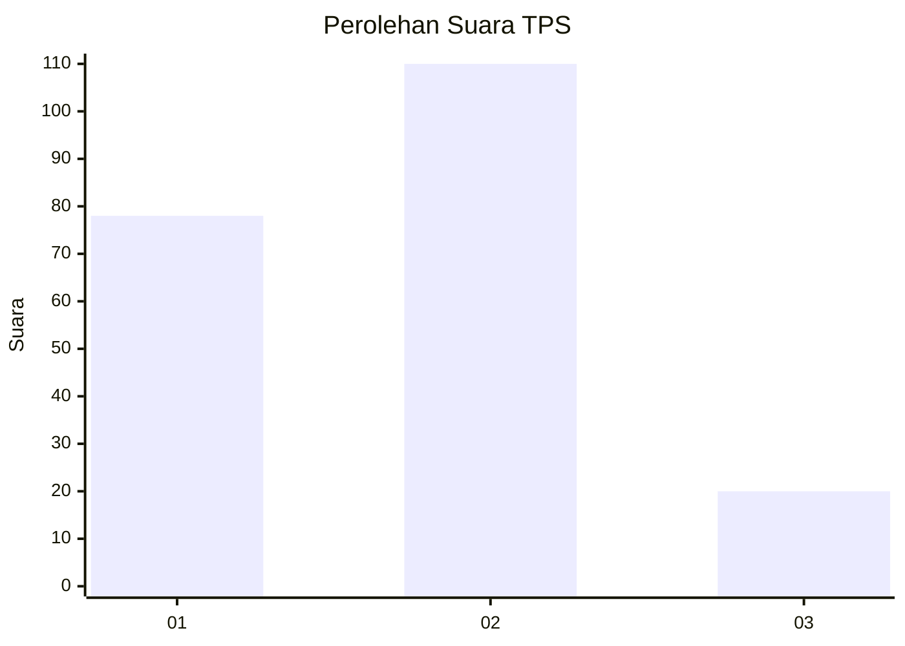
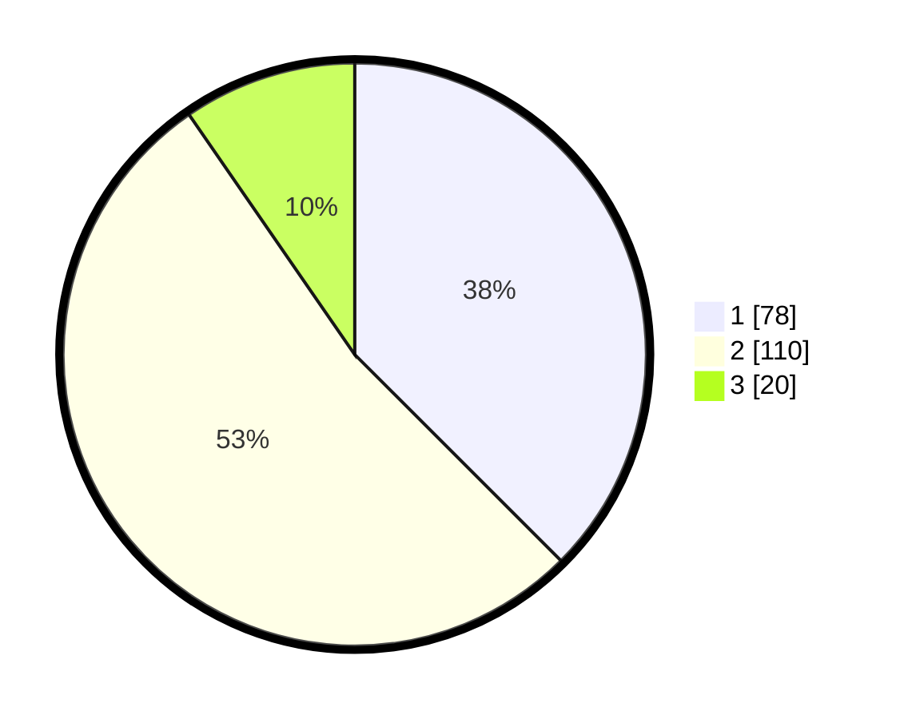

# Hasil

## Grafik

## Tabel

| No. | Nama Paslon    | Suara | Suara (raw) | Persentase |
|:--- |:-------------- | -----:| -----------:| ----------:|
| 1   | ANIES MUHAIMIN | 78    | [78][p-1]   | 37,50      |
| 2   | PRABOWO GIBRAN | 110   | [110][p-2]  | 52,88      |
| 3   | GANJAR MAHFUD  | 20    | [20][p-3]   | 9,62       |

[p-1]: https://github.com/gigit-pemilu/pemilu-2024-35-jawa-timur/blob/main/pilpres/hitung-suara/sub/35-jawa-timur/sub/04-tulungagung/sub/17-bandung/sub/2009-mergayu/sub/002-tps/sub/paslon-1.txt
[p-2]: https://github.com/gigit-pemilu/pemilu-2024-35-jawa-timur/blob/main/pilpres/hitung-suara/sub/35-jawa-timur/sub/04-tulungagung/sub/17-bandung/sub/2009-mergayu/sub/002-tps/sub/paslon-2.txt
[p-3]: https://github.com/gigit-pemilu/pemilu-2024-35-jawa-timur/blob/main/pilpres/hitung-suara/sub/35-jawa-timur/sub/04-tulungagung/sub/17-bandung/sub/2009-mergayu/sub/002-tps/sub/paslon-3.txt

## Foto C Plano

https://sirekap-obj-formc.kpu.go.id/4a68/pemilu/ppwp/35/04/17/20/09/3504172009002-20240215-045624--4fbfd5b2-e7b1-4aea-a6c4-bf78fbe3fdaa.jpg

https://sirekap-obj-formc.kpu.go.id/4a68/pemilu/ppwp/35/04/17/20/09/3504172009002-20240215-045647--8e9426e6-361f-4252-b213-859bafec13f1.jpg

https://sirekap-obj-formc.kpu.go.id/4a68/pemilu/ppwp/35/04/17/20/09/3504172009002-20240215-045713--45b640a7-8956-4543-9abe-d1d623f5e954.jpg

## Metadata

| Key        | Value               |
| ---------- | ------------------- |
| Time Stamp | 2024-02-17 17:30:00 |

