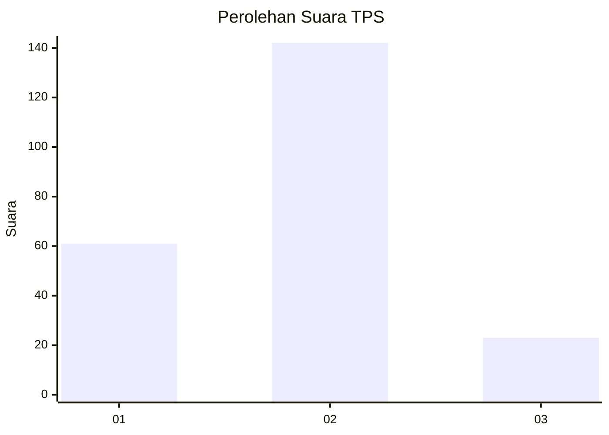
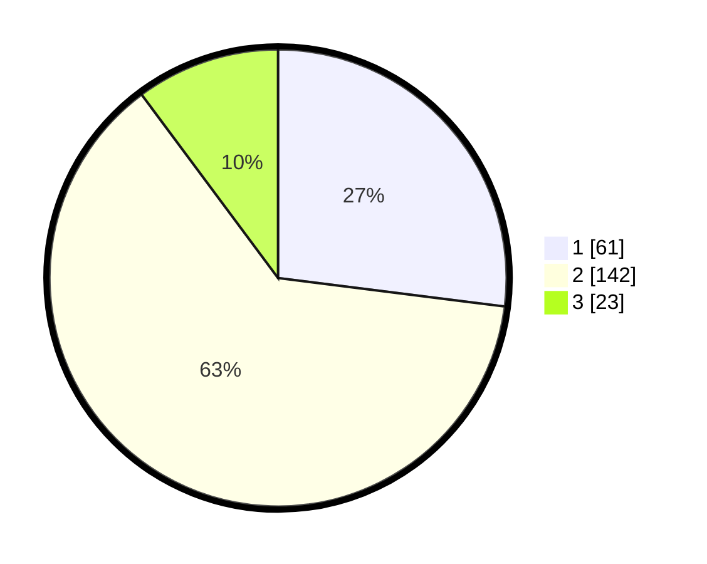

# Hasil

## Grafik

## Tabel

| No. | Nama Paslon    | Suara | Suara (raw) | Persentase |
|:--- |:-------------- | -----:| -----------:| ----------:|
| 1   | ANIES MUHAIMIN | 61    | [61][p-1]   | 26,99      |
| 2   | PRABOWO GIBRAN | 142   | [142][p-2]  | 62,83      |
| 3   | GANJAR MAHFUD  | 23    | [23][p-3]   | 10,18      |

[p-1]: https://github.com/gigit-pemilu/pemilu-2024/blob/main/pilpres/hitung-suara/sub/35-jawa-timur/sub/04-tulungagung/sub/17-bandung/sub/2009-mergayu/sub/003-tps/sub/paslon-1.txt
[p-2]: https://github.com/gigit-pemilu/pemilu-2024/blob/main/pilpres/hitung-suara/sub/35-jawa-timur/sub/04-tulungagung/sub/17-bandung/sub/2009-mergayu/sub/003-tps/sub/paslon-2.txt
[p-3]: https://github.com/gigit-pemilu/pemilu-2024/blob/main/pilpres/hitung-suara/sub/35-jawa-timur/sub/04-tulungagung/sub/17-bandung/sub/2009-mergayu/sub/003-tps/sub/paslon-3.txt

## Foto C Plano

https://sirekap-obj-formc.kpu.go.id/78ba/pemilu/ppwp/35/04/17/20/09/3504172009003-20240215-001230--0eaa15f2-7b61-4315-8f3f-d9022485ed3d.jpg

https://sirekap-obj-formc.kpu.go.id/78ba/pemilu/ppwp/35/04/17/20/09/3504172009003-20240215-001515--40d0aef0-a64b-4394-b011-527613af2596.jpg

https://sirekap-obj-formc.kpu.go.id/78ba/pemilu/ppwp/35/04/17/20/09/3504172009003-20240215-001911--da7f8d1e-e9f6-4b62-8f9b-a63a012eab96.jpg

## Metadata

| Key        | Value               |
| ---------- | ------------------- |
| Time Stamp | 2024-02-17 17:30:00 |

