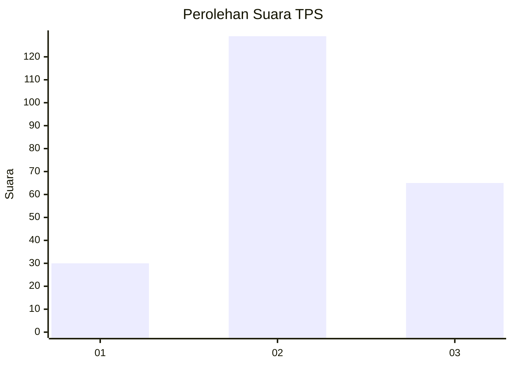
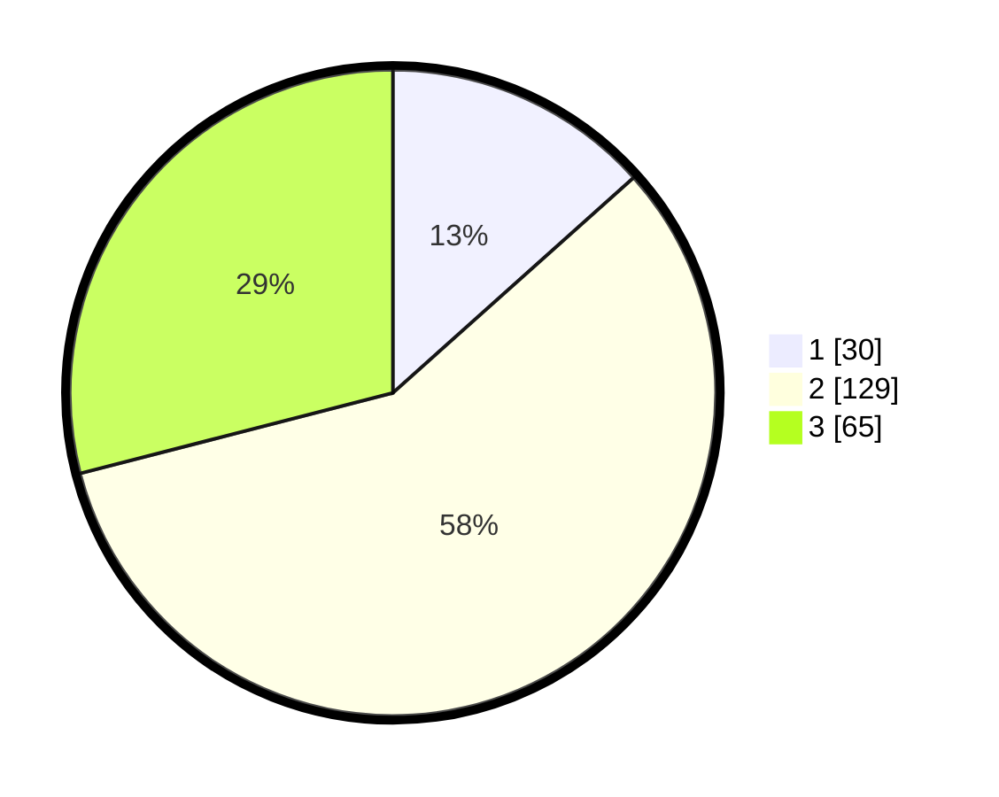

# Hasil

## Grafik

## Tabel

| No. | Nama Paslon    | Suara | Suara (raw) | Persentase |
|:--- |:-------------- | -----:| -----------:| ----------:|
| 1   | ANIES MUHAIMIN | 30    | [30][p-1]   | 13,39      |
| 2   | PRABOWO GIBRAN | 129   | [129][p-2]  | 57,59      |
| 3   | GANJAR MAHFUD  | 65    | [65][p-3]   | 29,02      |

[p-1]: https://github.com/gigit-pemilu/pemilu-2024/blob/main/pilpres/hitung-suara/sub/35-jawa-timur/sub/04-tulungagung/sub/17-bandung/sub/2009-mergayu/sub/006-tps/sub/paslon-1.txt
[p-2]: https://github.com/gigit-pemilu/pemilu-2024/blob/main/pilpres/hitung-suara/sub/35-jawa-timur/sub/04-tulungagung/sub/17-bandung/sub/2009-mergayu/sub/006-tps/sub/paslon-2.txt
[p-3]: https://github.com/gigit-pemilu/pemilu-2024/blob/main/pilpres/hitung-suara/sub/35-jawa-timur/sub/04-tulungagung/sub/17-bandung/sub/2009-mergayu/sub/006-tps/sub/paslon-3.txt

## Foto C Plano

https://sirekap-obj-formc.kpu.go.id/62a0/pemilu/ppwp/35/04/17/20/09/3504172009006-20240215-000751--adb19800-9de0-424d-b1a0-b8d7d9dd81c0.jpg

https://sirekap-obj-formc.kpu.go.id/62a0/pemilu/ppwp/35/04/17/20/09/3504172009006-20240215-000942--75093b6c-8c64-4e3b-a272-4b9a500e7de9.jpg

https://sirekap-obj-formc.kpu.go.id/62a0/pemilu/ppwp/35/04/17/20/09/3504172009006-20240215-001236--2eee1946-8901-4ed4-b541-258be566d388.jpg

## Metadata

| Key        | Value               |
| ---------- | ------------------- |
| Time Stamp | 2024-02-17 17:30:00 |

