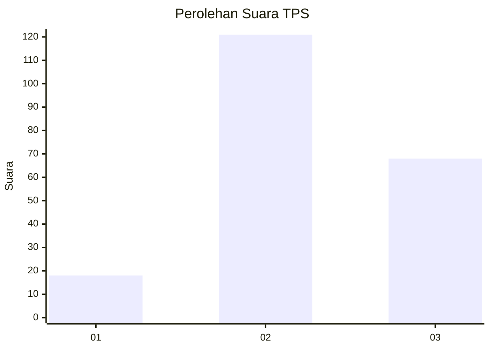
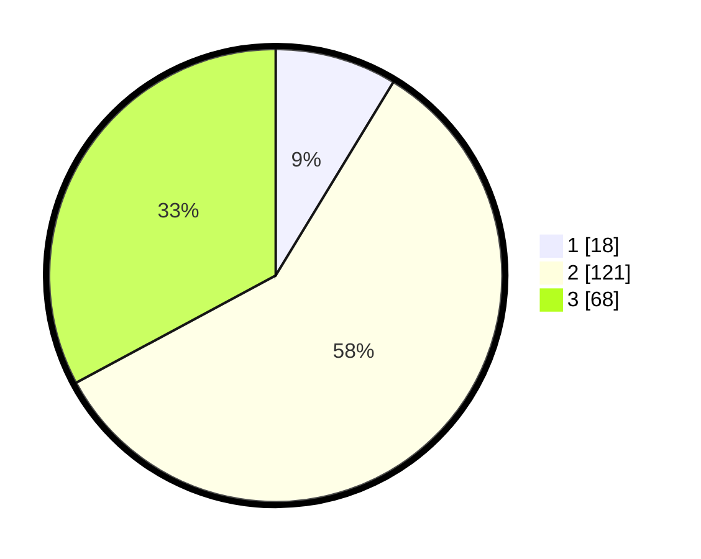

# Hasil

## Grafik

## Tabel

| No. | Nama Paslon    | Suara | Suara (raw) | Persentase |
|:--- |:-------------- | -----:| -----------:| ----------:|
| 1   | ANIES MUHAIMIN | 18    | [18][p-1]   | 8,70       |
| 2   | PRABOWO GIBRAN | 121   | [121][p-2]  | 58,45      |
| 3   | GANJAR MAHFUD  | 68    | [68][p-3]   | 32,85      |

[p-1]: https://github.com/gigit-pemilu/pemilu-2024-35-jawa-timur/blob/main/pilpres/hitung-suara/sub/35-jawa-timur/sub/04-tulungagung/sub/17-bandung/sub/2010-sebalor/sub/001-tps/sub/paslon-1.txt
[p-2]: https://github.com/gigit-pemilu/pemilu-2024-35-jawa-timur/blob/main/pilpres/hitung-suara/sub/35-jawa-timur/sub/04-tulungagung/sub/17-bandung/sub/2010-sebalor/sub/001-tps/sub/paslon-2.txt
[p-3]: https://github.com/gigit-pemilu/pemilu-2024-35-jawa-timur/blob/main/pilpres/hitung-suara/sub/35-jawa-timur/sub/04-tulungagung/sub/17-bandung/sub/2010-sebalor/sub/001-tps/sub/paslon-3.txt

## Foto C Plano

https://sirekap-obj-formc.kpu.go.id/7a8d/pemilu/ppwp/35/04/17/20/10/3504172010001-20240214-233512--43cdc4b3-4034-47f7-9fc0-d6653445a73f.jpg

https://sirekap-obj-formc.kpu.go.id/7a8d/pemilu/ppwp/35/04/17/20/10/3504172010001-20240214-233601--79b8e565-e05a-4ad0-bad4-04817d67d804.jpg

https://sirekap-obj-formc.kpu.go.id/7a8d/pemilu/ppwp/35/04/17/20/10/3504172010001-20240214-233633--f06bc27c-86fc-4467-b3f9-4a048f984bab.jpg

## Metadata

| Key        | Value               |
| ---------- | ------------------- |
| Time Stamp | 2024-02-17 17:30:00 |

