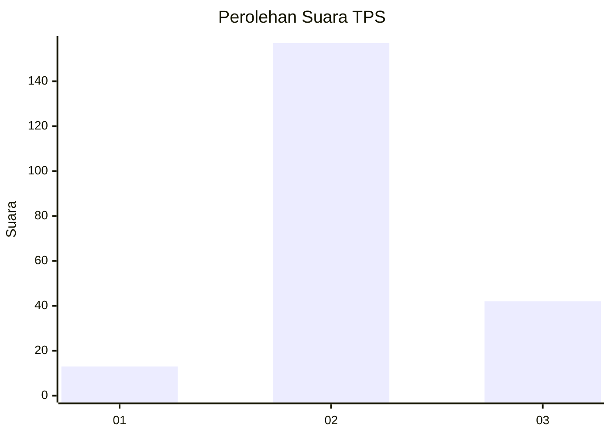

# Hasil

## Grafik

## Tabel

| No. | Nama Paslon    | Suara | Suara (raw) | Persentase |
|:--- |:-------------- | -----:| -----------:| ----------:|
| 1   | ANIES MUHAIMIN | 13    | [13][p-1]   | 6,13       |
| 2   | PRABOWO GIBRAN | 157   | [157][p-2]  | 74,06      |
| 3   | GANJAR MAHFUD  | 42    | [42][p-3]   | 19,81      |

[p-1]: https://github.com/gigit-pemilu/pemilu-2024-35-jawa-timur/blob/main/pilpres/hitung-suara/sub/35-jawa-timur/sub/04-tulungagung/sub/17-bandung/sub/2010-sebalor/sub/005-tps/sub/paslon-1.txt
[p-2]: https://github.com/gigit-pemilu/pemilu-2024-35-jawa-timur/blob/main/pilpres/hitung-suara/sub/35-jawa-timur/sub/04-tulungagung/sub/17-bandung/sub/2010-sebalor/sub/005-tps/sub/paslon-2.txt
[p-3]: https://github.com/gigit-pemilu/pemilu-2024-35-jawa-timur/blob/main/pilpres/hitung-suara/sub/35-jawa-timur/sub/04-tulungagung/sub/17-bandung/sub/2010-sebalor/sub/005-tps/sub/paslon-3.txt

## Foto C Plano

https://sirekap-obj-formc.kpu.go.id/e415/pemilu/ppwp/35/04/17/20/10/3504172010005-20240215-004043--9367c1c5-d7d1-48fc-8904-4bd9d5218da6.jpg

https://sirekap-obj-formc.kpu.go.id/e415/pemilu/ppwp/35/04/17/20/10/3504172010005-20240215-004136--eff9e2e9-b270-4d62-9b94-6f0eea1086d5.jpg

https://sirekap-obj-formc.kpu.go.id/e415/pemilu/ppwp/35/04/17/20/10/3504172010005-20240215-004216--8edde4a4-de60-402c-8afd-bd540ed251a8.jpg

## Metadata

| Key        | Value               |
| ---------- | ------------------- |
| Time Stamp | 2024-02-17 17:30:00 |

