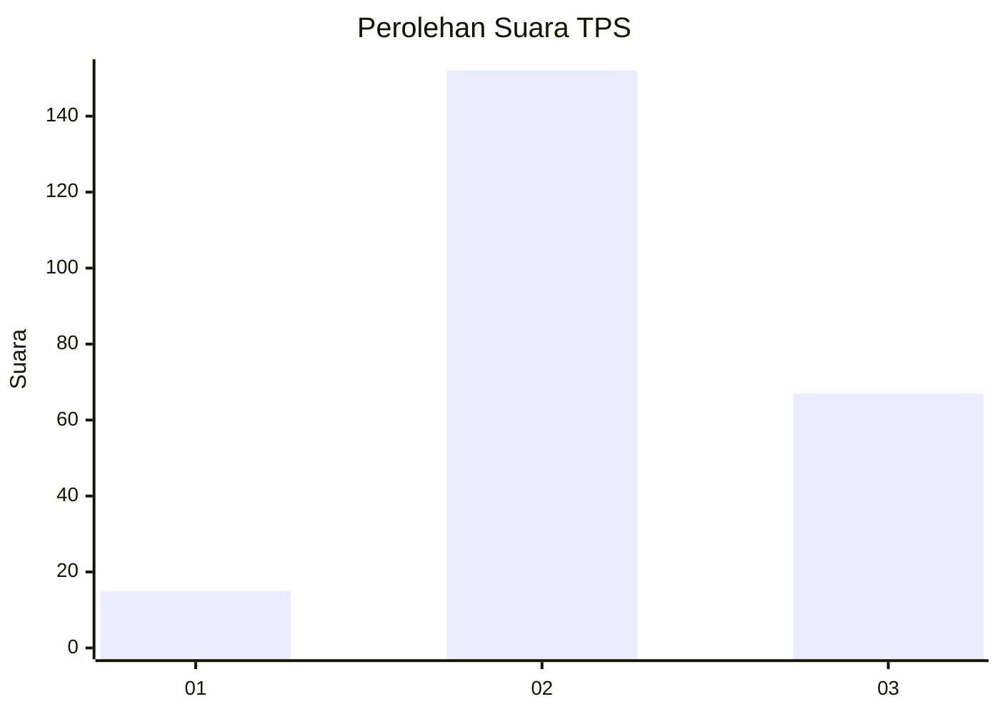
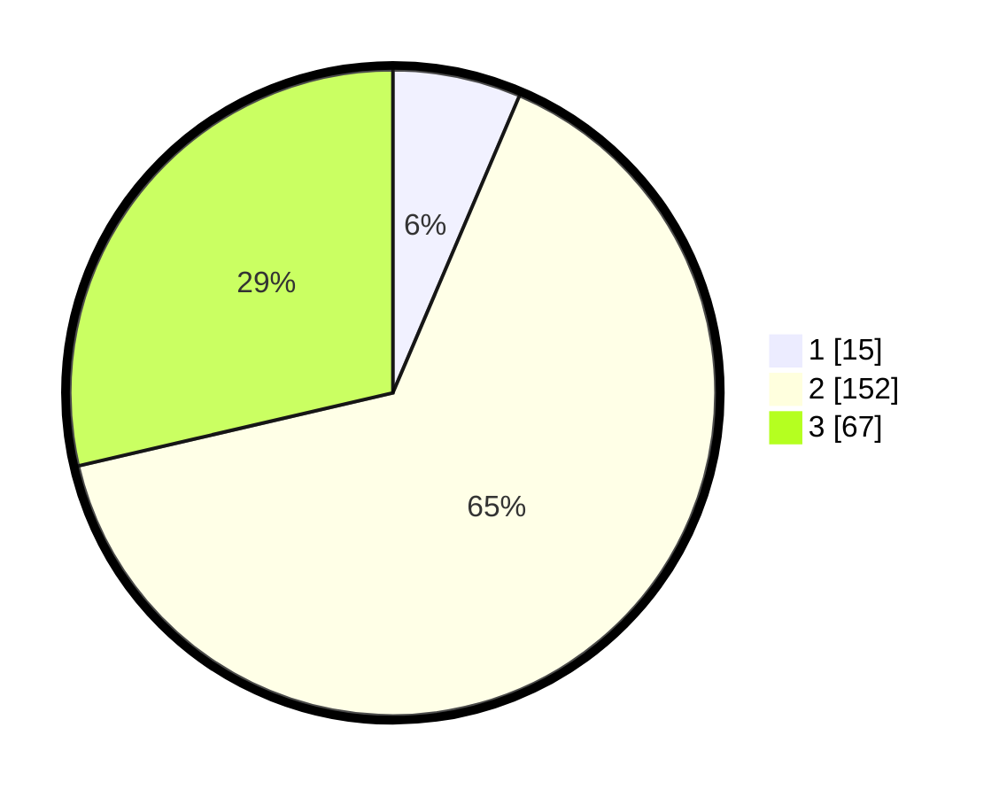

# Hasil

## Grafik

## Tabel

| No. | Nama Paslon    | Suara | Suara (raw) | Persentase |
|:--- |:-------------- | -----:| -----------:| ----------:|
| 1   | ANIES MUHAIMIN | 15    | [15][p-1]   | 6,41       |
| 2   | PRABOWO GIBRAN | 152   | [152][p-2]  | 64,96      |
| 3   | GANJAR MAHFUD  | 67    | [67][p-3]   | 28,63      |

[p-1]: https://github.com/gigit-pemilu/pemilu-2024/blob/main/pilpres/hitung-suara/sub/35-jawa-timur/sub/04-tulungagung/sub/17-bandung/sub/2010-sebalor/sub/006-tps/sub/paslon-1.txt
[p-2]: https://github.com/gigit-pemilu/pemilu-2024/blob/main/pilpres/hitung-suara/sub/35-jawa-timur/sub/04-tulungagung/sub/17-bandung/sub/2010-sebalor/sub/006-tps/sub/paslon-2.txt
[p-3]: https://github.com/gigit-pemilu/pemilu-2024/blob/main/pilpres/hitung-suara/sub/35-jawa-timur/sub/04-tulungagung/sub/17-bandung/sub/2010-sebalor/sub/006-tps/sub/paslon-3.txt

## Foto C Plano

https://sirekap-obj-formc.kpu.go.id/a042/pemilu/ppwp/35/04/17/20/10/3504172010006-20240215-003503--1fb1c9b9-40fa-45bb-99a2-fa71cadc057b.jpg

https://sirekap-obj-formc.kpu.go.id/a042/pemilu/ppwp/35/04/17/20/10/3504172010006-20240215-003612--813d056b-4bfe-4d51-9edd-9a64df16c882.jpg

https://sirekap-obj-formc.kpu.go.id/a042/pemilu/ppwp/35/04/17/20/10/3504172010006-20240215-003721--0d7c049a-8a14-41fc-8c85-accbfa7077c4.jpg

## Metadata

| Key        | Value               |
| ---------- | ------------------- |
| Time Stamp | 2024-02-17 17:30:00 |

