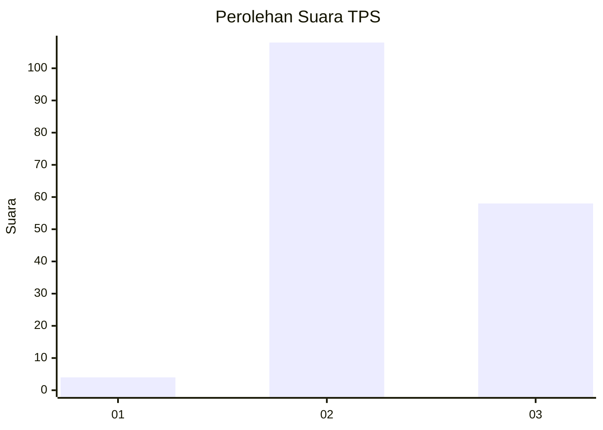
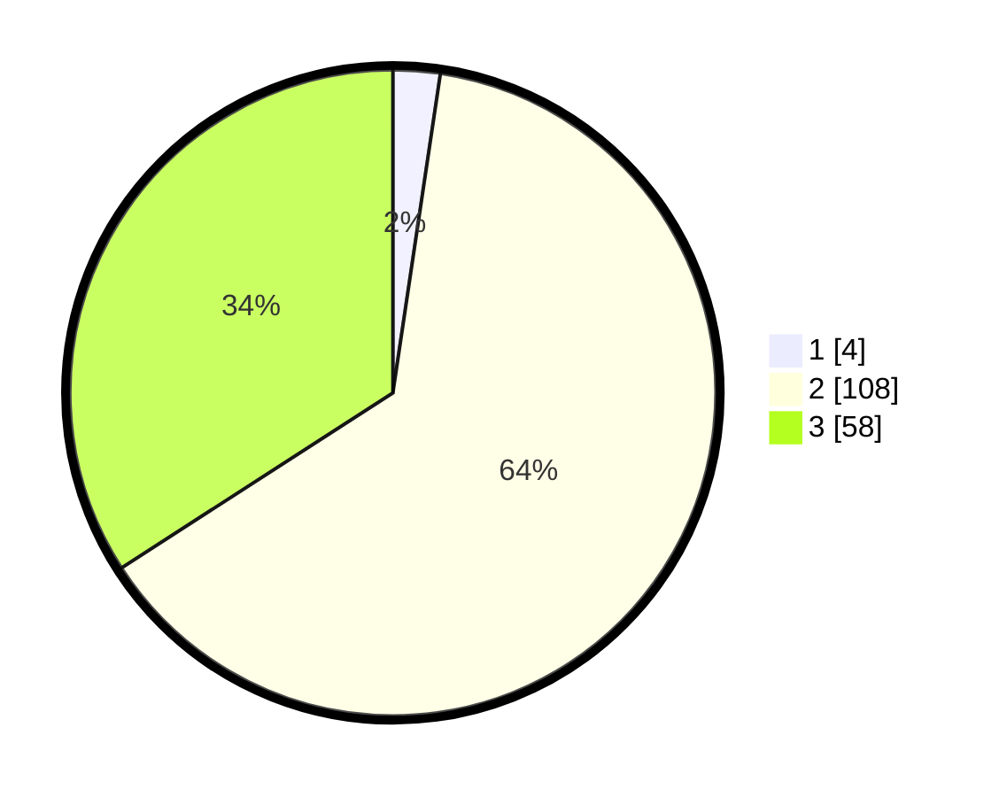

# Hasil

## Grafik

## Tabel

| No. | Nama Paslon    | Suara | Suara (raw) | Persentase |
|:--- |:-------------- | -----:| -----------:| ----------:|
| 1   | ANIES MUHAIMIN | 4     | [4][p-1]    | 2,35       |
| 2   | PRABOWO GIBRAN | 108   | [108][p-2]  | 63,53      |
| 3   | GANJAR MAHFUD  | 58    | [58][p-3]   | 34,12      |

[p-1]: https://github.com/gigit-pemilu/pemilu-2024-35-jawa-timur/blob/main/pilpres/hitung-suara/sub/35-jawa-timur/sub/04-tulungagung/sub/17-bandung/sub/2010-sebalor/sub/007-tps/sub/paslon-1.txt
[p-2]: https://github.com/gigit-pemilu/pemilu-2024-35-jawa-timur/blob/main/pilpres/hitung-suara/sub/35-jawa-timur/sub/04-tulungagung/sub/17-bandung/sub/2010-sebalor/sub/007-tps/sub/paslon-2.txt
[p-3]: https://github.com/gigit-pemilu/pemilu-2024-35-jawa-timur/blob/main/pilpres/hitung-suara/sub/35-jawa-timur/sub/04-tulungagung/sub/17-bandung/sub/2010-sebalor/sub/007-tps/sub/paslon-3.txt

## Foto C Plano

https://sirekap-obj-formc.kpu.go.id/4797/pemilu/ppwp/35/04/17/20/10/3504172010007-20240214-232514--11c4ce14-d1ac-4321-946b-966208fea73c.jpg

https://sirekap-obj-formc.kpu.go.id/4797/pemilu/ppwp/35/04/17/20/10/3504172010007-20240215-001210--c9011233-4791-4066-917a-8a1ba1d24d33.jpg

https://sirekap-obj-formc.kpu.go.id/4797/pemilu/ppwp/35/04/17/20/10/3504172010007-20240215-001330--813ee555-84f4-4a21-8bb2-c8e3b90c41ce.jpg

## Metadata

| Key        | Value               |
| ---------- | ------------------- |
| Time Stamp | 2024-02-17 17:30:00 |

