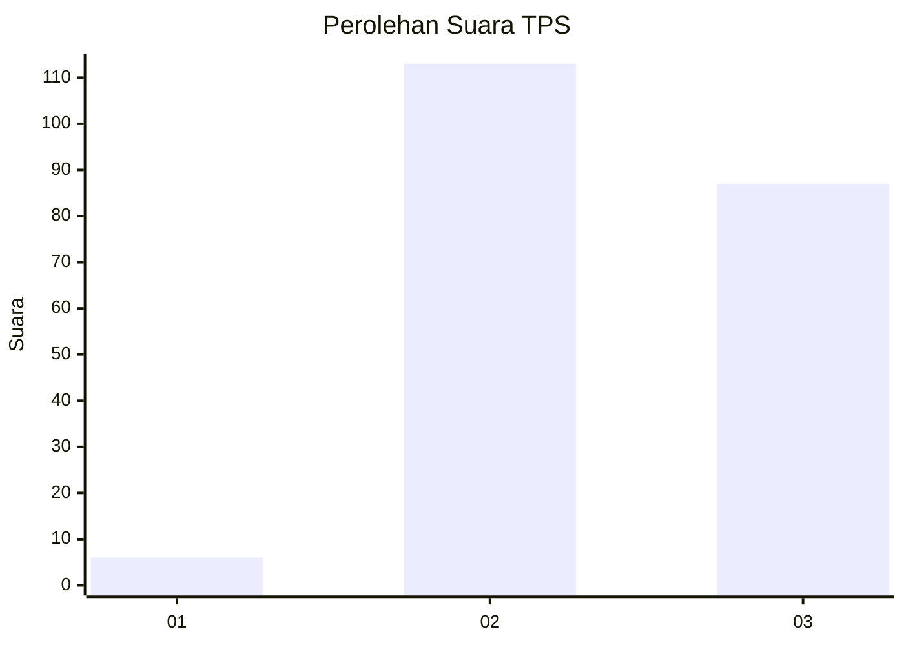
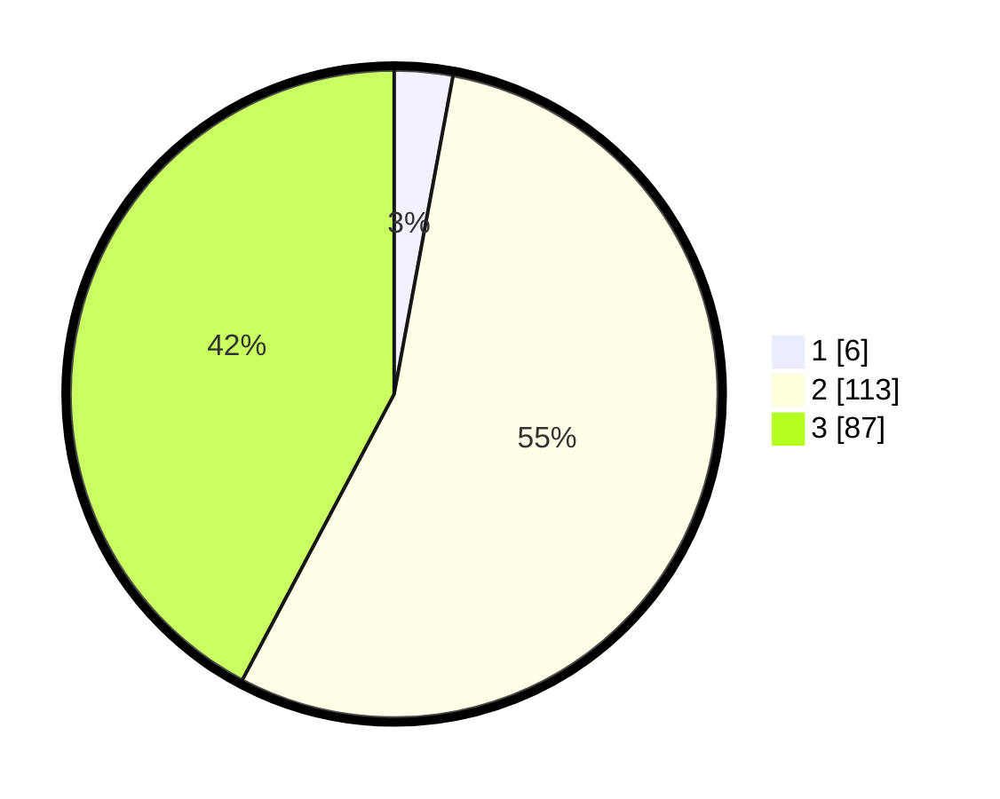

# Hasil

## Grafik

## Tabel

| No. | Nama Paslon    | Suara | Suara (raw) | Persentase |
|:--- |:-------------- | -----:| -----------:| ----------:|
| 1   | ANIES MUHAIMIN | 6     | [6][p-1]    | 2,91       |
| 2   | PRABOWO GIBRAN | 113   | [113][p-2]  | 54,85      |
| 3   | GANJAR MAHFUD  | 87    | [87][p-3]   | 42,23      |

[p-1]: https://github.com/gigit-pemilu/pemilu-2024-35-jawa-timur/blob/main/pilpres/hitung-suara/sub/35-jawa-timur/sub/04-tulungagung/sub/17-bandung/sub/2011-sukoharjo/sub/001-tps/sub/paslon-1.txt
[p-2]: https://github.com/gigit-pemilu/pemilu-2024-35-jawa-timur/blob/main/pilpres/hitung-suara/sub/35-jawa-timur/sub/04-tulungagung/sub/17-bandung/sub/2011-sukoharjo/sub/001-tps/sub/paslon-2.txt
[p-3]: https://github.com/gigit-pemilu/pemilu-2024-35-jawa-timur/blob/main/pilpres/hitung-suara/sub/35-jawa-timur/sub/04-tulungagung/sub/17-bandung/sub/2011-sukoharjo/sub/001-tps/sub/paslon-3.txt

## Foto C Plano

https://sirekap-obj-formc.kpu.go.id/6311/pemilu/ppwp/35/04/17/20/11/3504172011001-20240214-205507--4fb91988-b7a5-49bb-9f3d-6239cc4e1d1f.jpg

https://sirekap-obj-formc.kpu.go.id/6311/pemilu/ppwp/35/04/17/20/11/3504172011001-20240214-205628--002e905d-bc3f-4ebb-93e8-87ac89903775.jpg

https://sirekap-obj-formc.kpu.go.id/6311/pemilu/ppwp/35/04/17/20/11/3504172011001-20240214-205743--4cf70fee-eaf0-4c56-b9a6-f592182e9faf.jpg

## Metadata

| Key        | Value               |
| ---------- | ------------------- |
| Time Stamp | 2024-02-15 15:00:29 |

