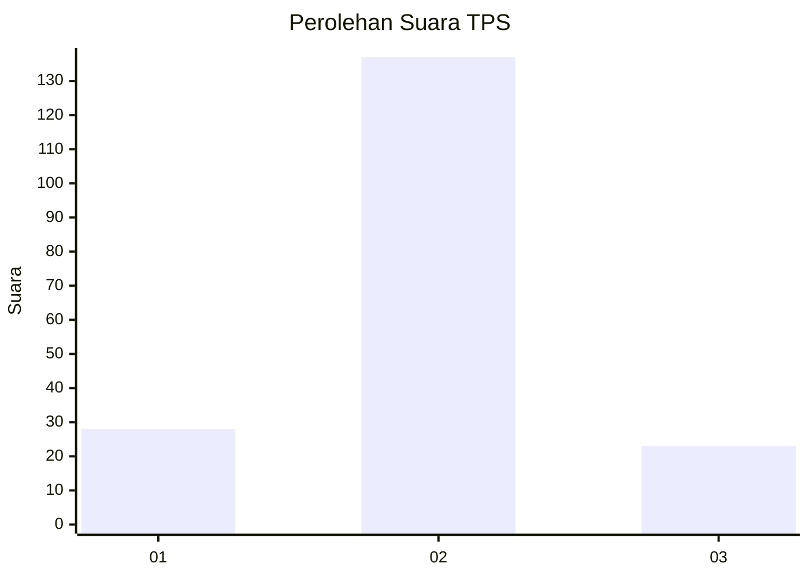
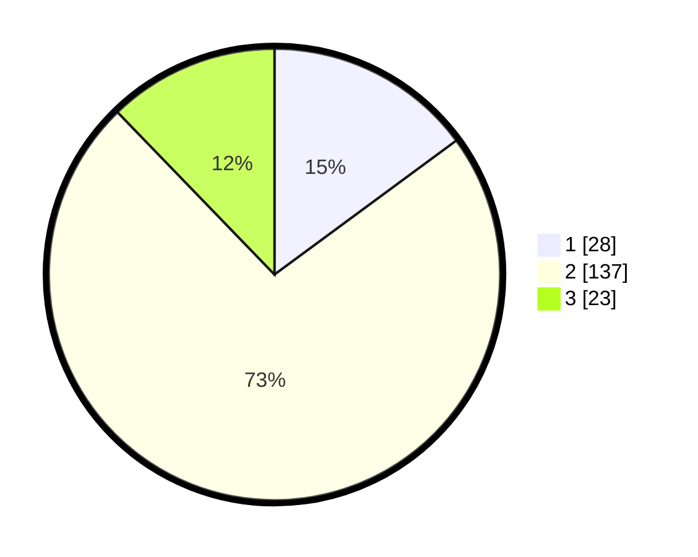

# Hasil

## Grafik

## Tabel

| No. | Nama Paslon    | Suara | Suara (raw) | Persentase |
|:--- |:-------------- | -----:| -----------:| ----------:|
| 1   | ANIES MUHAIMIN | 28    | [28][p-1]   | 14,89      |
| 2   | PRABOWO GIBRAN | 137   | [137][p-2]  | 72,87      |
| 3   | GANJAR MAHFUD  | 23    | [23][p-3]   | 12,23      |

[p-1]: https://github.com/gigit-pemilu/pemilu-2024/blob/main/pilpres/hitung-suara/sub/35-jawa-timur/sub/04-tulungagung/sub/17-bandung/sub/2011-sukoharjo/sub/002-tps/sub/paslon-1.txt
[p-2]: https://github.com/gigit-pemilu/pemilu-2024/blob/main/pilpres/hitung-suara/sub/35-jawa-timur/sub/04-tulungagung/sub/17-bandung/sub/2011-sukoharjo/sub/002-tps/sub/paslon-2.txt
[p-3]: https://github.com/gigit-pemilu/pemilu-2024/blob/main/pilpres/hitung-suara/sub/35-jawa-timur/sub/04-tulungagung/sub/17-bandung/sub/2011-sukoharjo/sub/002-tps/sub/paslon-3.txt

## Foto C Plano

https://sirekap-obj-formc.kpu.go.id/d238/pemilu/ppwp/35/04/17/20/11/3504172011002-20240214-233137--b29a868a-3812-4bfa-891b-84771c6c28c8.jpg

https://sirekap-obj-formc.kpu.go.id/d238/pemilu/ppwp/35/04/17/20/11/3504172011002-20240214-233459--223bb9e8-3860-48aa-9bc1-3ecd7fc808c5.jpg

https://sirekap-obj-formc.kpu.go.id/d238/pemilu/ppwp/35/04/17/20/11/3504172011002-20240214-233627--5acc2b7f-3902-4b95-ad51-2daf0bc6a2d5.jpg

## Metadata

| Key        | Value               |
| ---------- | ------------------- |
| Time Stamp | 2024-02-17 17:30:00 |

