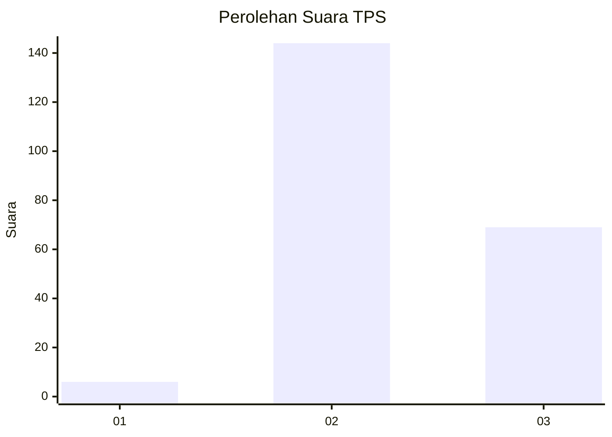
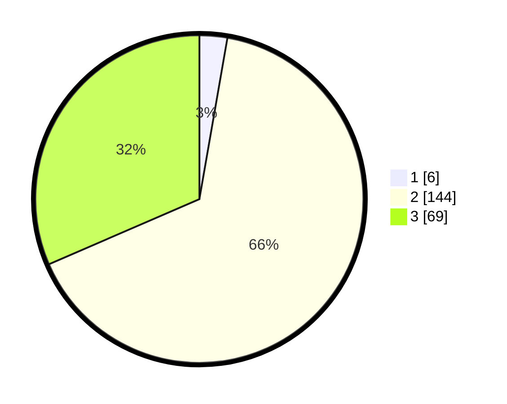

# Hasil

## Grafik

## Tabel

| No. | Nama Paslon    | Suara | Suara (raw) | Persentase |
|:--- |:-------------- | -----:| -----------:| ----------:|
| 1   | ANIES MUHAIMIN | 6     | [6][p-1]    | 2,74       |
| 2   | PRABOWO GIBRAN | 144   | [144][p-2]  | 65,75      |
| 3   | GANJAR MAHFUD  | 69    | [69][p-3]   | 31,51      |

[p-1]: https://github.com/gigit-pemilu/pemilu-2024-35-jawa-timur/blob/main/pilpres/hitung-suara/sub/35-jawa-timur/sub/04-tulungagung/sub/17-bandung/sub/2011-sukoharjo/sub/003-tps/sub/paslon-1.txt
[p-2]: https://github.com/gigit-pemilu/pemilu-2024-35-jawa-timur/blob/main/pilpres/hitung-suara/sub/35-jawa-timur/sub/04-tulungagung/sub/17-bandung/sub/2011-sukoharjo/sub/003-tps/sub/paslon-2.txt
[p-3]: https://github.com/gigit-pemilu/pemilu-2024-35-jawa-timur/blob/main/pilpres/hitung-suara/sub/35-jawa-timur/sub/04-tulungagung/sub/17-bandung/sub/2011-sukoharjo/sub/003-tps/sub/paslon-3.txt

## Foto C Plano

https://sirekap-obj-formc.kpu.go.id/478b/pemilu/ppwp/35/04/17/20/11/3504172011003-20240214-222834--48e4afe4-e70b-4878-8451-9d9672fdb8e0.jpg

https://sirekap-obj-formc.kpu.go.id/478b/pemilu/ppwp/35/04/17/20/11/3504172011003-20240214-222928--621d4b6e-02c4-4511-9ba8-038b4a437b7c.jpg

https://sirekap-obj-formc.kpu.go.id/478b/pemilu/ppwp/35/04/17/20/11/3504172011003-20240214-223016--9fe888d3-a9ee-43cd-8806-453e3b6a76cd.jpg

## Metadata

| Key        | Value               |
| ---------- | ------------------- |
| Time Stamp | 2024-02-17 17:30:00 |

