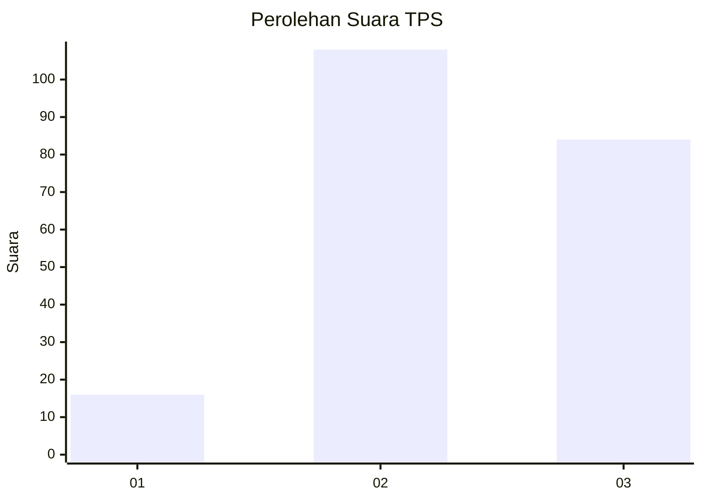
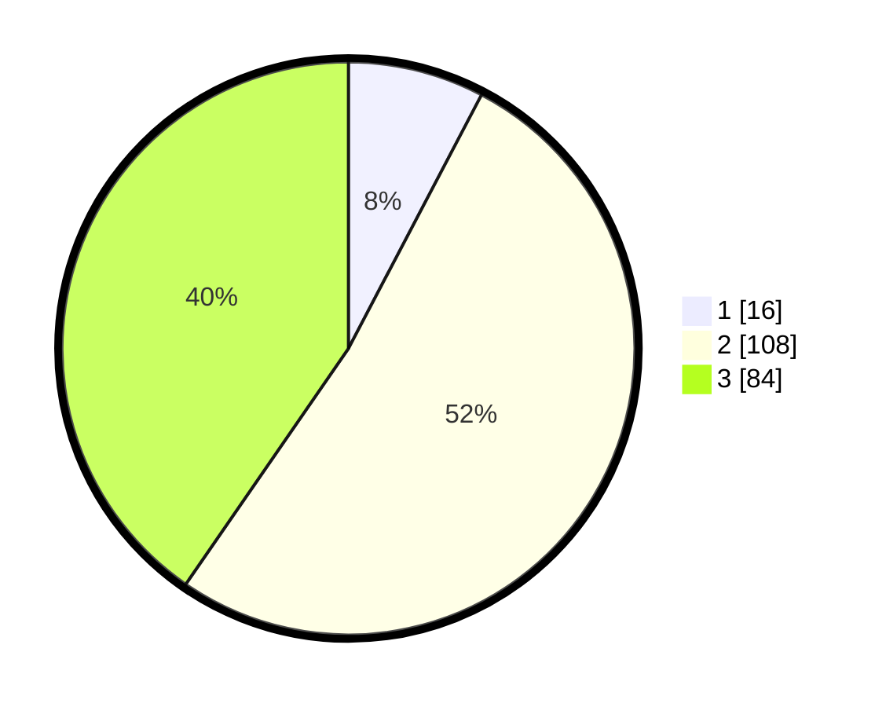

# Hasil

## Grafik

## Tabel

| No. | Nama Paslon    | Suara | Suara (raw) | Persentase |
|:--- |:-------------- | -----:| -----------:| ----------:|
| 1   | ANIES MUHAIMIN | 16    | [16][p-1]   | 7,69       |
| 2   | PRABOWO GIBRAN | 108   | [108][p-2]  | 51,92      |
| 3   | GANJAR MAHFUD  | 84    | [84][p-3]   | 40,38      |

[p-1]: https://github.com/gigit-pemilu/pemilu-2024/blob/main/pilpres/hitung-suara/sub/35-jawa-timur/sub/04-tulungagung/sub/17-bandung/sub/2014-ngepeh/sub/001-tps/sub/paslon-1.txt
[p-2]: https://github.com/gigit-pemilu/pemilu-2024/blob/main/pilpres/hitung-suara/sub/35-jawa-timur/sub/04-tulungagung/sub/17-bandung/sub/2014-ngepeh/sub/001-tps/sub/paslon-2.txt
[p-3]: https://github.com/gigit-pemilu/pemilu-2024/blob/main/pilpres/hitung-suara/sub/35-jawa-timur/sub/04-tulungagung/sub/17-bandung/sub/2014-ngepeh/sub/001-tps/sub/paslon-3.txt

## Foto C Plano

https://sirekap-obj-formc.kpu.go.id/1252/pemilu/ppwp/35/04/17/20/14/3504172014001-20240214-223104--03750063-f132-4f7e-917b-1124d0dec1a6.jpg

https://sirekap-obj-formc.kpu.go.id/1252/pemilu/ppwp/35/04/17/20/14/3504172014001-20240214-223544--bb8c9ec7-6125-48da-880b-b31d5781cc19.jpg

https://sirekap-obj-formc.kpu.go.id/1252/pemilu/ppwp/35/04/17/20/14/3504172014001-20240214-223850--c876a0c3-c54d-46f8-a8fd-f86d760c3e0b.jpg

## Metadata

| Key        | Value               |
| ---------- | ------------------- |
| Time Stamp | 2024-02-17 17:30:00 |

