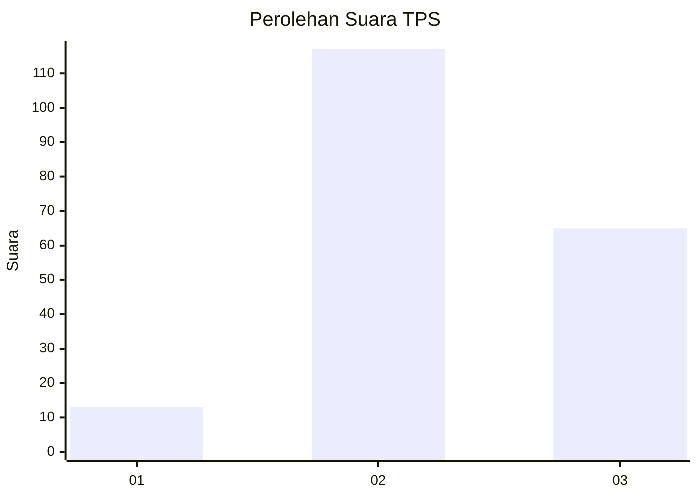
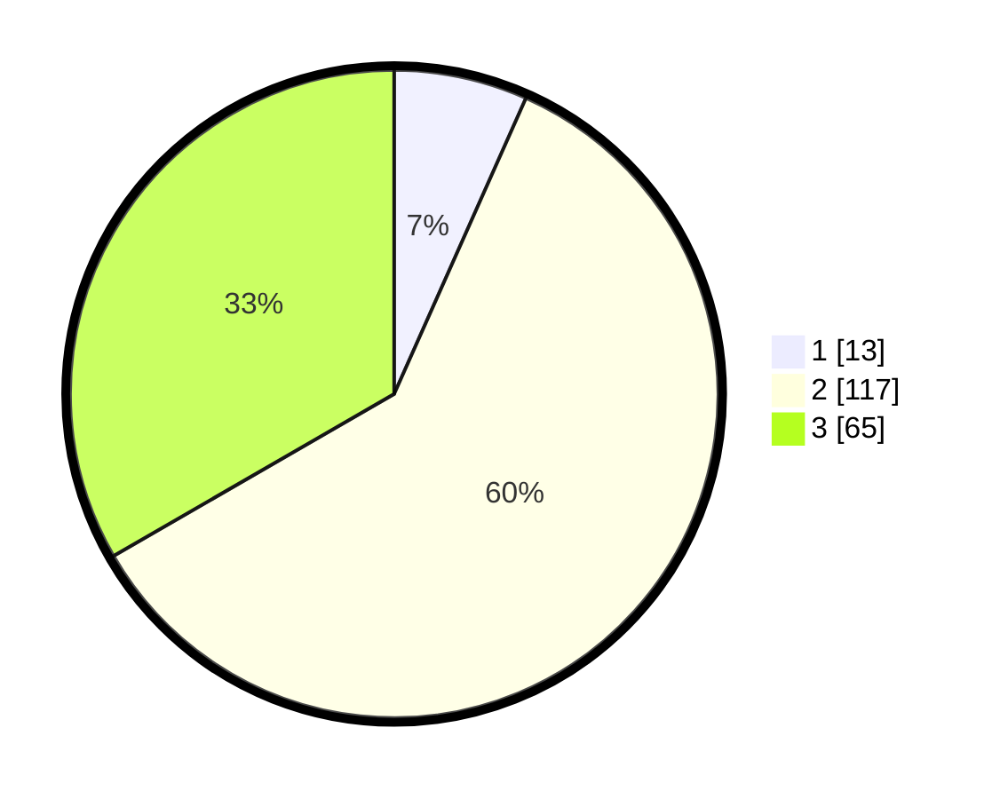

# Hasil

## Grafik

## Tabel

| No. | Nama Paslon    | Suara | Suara (raw) | Persentase |
|:--- |:-------------- | -----:| -----------:| ----------:|
| 1   | ANIES MUHAIMIN | 13    | [13][p-1]   | 6,67       |
| 2   | PRABOWO GIBRAN | 117   | [117][p-2]  | 60,00      |
| 3   | GANJAR MAHFUD  | 65    | [65][p-3]   | 33,33      |

[p-1]: https://github.com/gigit-pemilu/pemilu-2024-35-jawa-timur/blob/main/pilpres/hitung-suara/sub/35-jawa-timur/sub/04-tulungagung/sub/17-bandung/sub/2014-ngepeh/sub/003-tps/sub/paslon-1.txt
[p-2]: https://github.com/gigit-pemilu/pemilu-2024-35-jawa-timur/blob/main/pilpres/hitung-suara/sub/35-jawa-timur/sub/04-tulungagung/sub/17-bandung/sub/2014-ngepeh/sub/003-tps/sub/paslon-2.txt
[p-3]: https://github.com/gigit-pemilu/pemilu-2024-35-jawa-timur/blob/main/pilpres/hitung-suara/sub/35-jawa-timur/sub/04-tulungagung/sub/17-bandung/sub/2014-ngepeh/sub/003-tps/sub/paslon-3.txt

## Foto C Plano

https://sirekap-obj-formc.kpu.go.id/480d/pemilu/ppwp/35/04/17/20/14/3504172014003-20240214-220209--6ae3b53e-a44a-43eb-9eaf-698c6819dd4b.jpg

https://sirekap-obj-formc.kpu.go.id/480d/pemilu/ppwp/35/04/17/20/14/3504172014003-20240214-220542--71ebb5b7-655b-4a6b-96af-4144f2576e45.jpg

https://sirekap-obj-formc.kpu.go.id/480d/pemilu/ppwp/35/04/17/20/14/3504172014003-20240214-220659--b276d03d-d38b-4a1d-8d4e-27400b291278.jpg

## Metadata

| Key        | Value               |
| ---------- | ------------------- |
| Time Stamp | 2024-02-17 18:00:00 |

