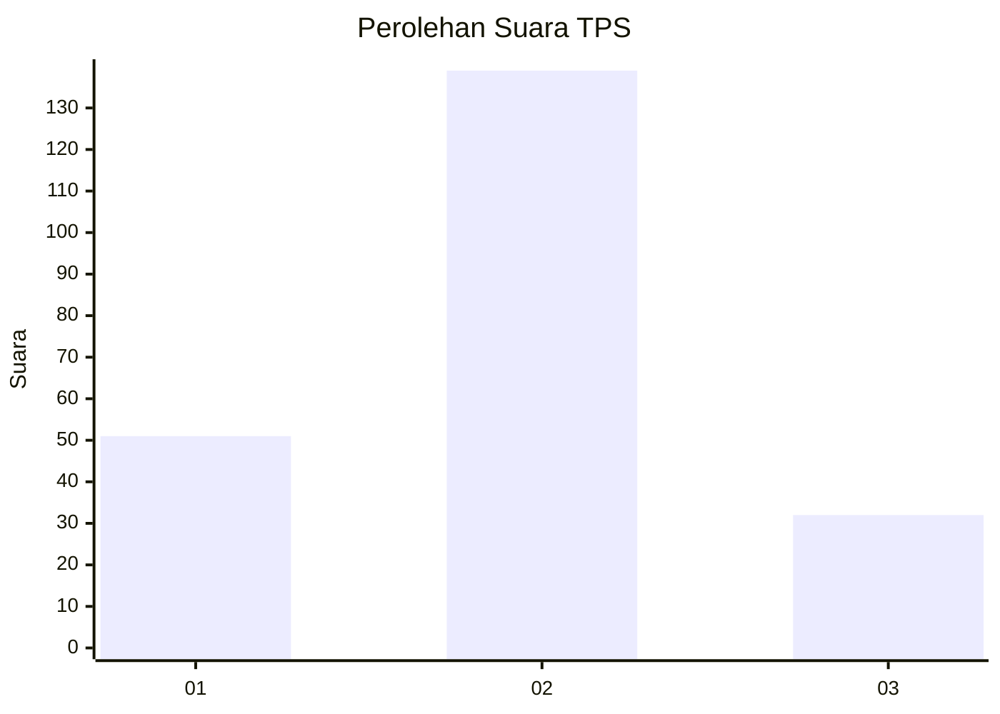
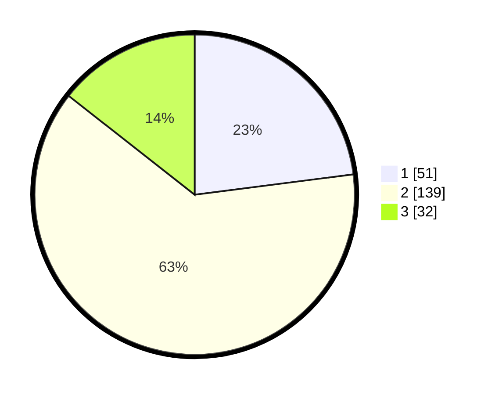

# Hasil

## Grafik

## Tabel

| No. | Nama Paslon    | Suara | Suara (raw) | Persentase |
|:--- |:-------------- | -----:| -----------:| ----------:|
| 1   | ANIES MUHAIMIN | 51    | [51][p-1]   | 22,97      |
| 2   | PRABOWO GIBRAN | 139   | [139][p-2]  | 62,61      |
| 3   | GANJAR MAHFUD  | 32    | [32][p-3]   | 14,41      |

[p-1]: https://github.com/gigit-pemilu/pemilu-2024/blob/main/pilpres/hitung-suara/sub/35-jawa-timur/sub/04-tulungagung/sub/17-bandung/sub/2015-suruhan-lor/sub/006-tps/sub/paslon-1.txt
[p-2]: https://github.com/gigit-pemilu/pemilu-2024/blob/main/pilpres/hitung-suara/sub/35-jawa-timur/sub/04-tulungagung/sub/17-bandung/sub/2015-suruhan-lor/sub/006-tps/sub/paslon-2.txt
[p-3]: https://github.com/gigit-pemilu/pemilu-2024/blob/main/pilpres/hitung-suara/sub/35-jawa-timur/sub/04-tulungagung/sub/17-bandung/sub/2015-suruhan-lor/sub/006-tps/sub/paslon-3.txt

## Foto C Plano

https://sirekap-obj-formc.kpu.go.id/d49e/pemilu/ppwp/35/04/17/20/15/3504172015006-20240218-002155--3820da27-7b94-4b06-82f6-6cb10d386ebd.jpg

https://sirekap-obj-formc.kpu.go.id/d49e/pemilu/ppwp/35/04/17/20/15/3504172015006-20240218-002715--ba64001b-a383-41c0-8136-e9e51e1ecb1e.jpg

https://sirekap-obj-formc.kpu.go.id/d49e/pemilu/ppwp/35/04/17/20/15/3504172015006-20240218-002755--fad631d3-0456-452e-86e2-e9fbf3121490.jpg

## Metadata

| Key        | Value               |
| ---------- | ------------------- |
| Time Stamp | 2024-02-25 12:00:00 |

