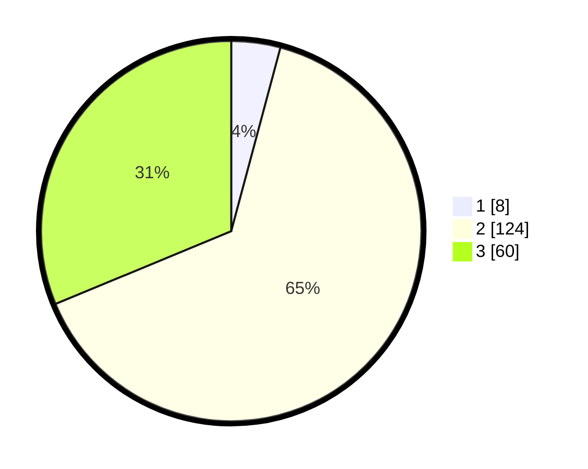

# Hasil

## Grafik

## Tabel

| No. | Nama Paslon    | Suara | Suara (raw) | Persentase |
|:--- |:-------------- | -----:| -----------:| ----------:|
| 1   | ANIES MUHAIMIN | 8     | [8][p-1]    | 4,17       |
| 2   | PRABOWO GIBRAN | 124   | [124][p-2]  | 64,58      |
| 3   | GANJAR MAHFUD  | 60    | [60][p-3]   | 31,25      |

[p-1]: https://github.com/gigit-pemilu/pemilu-2024/blob/main/pilpres/hitung-suara/sub/35-jawa-timur/sub/04-tulungagung/sub/17-bandung/sub/2018-gandong/sub/007-tps/sub/paslon-1.txt
[p-2]: https://github.com/gigit-pemilu/pemilu-2024/blob/main/pilpres/hitung-suara/sub/35-jawa-timur/sub/04-tulungagung/sub/17-bandung/sub/2018-gandong/sub/007-tps/sub/paslon-2.txt
[p-3]: https://github.com/gigit-pemilu/pemilu-2024/blob/main/pilpres/hitung-suara/sub/35-jawa-timur/sub/04-tulungagung/sub/17-bandung/sub/2018-gandong/sub/007-tps/sub/paslon-3.txt

## Foto C Plano

https://sirekap-obj-formc.kpu.go.id/df1a/pemilu/ppwp/35/04/17/20/18/3504172018007-20240215-050157--f3268e5c-794b-4213-b6d3-83b77fcf0715.jpg

https://sirekap-obj-formc.kpu.go.id/df1a/pemilu/ppwp/35/04/17/20/18/3504172018007-20240215-050336--0d81c9b5-20e6-4ec8-a2e3-adf6989bbbbe.jpg

https://sirekap-obj-formc.kpu.go.id/df1a/pemilu/ppwp/35/04/17/20/18/3504172018007-20240215-050435--76112d29-1ea8-41f2-8824-d3be7aa94e12.jpg

## Metadata

| Key        | Value               |
| ---------- | ------------------- |
| Time Stamp | 2024-02-17 17:30:00 |

