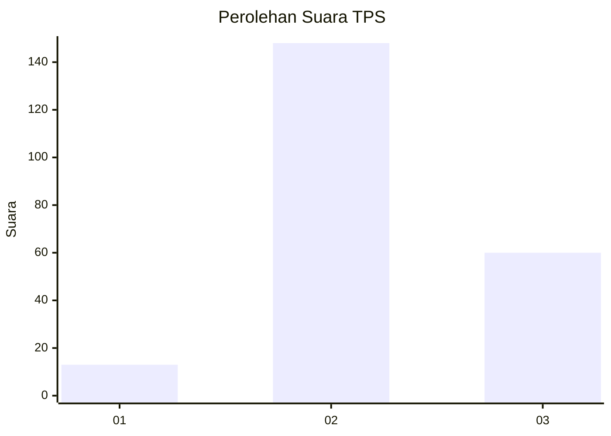

# Hasil

## Grafik

## Tabel

| No. | Nama Paslon    | Suara | Suara (raw) | Persentase |
|:--- |:-------------- | -----:| -----------:| ----------:|
| 1   | ANIES MUHAIMIN | 13    | [13][p-1]   | 5,88       |
| 2   | PRABOWO GIBRAN | 148   | [148][p-2]  | 66,97      |
| 3   | GANJAR MAHFUD  | 60    | [60][p-3]   | 27,15      |

[p-1]: https://github.com/gigit-pemilu/pemilu-2024/blob/main/pilpres/hitung-suara/sub/35-jawa-timur/sub/04-tulungagung/sub/18-pakel/sub/2014-sanan/sub/007-tps/sub/paslon-1.txt
[p-2]: https://github.com/gigit-pemilu/pemilu-2024/blob/main/pilpres/hitung-suara/sub/35-jawa-timur/sub/04-tulungagung/sub/18-pakel/sub/2014-sanan/sub/007-tps/sub/paslon-2.txt
[p-3]: https://github.com/gigit-pemilu/pemilu-2024/blob/main/pilpres/hitung-suara/sub/35-jawa-timur/sub/04-tulungagung/sub/18-pakel/sub/2014-sanan/sub/007-tps/sub/paslon-3.txt

## Foto C Plano

https://sirekap-obj-formc.kpu.go.id/6d6e/pemilu/ppwp/35/04/18/20/14/3504182014007-20240217-112916--f7ef1ae4-e6ad-4186-b72e-aae0ff5652a6.jpg

https://sirekap-obj-formc.kpu.go.id/6d6e/pemilu/ppwp/35/04/18/20/14/3504182014007-20240214-212956--f5dc951a-7e72-44ce-a38e-515cc4b3dd51.jpg

https://sirekap-obj-formc.kpu.go.id/6d6e/pemilu/ppwp/35/04/18/20/14/3504182014007-20240214-234433--09df6bdc-f940-4b1b-a171-81c83b923862.jpg

## Metadata

| Key        | Value               |
| ---------- | ------------------- |
| Time Stamp | 2024-02-19 06:16:00 |

