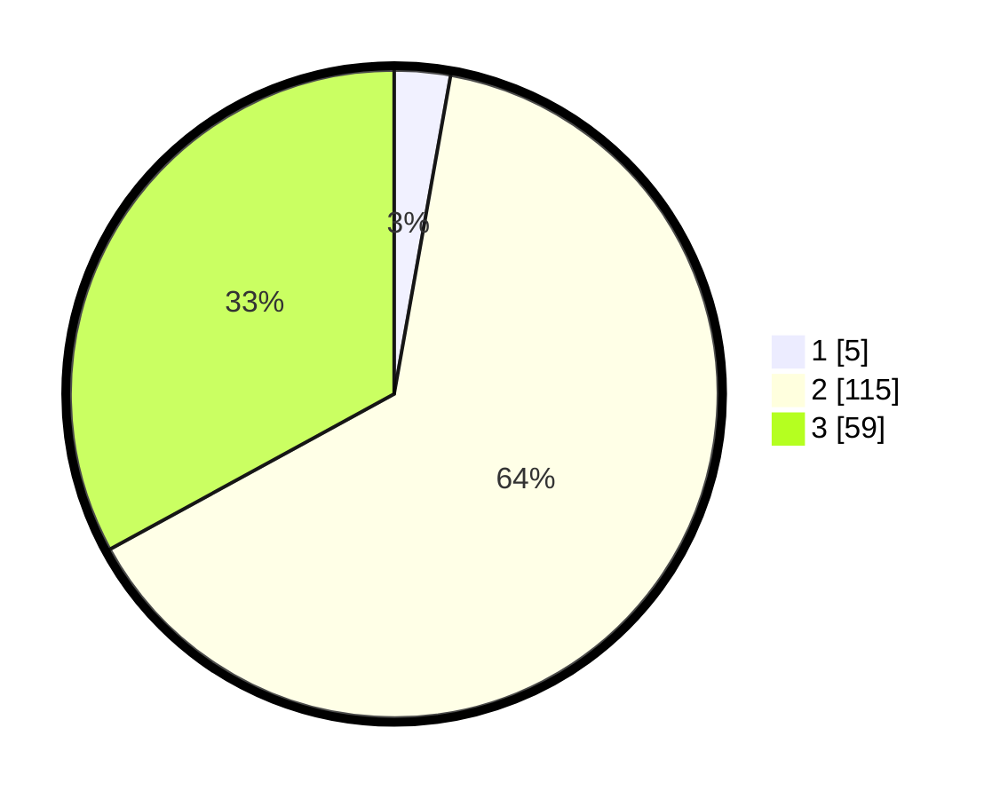

# Hasil

## Grafik

## Tabel

| No. | Nama Paslon    | Suara | Suara (raw) | Persentase |
|:--- |:-------------- | -----:| -----------:| ----------:|
| 1   | ANIES MUHAIMIN | 5     | [5][p-1]    | 2,79       |
| 2   | PRABOWO GIBRAN | 115   | [115][p-2]  | 64,25      |
| 3   | GANJAR MAHFUD  | 59    | [59][p-3]   | 32,96      |

[p-1]: https://github.com/gigit-pemilu/pemilu-2024/blob/main/pilpres/hitung-suara/sub/35-jawa-timur/sub/04-tulungagung/sub/19-tanggunggunung/sub/2001-kresikan/sub/002-tps/sub/paslon-1.txt
[p-2]: https://github.com/gigit-pemilu/pemilu-2024/blob/main/pilpres/hitung-suara/sub/35-jawa-timur/sub/04-tulungagung/sub/19-tanggunggunung/sub/2001-kresikan/sub/002-tps/sub/paslon-2.txt
[p-3]: https://github.com/gigit-pemilu/pemilu-2024/blob/main/pilpres/hitung-suara/sub/35-jawa-timur/sub/04-tulungagung/sub/19-tanggunggunung/sub/2001-kresikan/sub/002-tps/sub/paslon-3.txt

## Foto C Plano

https://sirekap-obj-formc.kpu.go.id/3663/pemilu/ppwp/35/04/19/20/01/3504192001002-20240214-194641--32b01ef3-b18a-4805-84ff-348b4ad78127.jpg

https://sirekap-obj-formc.kpu.go.id/3663/pemilu/ppwp/35/04/19/20/01/3504192001002-20240214-194645--4affd1e6-f8f8-435e-80e7-882f533d7a2f.jpg

https://sirekap-obj-formc.kpu.go.id/3663/pemilu/ppwp/35/04/19/20/01/3504192001002-20240214-200417--fe8ec5f3-86af-4024-af09-a0a7c4da8bf1.jpg

## Metadata

| Key        | Value               |
| ---------- | ------------------- |
| Time Stamp | 2024-02-16 22:01:00 |

## DATA PEMILIH TETAP

Jumlah pemilih dalam DPT: **226**.
 * L: **113**.
 * P: **113**.

## DATA PENGGUNA HAK PILIH

Jumlah pengguna hak pilih dalam DPT: **183**.
 * L: **87**.
 * P: **96**.

Jumlah pengguna hak pilih dalam DPTb: **0**.
 * L: **0**.
 * P: **0**.

Jumlah pengguna hak pilih dalam DPK: **0**.
 * L: **0**.
 * P: **0**.

Jumlah pengguna hak pilih: **183**.
 * L: **87**.
 * P: **96**.

## JUMLAH SUARA SAH DAN TIDAK SAH

JUMLAH SELURUH SUARA SAH: **179**.

JUMLAH SUARA TIDAK SAH: **4**.

JUMLAH SELURUH SUARA SAH DAN SUARA TIDAK SAH: **183**.

