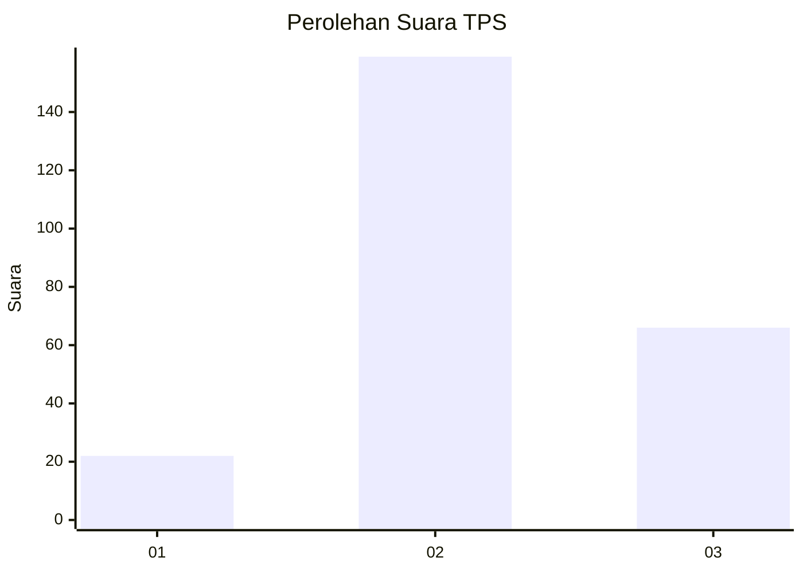
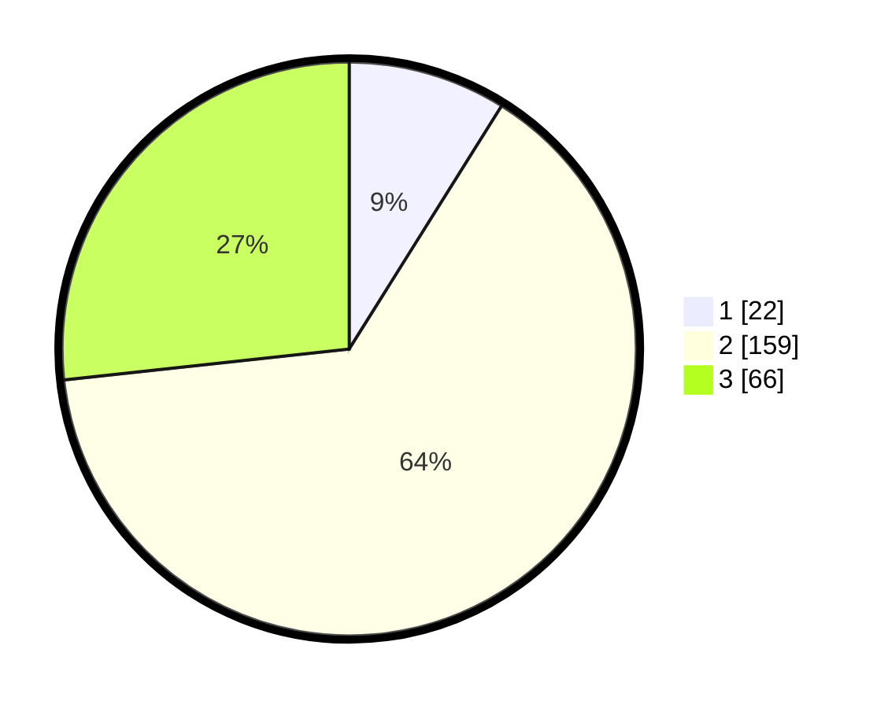

# Hasil

## Grafik

## Tabel

| No. | Nama Paslon    | Suara | Suara (raw) | Persentase |
|:--- |:-------------- | -----:| -----------:| ----------:|
| 1   | ANIES MUHAIMIN | 22    | [22][p-1]   | 8,91       |
| 2   | PRABOWO GIBRAN | 159   | [159][p-2]  | 64,37      |
| 3   | GANJAR MAHFUD  | 66    | [66][p-3]   | 26,72      |

[p-1]: https://github.com/gigit-pemilu/pemilu-2024/blob/main/pilpres/hitung-suara/sub/35-jawa-timur/sub/05-blitar/sub/01-wonodadi/sub/2001-jaten/sub/001-tps/sub/paslon-1.txt
[p-2]: https://github.com/gigit-pemilu/pemilu-2024/blob/main/pilpres/hitung-suara/sub/35-jawa-timur/sub/05-blitar/sub/01-wonodadi/sub/2001-jaten/sub/001-tps/sub/paslon-2.txt
[p-3]: https://github.com/gigit-pemilu/pemilu-2024/blob/main/pilpres/hitung-suara/sub/35-jawa-timur/sub/05-blitar/sub/01-wonodadi/sub/2001-jaten/sub/001-tps/sub/paslon-3.txt

## Foto C Plano

https://sirekap-obj-formc.kpu.go.id/4aab/pemilu/ppwp/35/05/01/20/01/3505012001001-20240214-220410--7f92add5-87eb-47f2-9713-b95367358f35.jpg

https://sirekap-obj-formc.kpu.go.id/4aab/pemilu/ppwp/35/05/01/20/01/3505012001001-20240214-220431--9a05f625-c5a2-49c0-b16b-9f1140f69aad.jpg

https://sirekap-obj-formc.kpu.go.id/4aab/pemilu/ppwp/35/05/01/20/01/3505012001001-20240214-220421--e68b891c-15d9-4259-82c8-0693db5f0aac.jpg

## Metadata

| Key        | Value               |
| ---------- | ------------------- |
| Time Stamp | 2024-02-15 00:41:44 |

## DATA PEMILIH TETAP

Jumlah pemilih dalam DPT: **289**.
 * L: **154**.
 * P: **135**.

## DATA PENGGUNA HAK PILIH

Jumlah pengguna hak pilih dalam DPT: **251**.
 * L: **128**.
 * P: **123**.

Jumlah pengguna hak pilih dalam DPTb: **4**.
 * L: **1**.
 * P: **3**.

Jumlah pengguna hak pilih dalam DPK: **0**.
 * L: **0**.
 * P: **0**.

Jumlah pengguna hak pilih: **255**.
 * L: **129**.
 * P: **126**.

## JUMLAH SUARA SAH DAN TIDAK SAH

JUMLAH SELURUH SUARA SAH: **247**.

JUMLAH SUARA TIDAK SAH: **8**.

JUMLAH SELURUH SUARA SAH DAN SUARA TIDAK SAH: **255**.

