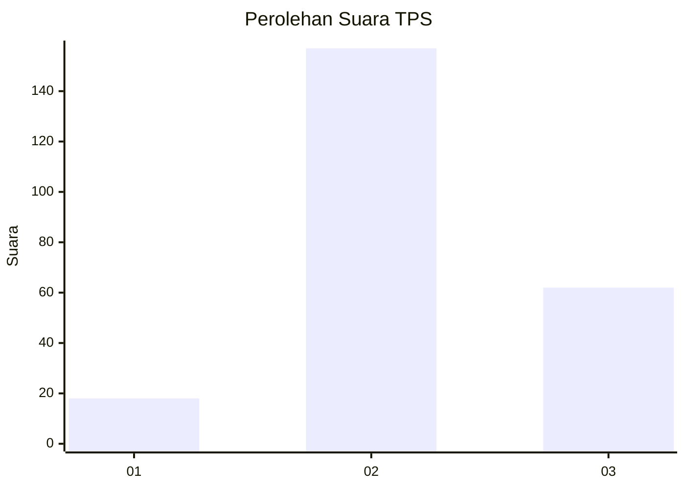

# Hasil

## Grafik

## Tabel

| No. | Nama Paslon    | Suara | Suara (raw) | Persentase |
|:--- |:-------------- | -----:| -----------:| ----------:|
| 1   | ANIES MUHAIMIN | 18    | [18][p-1]   | 7,59       |
| 2   | PRABOWO GIBRAN | 157   | [157][p-2]  | 66,24      |
| 3   | GANJAR MAHFUD  | 62    | [62][p-3]   | 26,16      |

[p-1]: https://github.com/gigit-pemilu/pemilu-2024/blob/main/pilpres/hitung-suara/sub/35-jawa-timur/sub/05-blitar/sub/01-wonodadi/sub/2001-jaten/sub/002-tps/sub/paslon-1.txt
[p-2]: https://github.com/gigit-pemilu/pemilu-2024/blob/main/pilpres/hitung-suara/sub/35-jawa-timur/sub/05-blitar/sub/01-wonodadi/sub/2001-jaten/sub/002-tps/sub/paslon-2.txt
[p-3]: https://github.com/gigit-pemilu/pemilu-2024/blob/main/pilpres/hitung-suara/sub/35-jawa-timur/sub/05-blitar/sub/01-wonodadi/sub/2001-jaten/sub/002-tps/sub/paslon-3.txt

## Foto C Plano

https://sirekap-obj-formc.kpu.go.id/0a21/pemilu/ppwp/35/05/01/20/01/3505012001002-20240214-200754--3da8cf70-b3c0-4782-81fb-5a65e19bb1b4.jpg

## Metadata

| Key        | Value               |
| ---------- | ------------------- |
| Time Stamp | 2024-02-14 21:46:01 |

