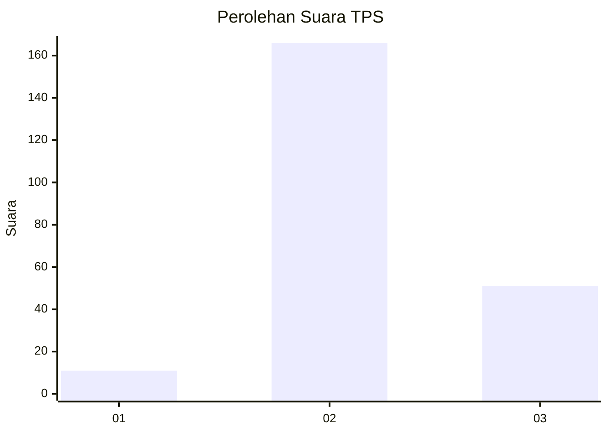
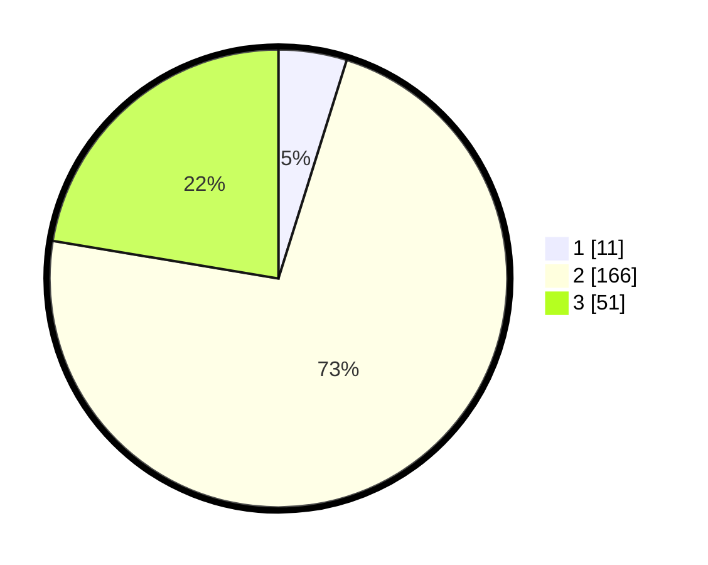

# Hasil

## Grafik

## Tabel

| No. | Nama Paslon    | Suara | Suara (raw) | Persentase |
|:--- |:-------------- | -----:| -----------:| ----------:|
| 1   | ANIES MUHAIMIN | 11    | [11][p-1]   | 4,82       |
| 2   | PRABOWO GIBRAN | 166   | [166][p-2]  | 72,81      |
| 3   | GANJAR MAHFUD  | 51    | [51][p-3]   | 22,37      |

[p-1]: https://github.com/gigit-pemilu/pemilu-2024/blob/main/pilpres/hitung-suara/sub/35-jawa-timur/sub/05-blitar/sub/01-wonodadi/sub/2001-jaten/sub/003-tps/sub/paslon-1.txt
[p-2]: https://github.com/gigit-pemilu/pemilu-2024/blob/main/pilpres/hitung-suara/sub/35-jawa-timur/sub/05-blitar/sub/01-wonodadi/sub/2001-jaten/sub/003-tps/sub/paslon-2.txt
[p-3]: https://github.com/gigit-pemilu/pemilu-2024/blob/main/pilpres/hitung-suara/sub/35-jawa-timur/sub/05-blitar/sub/01-wonodadi/sub/2001-jaten/sub/003-tps/sub/paslon-3.txt

## Foto C Plano

https://sirekap-obj-formc.kpu.go.id/40cc/pemilu/ppwp/35/05/01/20/01/3505012001003-20240215-033526--c3dadeb4-d149-44a7-97b3-10c7fb6f963c.jpg

https://sirekap-obj-formc.kpu.go.id/40cc/pemilu/ppwp/35/05/01/20/01/3505012001003-20240215-033548--290e3409-cc6e-465b-8521-e5ebb0741ab7.jpg

https://sirekap-obj-formc.kpu.go.id/40cc/pemilu/ppwp/35/05/01/20/01/3505012001003-20240215-033537--f1d5745b-b52b-4e61-8699-d3aeeeefd03d.jpg

## Metadata

| Key        | Value               |
| ---------- | ------------------- |
| Time Stamp | 2024-02-15 09:00:24 |

## DATA PEMILIH TETAP

Jumlah pemilih dalam DPT: **291**.
 * L: **142**.
 * P: **149**.

## DATA PENGGUNA HAK PILIH

Jumlah pengguna hak pilih dalam DPT: **231**.
 * L: **113**.
 * P: **118**.

Jumlah pengguna hak pilih dalam DPTb: **1**.
 * L: **1**.
 * P: **0**.

Jumlah pengguna hak pilih dalam DPK: **2**.
 * L: **2**.
 * P: **0**.

Jumlah pengguna hak pilih: **234**.
 * L: **116**.
 * P: **118**.

## JUMLAH SUARA SAH DAN TIDAK SAH

JUMLAH SELURUH SUARA SAH: **228**.

JUMLAH SUARA TIDAK SAH: **6**.

JUMLAH SELURUH SUARA SAH DAN SUARA TIDAK SAH: **234**.

