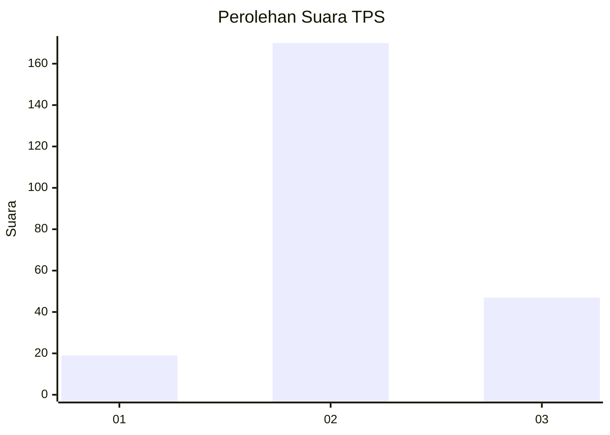
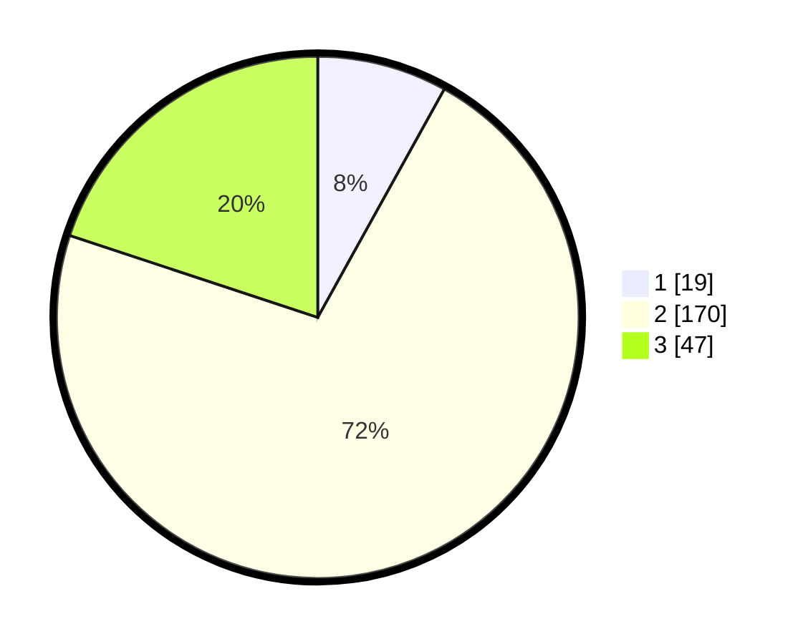

# Hasil

## Grafik

## Tabel

| No. | Nama Paslon    | Suara | Suara (raw) | Persentase |
|:--- |:-------------- | -----:| -----------:| ----------:|
| 1   | ANIES MUHAIMIN | 19    | [19][p-1]   | 8,05       |
| 2   | PRABOWO GIBRAN | 170   | [170][p-2]  | 72,03      |
| 3   | GANJAR MAHFUD  | 47    | [47][p-3]   | 19,92      |

[p-1]: https://github.com/gigit-pemilu/pemilu-2024-35-jawa-timur/blob/main/pilpres/hitung-suara/sub/35-jawa-timur/sub/05-blitar/sub/01-wonodadi/sub/2001-jaten/sub/004-tps/sub/paslon-1.txt
[p-2]: https://github.com/gigit-pemilu/pemilu-2024-35-jawa-timur/blob/main/pilpres/hitung-suara/sub/35-jawa-timur/sub/05-blitar/sub/01-wonodadi/sub/2001-jaten/sub/004-tps/sub/paslon-2.txt
[p-3]: https://github.com/gigit-pemilu/pemilu-2024-35-jawa-timur/blob/main/pilpres/hitung-suara/sub/35-jawa-timur/sub/05-blitar/sub/01-wonodadi/sub/2001-jaten/sub/004-tps/sub/paslon-3.txt

## Foto C Plano

https://sirekap-obj-formc.kpu.go.id/d5df/pemilu/ppwp/35/05/01/20/01/3505012001004-20240216-175748--5ff0da06-be4c-43a4-afe9-01fb257b4a0c.jpg

https://sirekap-obj-formc.kpu.go.id/d5df/pemilu/ppwp/35/05/01/20/01/3505012001004-20240216-175749--8a46d40e-70f6-431d-9ca4-ce268c8e5d8f.jpg

https://sirekap-obj-formc.kpu.go.id/d5df/pemilu/ppwp/35/05/01/20/01/3505012001004-20240216-175748--bc3b761b-d778-466f-91ea-fe554190410c.jpg

## Metadata

| Key        | Value               |
| ---------- | ------------------- |
| Time Stamp | 2024-02-17 09:00:02 |

## DATA PEMILIH TETAP

Jumlah pemilih dalam DPT: **300**.
 * L: **147**.
 * P: **153**.

## DATA PENGGUNA HAK PILIH

Jumlah pengguna hak pilih dalam DPT: **245**.
 * L: **115**.
 * P: **130**.

Jumlah pengguna hak pilih dalam DPTb: **2**.
 * L: **0**.
 * P: **2**.

Jumlah pengguna hak pilih dalam DPK: **0**.
 * L: **0**.
 * P: **0**.

Jumlah pengguna hak pilih: **247**.
 * L: **115**.
 * P: **132**.

## JUMLAH SUARA SAH DAN TIDAK SAH

JUMLAH SELURUH SUARA SAH: **236**.

JUMLAH SUARA TIDAK SAH: **11**.

JUMLAH SELURUH SUARA SAH DAN SUARA TIDAK SAH: **247**.

