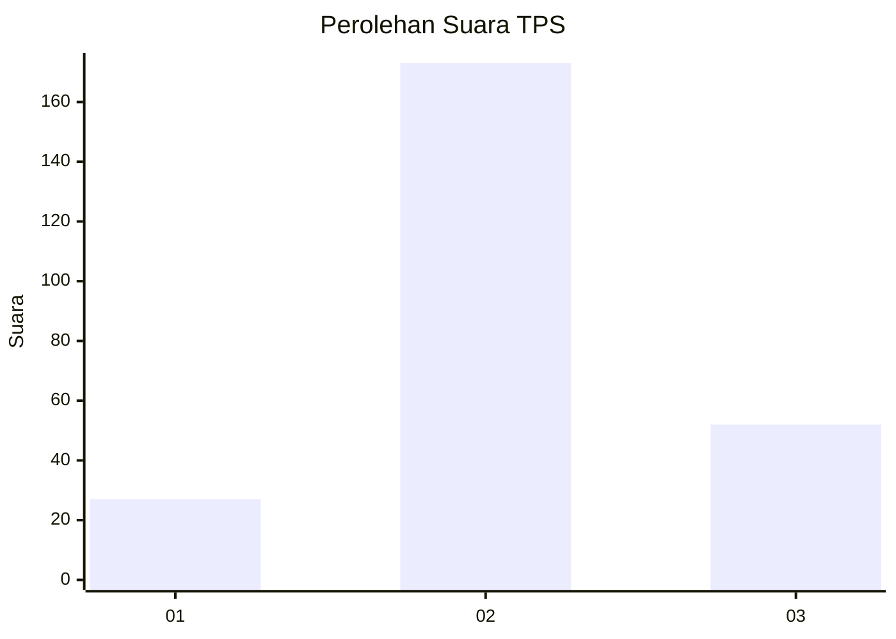
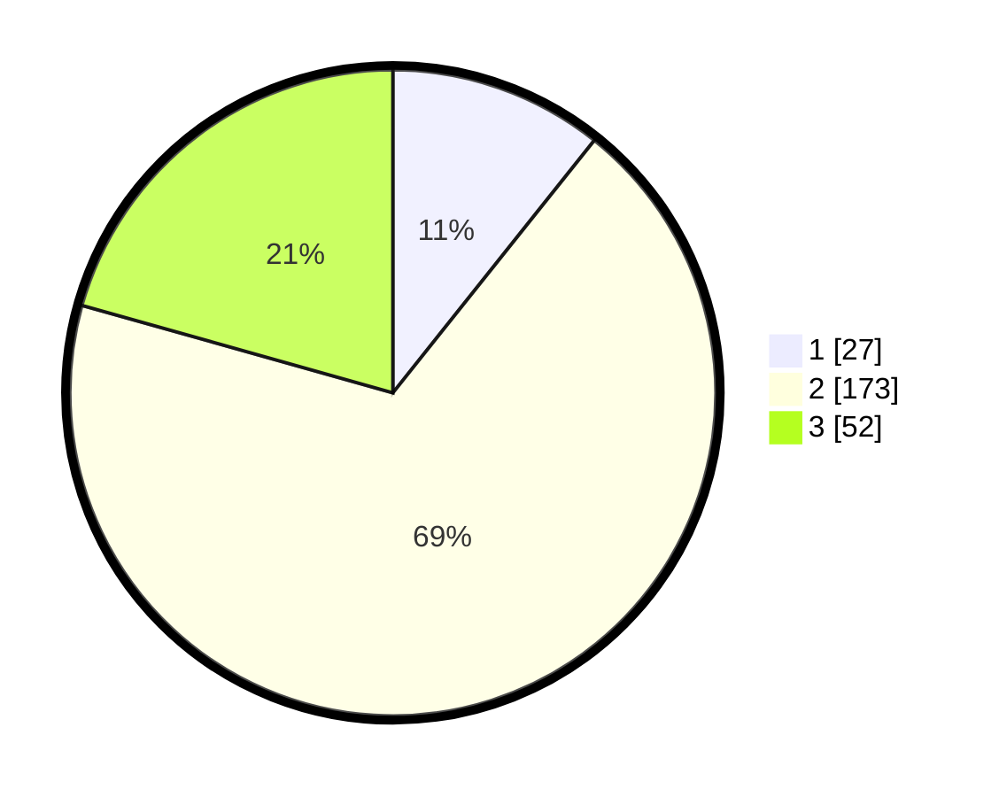

# Hasil

## Grafik

## Tabel

| No. | Nama Paslon    | Suara | Suara (raw) | Persentase |
|:--- |:-------------- | -----:| -----------:| ----------:|
| 1   | ANIES MUHAIMIN | 27    | [27][p-1]   | 10,71      |
| 2   | PRABOWO GIBRAN | 173   | [173][p-2]  | 68,65      |
| 3   | GANJAR MAHFUD  | 52    | [52][p-3]   | 20,63      |

[p-1]: https://github.com/gigit-pemilu/pemilu-2024/blob/main/pilpres/hitung-suara/sub/35-jawa-timur/sub/05-blitar/sub/01-wonodadi/sub/2001-jaten/sub/005-tps/sub/paslon-1.txt
[p-2]: https://github.com/gigit-pemilu/pemilu-2024/blob/main/pilpres/hitung-suara/sub/35-jawa-timur/sub/05-blitar/sub/01-wonodadi/sub/2001-jaten/sub/005-tps/sub/paslon-2.txt
[p-3]: https://github.com/gigit-pemilu/pemilu-2024/blob/main/pilpres/hitung-suara/sub/35-jawa-timur/sub/05-blitar/sub/01-wonodadi/sub/2001-jaten/sub/005-tps/sub/paslon-3.txt

## Foto C Plano

https://sirekap-obj-formc.kpu.go.id/d72a/pemilu/ppwp/35/05/01/20/01/3505012001005-20240215-201500--c19c0ab2-0eda-4744-84ce-846e941b7371.jpg

https://sirekap-obj-formc.kpu.go.id/d72a/pemilu/ppwp/35/05/01/20/01/3505012001005-20240215-201524--18011a2d-0600-4780-a315-94bfe86f69a8.jpg

https://sirekap-obj-formc.kpu.go.id/d72a/pemilu/ppwp/35/05/01/20/01/3505012001005-20240215-201514--03a5b7e7-2920-49f7-8563-ac1fbcdf6d40.jpg

## Metadata

| Key        | Value               |
| ---------- | ------------------- |
| Time Stamp | 2024-02-16 09:00:28 |

## DATA PEMILIH TETAP

Jumlah pemilih dalam DPT: **288**.
 * L: **141**.
 * P: **147**.

## DATA PENGGUNA HAK PILIH

Jumlah pengguna hak pilih dalam DPT: **256**.
 * L: **125**.
 * P: **131**.

Jumlah pengguna hak pilih dalam DPTb: **3**.
 * L: **0**.
 * P: **3**.

Jumlah pengguna hak pilih dalam DPK: **0**.
 * L: **0**.
 * P: **0**.

Jumlah pengguna hak pilih: **259**.
 * L: **125**.
 * P: **134**.

## JUMLAH SUARA SAH DAN TIDAK SAH

JUMLAH SELURUH SUARA SAH: **252**.

JUMLAH SUARA TIDAK SAH: **7**.

JUMLAH SELURUH SUARA SAH DAN SUARA TIDAK SAH: **259**.

