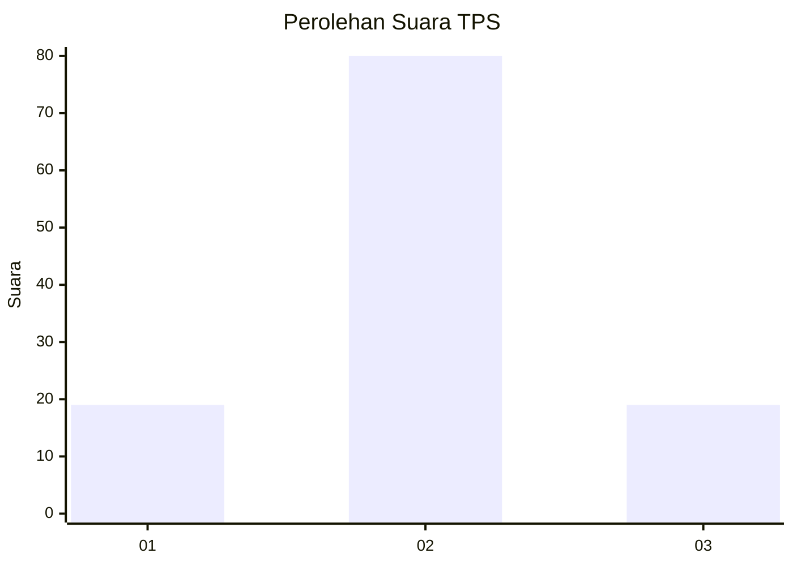
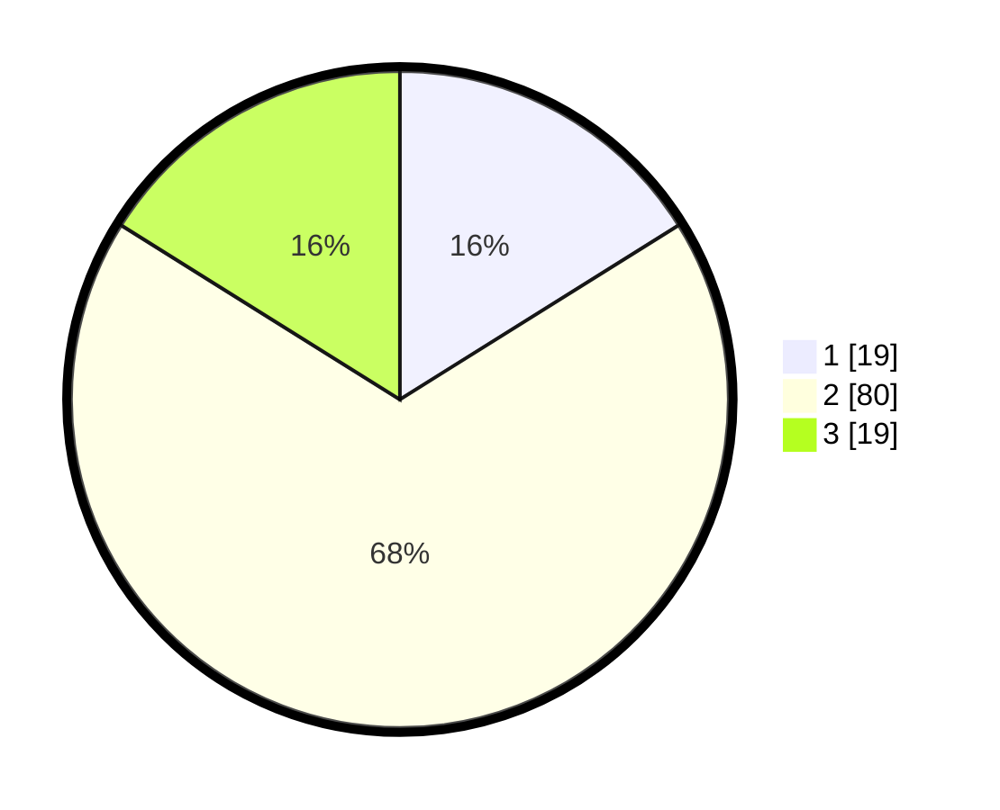

# Hasil

## Grafik

## Tabel

| No. | Nama Paslon    | Suara | Suara (raw) | Persentase |
|:--- |:-------------- | -----:| -----------:| ----------:|
| 1   | ANIES MUHAIMIN | 19    | [19][p-1]   | 16,10      |
| 2   | PRABOWO GIBRAN | 80    | [80][p-2]   | 67,80      |
| 3   | GANJAR MAHFUD  | 19    | [19][p-3]   | 16,10      |

[p-1]: https://github.com/gigit-pemilu/pemilu-2024-35-jawa-timur/blob/main/pilpres/hitung-suara/sub/35-jawa-timur/sub/05-blitar/sub/01-wonodadi/sub/2005-wonodadi/sub/017-tps/sub/paslon-1.txt
[p-2]: https://github.com/gigit-pemilu/pemilu-2024-35-jawa-timur/blob/main/pilpres/hitung-suara/sub/35-jawa-timur/sub/05-blitar/sub/01-wonodadi/sub/2005-wonodadi/sub/017-tps/sub/paslon-2.txt
[p-3]: https://github.com/gigit-pemilu/pemilu-2024-35-jawa-timur/blob/main/pilpres/hitung-suara/sub/35-jawa-timur/sub/05-blitar/sub/01-wonodadi/sub/2005-wonodadi/sub/017-tps/sub/paslon-3.txt

## Foto C Plano

https://sirekap-obj-formc.kpu.go.id/594d/pemilu/ppwp/35/05/01/20/05/3505012005017-20240214-214219--81fd99bf-2456-4359-9cb6-da372e763ded.jpg

https://sirekap-obj-formc.kpu.go.id/594d/pemilu/ppwp/35/05/01/20/05/3505012005017-20240214-214306--1bf3b209-9f0c-48dd-9d81-a9a8d8e5dcb5.jpg

https://sirekap-obj-formc.kpu.go.id/594d/pemilu/ppwp/35/05/01/20/05/3505012005017-20240214-214358--3026a8b7-5937-4dc3-9d1a-f62e1d981e57.jpg

## Metadata

| Key        | Value               |
| ---------- | ------------------- |
| Time Stamp | 2024-02-15 16:00:26 |

