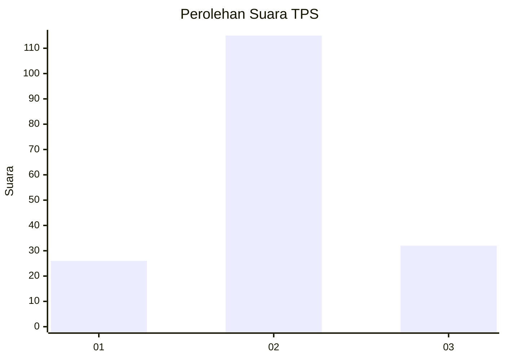
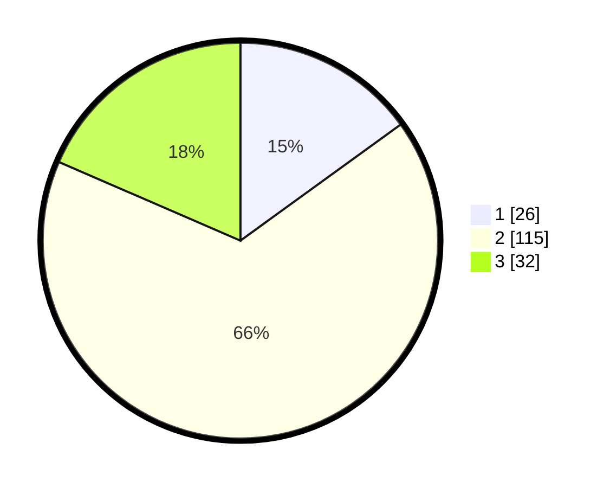

# Hasil

## Grafik

## Tabel

| No. | Nama Paslon    | Suara | Suara (raw) | Persentase |
|:--- |:-------------- | -----:| -----------:| ----------:|
| 1   | ANIES MUHAIMIN | 26    | [26][p-1]   | 15,03      |
| 2   | PRABOWO GIBRAN | 115   | [115][p-2]  | 66,47      |
| 3   | GANJAR MAHFUD  | 32    | [32][p-3]   | 18,50      |

[p-1]: https://github.com/gigit-pemilu/pemilu-2024/blob/main/pilpres/hitung-suara/sub/35-jawa-timur/sub/05-blitar/sub/01-wonodadi/sub/2005-wonodadi/sub/020-tps/sub/paslon-1.txt
[p-2]: https://github.com/gigit-pemilu/pemilu-2024/blob/main/pilpres/hitung-suara/sub/35-jawa-timur/sub/05-blitar/sub/01-wonodadi/sub/2005-wonodadi/sub/020-tps/sub/paslon-2.txt
[p-3]: https://github.com/gigit-pemilu/pemilu-2024/blob/main/pilpres/hitung-suara/sub/35-jawa-timur/sub/05-blitar/sub/01-wonodadi/sub/2005-wonodadi/sub/020-tps/sub/paslon-3.txt

## Foto C Plano

https://sirekap-obj-formc.kpu.go.id/fad5/pemilu/ppwp/35/05/01/20/05/3505012005020-20240219-101509--03919a28-a150-42d7-87f6-ade8fef1adee.jpg

https://sirekap-obj-formc.kpu.go.id/fad5/pemilu/ppwp/35/05/01/20/05/3505012005020-20240219-101546--8a4205c8-641f-41a0-91d3-1fee848dcf4c.jpg

https://sirekap-obj-formc.kpu.go.id/fad5/pemilu/ppwp/35/05/01/20/05/3505012005020-20240219-101622--70044793-83de-4589-b7ef-a5f9f595f385.jpg

## Metadata

| Key        | Value               |
| ---------- | ------------------- |
| Time Stamp | 2024-02-25 22:00:00 |

