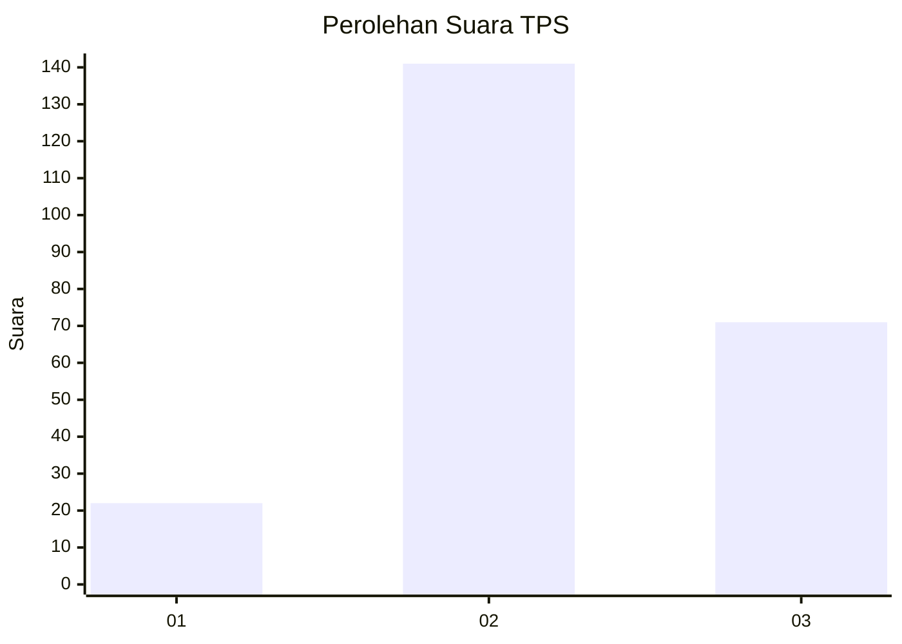
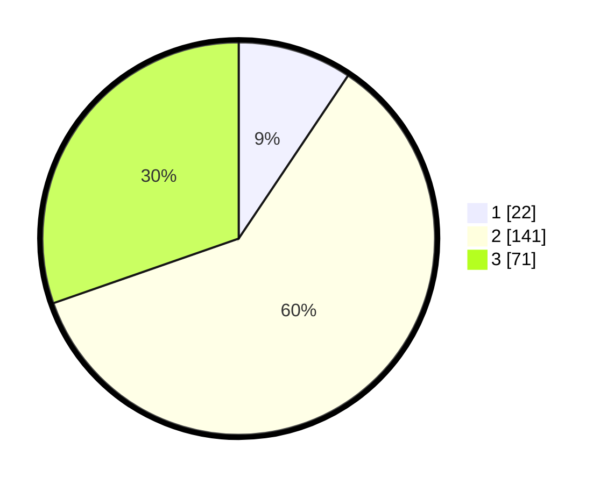

# Hasil

## Grafik

## Tabel

| No. | Nama Paslon    | Suara | Suara (raw) | Persentase |
|:--- |:-------------- | -----:| -----------:| ----------:|
| 1   | ANIES MUHAIMIN | 22    | [22][p-1]   | 9,40       |
| 2   | PRABOWO GIBRAN | 141   | [141][p-2]  | 60,26      |
| 3   | GANJAR MAHFUD  | 71    | [71][p-3]   | 30,34      |

[p-1]: https://github.com/gigit-pemilu/pemilu-2024/blob/main/pilpres/hitung-suara/sub/35-jawa-timur/sub/05-blitar/sub/01-wonodadi/sub/2008-pikatan/sub/005-tps/sub/paslon-1.txt
[p-2]: https://github.com/gigit-pemilu/pemilu-2024/blob/main/pilpres/hitung-suara/sub/35-jawa-timur/sub/05-blitar/sub/01-wonodadi/sub/2008-pikatan/sub/005-tps/sub/paslon-2.txt
[p-3]: https://github.com/gigit-pemilu/pemilu-2024/blob/main/pilpres/hitung-suara/sub/35-jawa-timur/sub/05-blitar/sub/01-wonodadi/sub/2008-pikatan/sub/005-tps/sub/paslon-3.txt

## Foto C Plano

https://sirekap-obj-formc.kpu.go.id/d1bb/pemilu/ppwp/35/05/01/20/08/3505012008005-20240215-030546--42fc0b44-ec22-4fcc-bda6-6773841ffdb6.jpg

https://sirekap-obj-formc.kpu.go.id/d1bb/pemilu/ppwp/35/05/01/20/08/3505012008005-20240215-030710--41de7757-3827-45ca-b9e8-ae78b76153bf.jpg

https://sirekap-obj-formc.kpu.go.id/d1bb/pemilu/ppwp/35/05/01/20/08/3505012008005-20240215-030808--f7ddf068-cbd7-4d1a-83f5-3bcbc2c532da.jpg

## Metadata

| Key        | Value               |
| ---------- | ------------------- |
| Time Stamp | 2024-02-15 12:00:28 |

