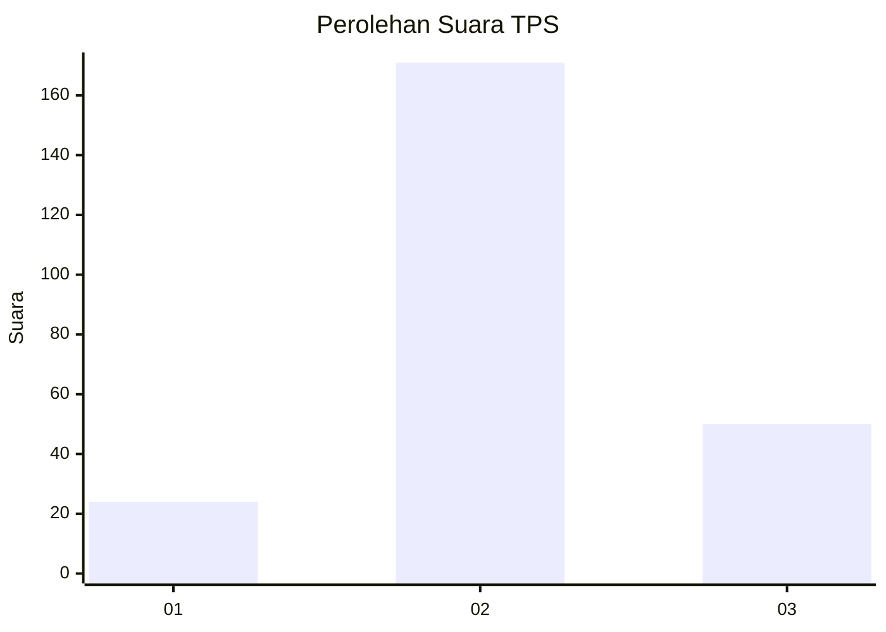
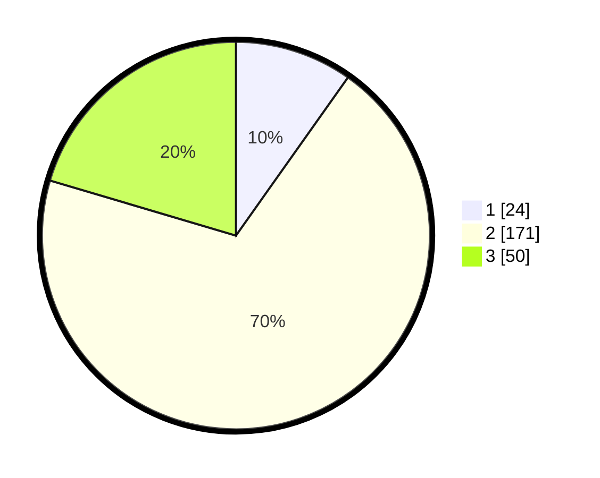

# Hasil

## Grafik

## Tabel

| No. | Nama Paslon    | Suara | Suara (raw) | Persentase |
|:--- |:-------------- | -----:| -----------:| ----------:|
| 1   | ANIES MUHAIMIN | 24    | [24][p-1]   | 9,80       |
| 2   | PRABOWO GIBRAN | 171   | [171][p-2]  | 69,80      |
| 3   | GANJAR MAHFUD  | 50    | [50][p-3]   | 20,41      |

[p-1]: https://github.com/gigit-pemilu/pemilu-2024/blob/main/pilpres/hitung-suara/sub/35-jawa-timur/sub/05-blitar/sub/02-udanawu/sub/2001-jati/sub/002-tps/sub/paslon-1.txt
[p-2]: https://github.com/gigit-pemilu/pemilu-2024/blob/main/pilpres/hitung-suara/sub/35-jawa-timur/sub/05-blitar/sub/02-udanawu/sub/2001-jati/sub/002-tps/sub/paslon-2.txt
[p-3]: https://github.com/gigit-pemilu/pemilu-2024/blob/main/pilpres/hitung-suara/sub/35-jawa-timur/sub/05-blitar/sub/02-udanawu/sub/2001-jati/sub/002-tps/sub/paslon-3.txt

## Foto C Plano

https://sirekap-obj-formc.kpu.go.id/ba00/pemilu/ppwp/35/05/02/20/01/3505022001002-20240216-190407--7b7065d1-96b8-40ad-9657-8315a43e01b3.jpg

https://sirekap-obj-formc.kpu.go.id/ba00/pemilu/ppwp/35/05/02/20/01/3505022001002-20240216-190409--1f9a32a7-7da3-4e9f-9fab-0e4eeea9f86f.jpg

https://sirekap-obj-formc.kpu.go.id/ba00/pemilu/ppwp/35/05/02/20/01/3505022001002-20240216-190408--6a3b0e12-f25c-4cc7-aba9-3a87739faef8.jpg

## Metadata

| Key        | Value               |
| ---------- | ------------------- |
| Time Stamp | 2024-02-16 21:01:00 |

## DATA PEMILIH TETAP

Jumlah pemilih dalam DPT: **287**.
 * L: **141**.
 * P: **146**.

## DATA PENGGUNA HAK PILIH

Jumlah pengguna hak pilih dalam DPT: **248**.
 * L: **122**.
 * P: **126**.

Jumlah pengguna hak pilih dalam DPTb: **0**.
 * L: **0**.
 * P: **0**.

Jumlah pengguna hak pilih dalam DPK: **0**.
 * L: **0**.
 * P: **0**.

Jumlah pengguna hak pilih: **248**.
 * L: **122**.
 * P: **126**.

## JUMLAH SUARA SAH DAN TIDAK SAH

JUMLAH SELURUH SUARA SAH: **245**.

JUMLAH SUARA TIDAK SAH: **3**.

JUMLAH SELURUH SUARA SAH DAN SUARA TIDAK SAH: **248**.

