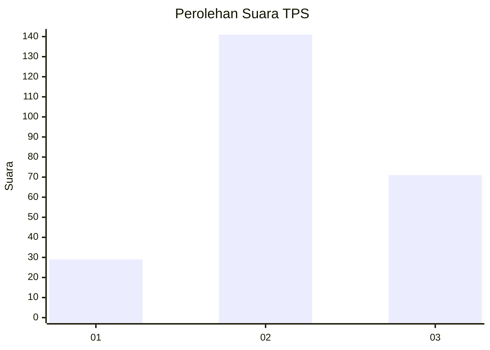
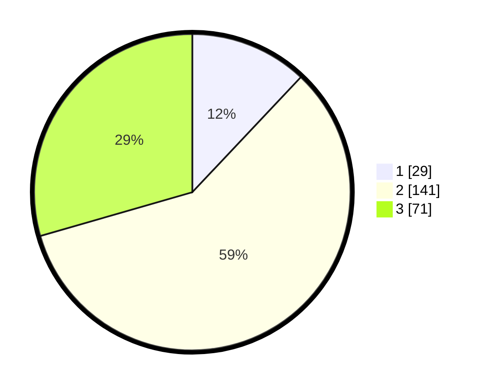

# Hasil

## Grafik

## Tabel

| No. | Nama Paslon    | Suara | Suara (raw) | Persentase |
|:--- |:-------------- | -----:| -----------:| ----------:|
| 1   | ANIES MUHAIMIN | 29    | [29][p-1]   | 12,03      |
| 2   | PRABOWO GIBRAN | 141   | [141][p-2]  | 58,51      |
| 3   | GANJAR MAHFUD  | 71    | [71][p-3]   | 29,46      |

[p-1]: https://github.com/gigit-pemilu/pemilu-2024-35-jawa-timur/blob/main/pilpres/hitung-suara/sub/35-jawa-timur/sub/05-blitar/sub/02-udanawu/sub/2002-temenggungan/sub/006-tps/sub/paslon-1.txt
[p-2]: https://github.com/gigit-pemilu/pemilu-2024-35-jawa-timur/blob/main/pilpres/hitung-suara/sub/35-jawa-timur/sub/05-blitar/sub/02-udanawu/sub/2002-temenggungan/sub/006-tps/sub/paslon-2.txt
[p-3]: https://github.com/gigit-pemilu/pemilu-2024-35-jawa-timur/blob/main/pilpres/hitung-suara/sub/35-jawa-timur/sub/05-blitar/sub/02-udanawu/sub/2002-temenggungan/sub/006-tps/sub/paslon-3.txt

## Foto C Plano

https://sirekap-obj-formc.kpu.go.id/7928/pemilu/ppwp/35/05/02/20/02/3505022002006-20240214-201214--2ed6cb3e-0784-49d5-b04d-7062b542a0bc.jpg

https://sirekap-obj-formc.kpu.go.id/7928/pemilu/ppwp/35/05/02/20/02/3505022002006-20240214-201333--fa69916f-7d21-44f5-a9de-03b0aaa391be.jpg

https://sirekap-obj-formc.kpu.go.id/7928/pemilu/ppwp/35/05/02/20/02/3505022002006-20240214-201517--d8520e03-65ac-4c29-9be1-25c8a2af118d.jpg

## Metadata

| Key        | Value               |
| ---------- | ------------------- |
| Time Stamp | 2024-02-15 12:00:28 |

