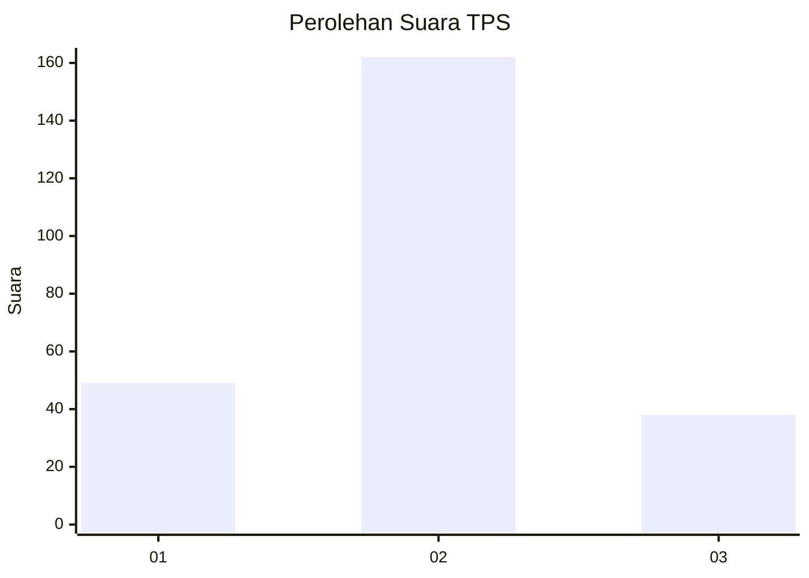
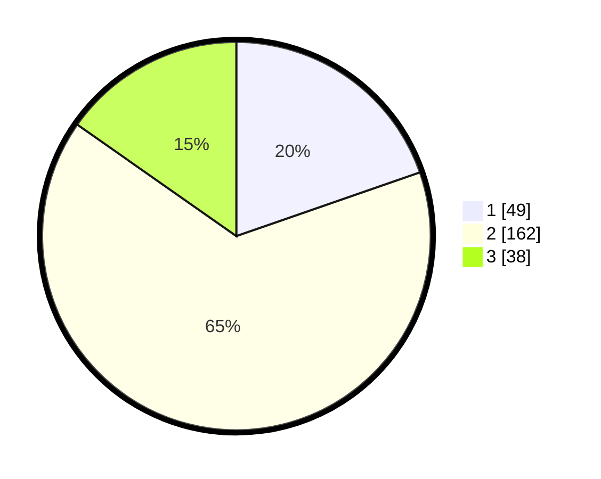

# Hasil

## Grafik

## Tabel

| No. | Nama Paslon    | Suara | Suara (raw) | Persentase |
|:--- |:-------------- | -----:| -----------:| ----------:|
| 1   | ANIES MUHAIMIN | 49    | [49][p-1]   | 19,68      |
| 2   | PRABOWO GIBRAN | 162   | [162][p-2]  | 65,06      |
| 3   | GANJAR MAHFUD  | 38    | [38][p-3]   | 15,26      |

[p-1]: https://github.com/gigit-pemilu/pemilu-2024/blob/main/pilpres/hitung-suara/sub/35-jawa-timur/sub/05-blitar/sub/02-udanawu/sub/2004-tunjung/sub/006-tps/sub/paslon-1.txt
[p-2]: https://github.com/gigit-pemilu/pemilu-2024/blob/main/pilpres/hitung-suara/sub/35-jawa-timur/sub/05-blitar/sub/02-udanawu/sub/2004-tunjung/sub/006-tps/sub/paslon-2.txt
[p-3]: https://github.com/gigit-pemilu/pemilu-2024/blob/main/pilpres/hitung-suara/sub/35-jawa-timur/sub/05-blitar/sub/02-udanawu/sub/2004-tunjung/sub/006-tps/sub/paslon-3.txt

## Foto C Plano

https://sirekap-obj-formc.kpu.go.id/de77/pemilu/ppwp/35/05/02/20/04/3505022004006-20240214-233531--d08d9d1e-a8ab-49e8-99ba-1e42325d581b.jpg

https://sirekap-obj-formc.kpu.go.id/de77/pemilu/ppwp/35/05/02/20/04/3505022004006-20240214-233748--af7fad05-c9ad-4d8b-8f6f-fdfaf033a362.jpg

https://sirekap-obj-formc.kpu.go.id/de77/pemilu/ppwp/35/05/02/20/04/3505022004006-20240214-234000--e35813ff-f80c-42a0-9d03-bfbe15c79d76.jpg

## Metadata

| Key        | Value               |
| ---------- | ------------------- |
| Time Stamp | 2024-02-15 15:30:25 |

