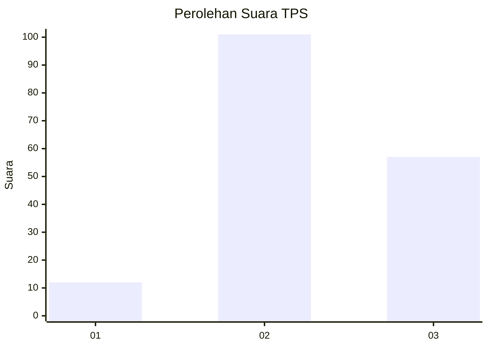
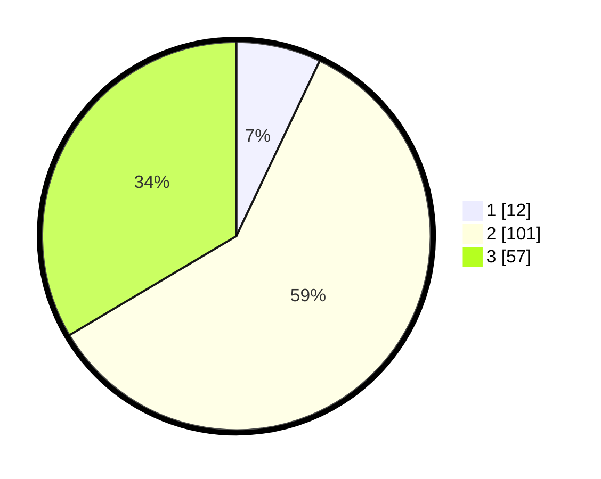

# Hasil

## Grafik

## Tabel

| No. | Nama Paslon    | Suara | Suara (raw) | Persentase |
|:--- |:-------------- | -----:| -----------:| ----------:|
| 1   | ANIES MUHAIMIN | 12    | [12][p-1]   | 7,06       |
| 2   | PRABOWO GIBRAN | 101   | [101][p-2]  | 59,41      |
| 3   | GANJAR MAHFUD  | 57    | [57][p-3]   | 33,53      |

[p-1]: https://github.com/gigit-pemilu/pemilu-2024-35-jawa-timur/blob/main/pilpres/hitung-suara/sub/35-jawa-timur/sub/05-blitar/sub/02-udanawu/sub/2005-bakung/sub/016-tps/sub/paslon-1.txt
[p-2]: https://github.com/gigit-pemilu/pemilu-2024-35-jawa-timur/blob/main/pilpres/hitung-suara/sub/35-jawa-timur/sub/05-blitar/sub/02-udanawu/sub/2005-bakung/sub/016-tps/sub/paslon-2.txt
[p-3]: https://github.com/gigit-pemilu/pemilu-2024-35-jawa-timur/blob/main/pilpres/hitung-suara/sub/35-jawa-timur/sub/05-blitar/sub/02-udanawu/sub/2005-bakung/sub/016-tps/sub/paslon-3.txt

## Foto C Plano

https://sirekap-obj-formc.kpu.go.id/4e9d/pemilu/ppwp/35/05/02/20/05/3505022005016-20240214-220304--ad0a4ebf-61b3-4dbd-957a-b84716c0bc8a.jpg

https://sirekap-obj-formc.kpu.go.id/4e9d/pemilu/ppwp/35/05/02/20/05/3505022005016-20240214-220920--589f1cb6-484a-4cbf-a3af-f06361ffc82b.jpg

https://sirekap-obj-formc.kpu.go.id/4e9d/pemilu/ppwp/35/05/02/20/05/3505022005016-20240214-221051--5a101b1b-4871-4c1a-a7a6-d20b67f2371d.jpg

## Metadata

| Key        | Value               |
| ---------- | ------------------- |
| Time Stamp | 2024-02-15 12:00:28 |

