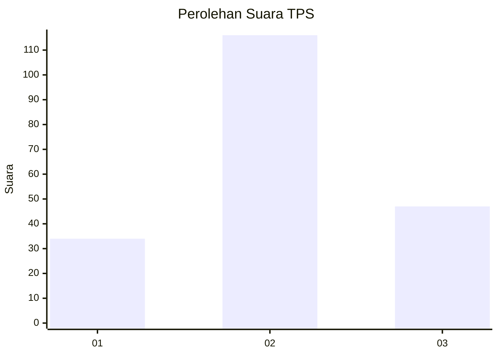
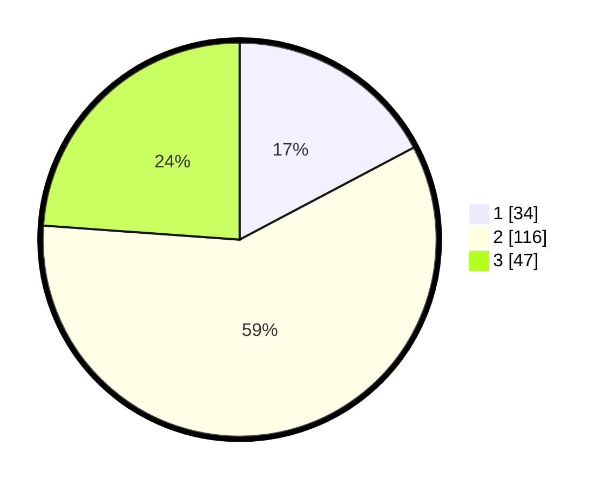

# Hasil

## Grafik

## Tabel

| No. | Nama Paslon    | Suara | Suara (raw) | Persentase |
|:--- |:-------------- | -----:| -----------:| ----------:|
| 1   | ANIES MUHAIMIN | 34    | [34][p-1]   | 17,26      |
| 2   | PRABOWO GIBRAN | 116   | [116][p-2]  | 58,88      |
| 3   | GANJAR MAHFUD  | 47    | [47][p-3]   | 23,86      |

[p-1]: https://github.com/gigit-pemilu/pemilu-2024/blob/main/pilpres/hitung-suara/sub/35-jawa-timur/sub/05-blitar/sub/03-srengat/sub/1004-togogan/sub/002-tps/sub/paslon-1.txt
[p-2]: https://github.com/gigit-pemilu/pemilu-2024/blob/main/pilpres/hitung-suara/sub/35-jawa-timur/sub/05-blitar/sub/03-srengat/sub/1004-togogan/sub/002-tps/sub/paslon-2.txt
[p-3]: https://github.com/gigit-pemilu/pemilu-2024/blob/main/pilpres/hitung-suara/sub/35-jawa-timur/sub/05-blitar/sub/03-srengat/sub/1004-togogan/sub/002-tps/sub/paslon-3.txt

## Foto C Plano

https://sirekap-obj-formc.kpu.go.id/8e79/pemilu/ppwp/35/05/03/10/04/3505031004002-20240221-234157--07fb5805-b26f-4411-95ad-0af468f6bbe6.jpg

https://sirekap-obj-formc.kpu.go.id/8e79/pemilu/ppwp/35/05/03/10/04/3505031004002-20240221-234128--0d93bfbf-90a4-433f-af70-2876e9d5cc57.jpg

https://sirekap-obj-formc.kpu.go.id/8e79/pemilu/ppwp/35/05/03/10/04/3505031004002-20240221-234142--01c4e78e-dab6-4773-9e0d-44d647461d09.jpg

## Metadata

| Key        | Value               |
| ---------- | ------------------- |
| Time Stamp | 2024-02-22 18:00:00 |

