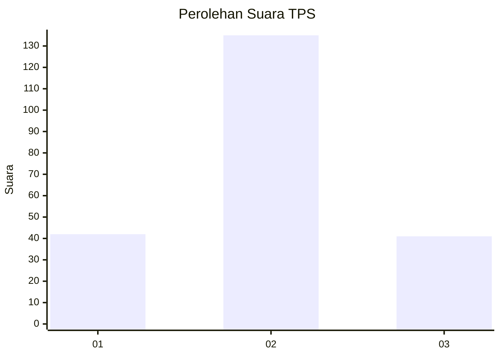
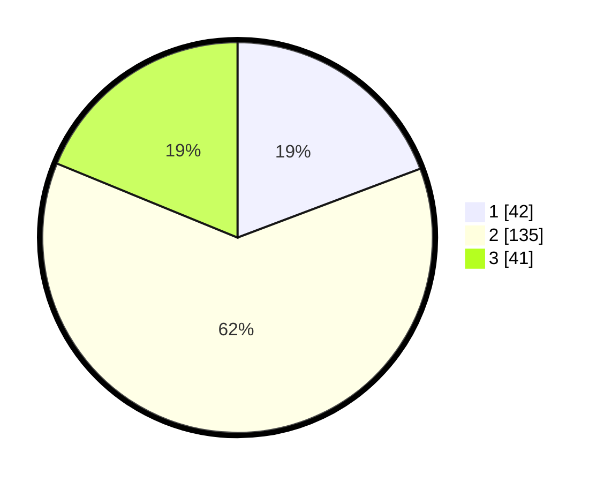

# Hasil

## Grafik

## Tabel

| No. | Nama Paslon    | Suara | Suara (raw) | Persentase |
|:--- |:-------------- | -----:| -----------:| ----------:|
| 1   | ANIES MUHAIMIN | 42    | [42][p-1]   | 19,27      |
| 2   | PRABOWO GIBRAN | 135   | [135][p-2]  | 61,93      |
| 3   | GANJAR MAHFUD  | 41    | [41][p-3]   | 18,81      |

[p-1]: https://github.com/gigit-pemilu/pemilu-2024/blob/main/pilpres/hitung-suara/sub/35-jawa-timur/sub/05-blitar/sub/03-srengat/sub/1009-dandong/sub/003-tps/sub/paslon-1.txt
[p-2]: https://github.com/gigit-pemilu/pemilu-2024/blob/main/pilpres/hitung-suara/sub/35-jawa-timur/sub/05-blitar/sub/03-srengat/sub/1009-dandong/sub/003-tps/sub/paslon-2.txt
[p-3]: https://github.com/gigit-pemilu/pemilu-2024/blob/main/pilpres/hitung-suara/sub/35-jawa-timur/sub/05-blitar/sub/03-srengat/sub/1009-dandong/sub/003-tps/sub/paslon-3.txt

## Foto C Plano

https://sirekap-obj-formc.kpu.go.id/ef88/pemilu/ppwp/35/05/03/10/09/3505031009003-20240216-184530--776d9b25-9855-4589-ae6a-1fb4a443d281.jpg

https://sirekap-obj-formc.kpu.go.id/ef88/pemilu/ppwp/35/05/03/10/09/3505031009003-20240215-001344--867f5bc0-fbc4-4fa4-9989-e2b9d888cafc.jpg

https://sirekap-obj-formc.kpu.go.id/ef88/pemilu/ppwp/35/05/03/10/09/3505031009003-20240216-185215--5ad5b83c-86ad-49a4-a6c6-bf3d12ec6b6f.jpg

## Metadata

| Key        | Value               |
| ---------- | ------------------- |
| Time Stamp | 2024-02-16 21:01:00 |

