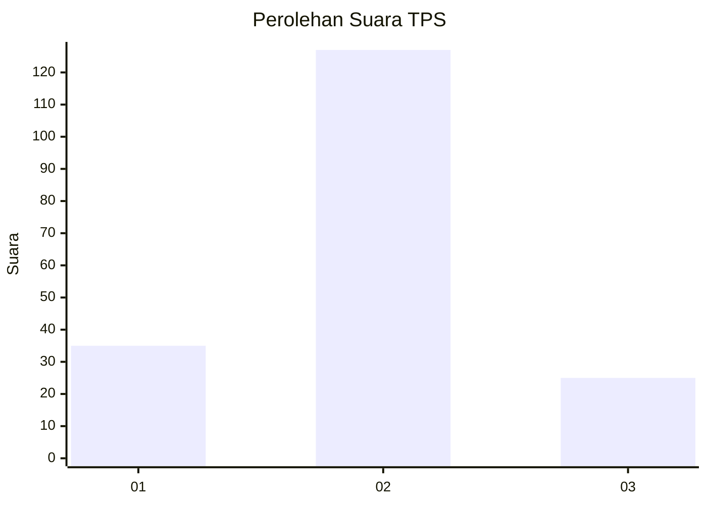
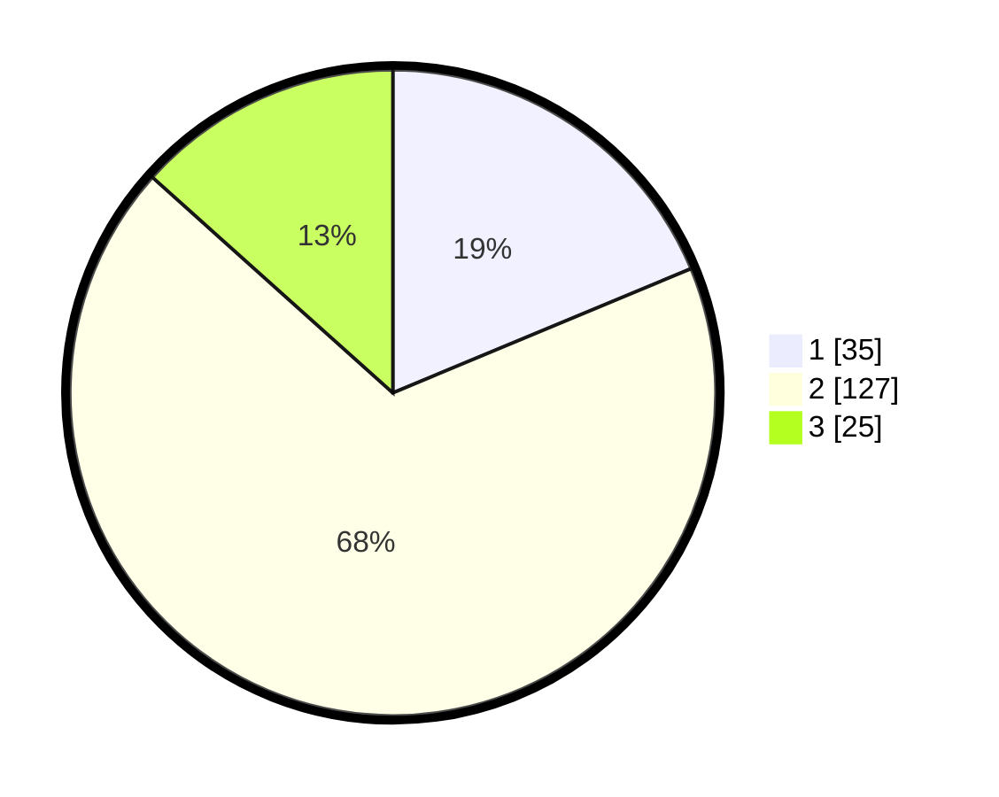

# Hasil

## Grafik

## Tabel

| No. | Nama Paslon    | Suara | Suara (raw) | Persentase |
|:--- |:-------------- | -----:| -----------:| ----------:|
| 1   | ANIES MUHAIMIN | 35    | [35][p-1]   | 18,72      |
| 2   | PRABOWO GIBRAN | 127   | [127][p-2]  | 67,91      |
| 3   | GANJAR MAHFUD  | 25    | [25][p-3]   | 13,37      |

[p-1]: https://github.com/gigit-pemilu/pemilu-2024/blob/main/pilpres/hitung-suara/sub/35-jawa-timur/sub/05-blitar/sub/03-srengat/sub/1009-dandong/sub/005-tps/sub/paslon-1.txt
[p-2]: https://github.com/gigit-pemilu/pemilu-2024/blob/main/pilpres/hitung-suara/sub/35-jawa-timur/sub/05-blitar/sub/03-srengat/sub/1009-dandong/sub/005-tps/sub/paslon-2.txt
[p-3]: https://github.com/gigit-pemilu/pemilu-2024/blob/main/pilpres/hitung-suara/sub/35-jawa-timur/sub/05-blitar/sub/03-srengat/sub/1009-dandong/sub/005-tps/sub/paslon-3.txt

## Foto C Plano

https://sirekap-obj-formc.kpu.go.id/7c51/pemilu/ppwp/35/05/03/10/09/3505031009005-20240221-234928--30c00c75-d0a6-486a-a3dd-9ebd86e7d824.jpg

https://sirekap-obj-formc.kpu.go.id/7c51/pemilu/ppwp/35/05/03/10/09/3505031009005-20240221-234940--6906bcdc-296a-40d7-b9c9-fb2b5ed6e924.jpg

## Metadata

| Key        | Value               |
| ---------- | ------------------- |
| Time Stamp | 2024-02-24 22:31:28 |

